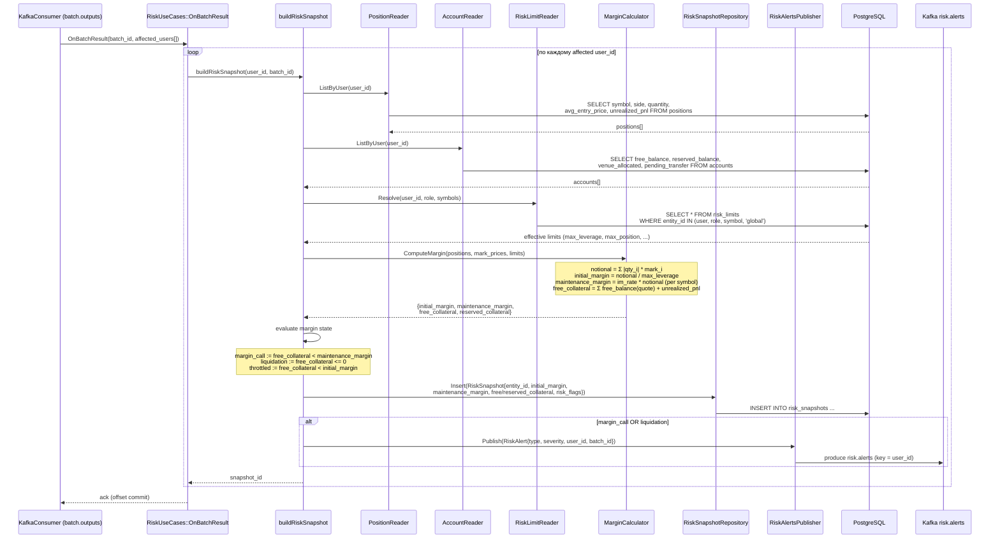

<!-- IN-013 frontmatter — Cockburn decomposition level.
---
id: SEQ-RISK-001-build-risk-snapshot
level: fish
component: risk-manager
---
-->

# SEQ-RISK-001. Internal: buildRiskSnapshot (margin, margin-call, persist + alert)

## Type

Internal Component Sequence (внутри `RiskUseCases::OnBatchResult` → `buildRiskSnapshot`)

## Feature

- [F-06](../../../02-system/features/F-06-positions-pnl-margin/)

## Use Case

- [UC-F06-01](../../../02-system/use-cases/UC-F06-01-show-positions/use-case.md)

## Purpose

Детализирует, что происходит при сборке `RiskSnapshot` после батча (F6-2):
чтение позиций и балансов затронутых пользователей, расчёт `initial_margin` и
`maintenance_margin` по `risk_limits`, определение состояния margin call,
запись строки в `risk_snapshots` и публикация `RiskAlert` в `risk.alerts` при
нарушении порога.

Триггер — consumer `batch.outputs` (post-trade). Service-level — см.
[SEQ-F06-UC-F06-01-services](../../sequences/SEQ-F06-UC-F06-01-services.md) и
post-trade поток [SEQ-F08-UC-F08-01-services](../../sequences/SEQ-F08-UC-F08-01-services.md).

## Diagram

## Margin formulas (domain)

- `notional = Σ |quantity_i| * mark_price_i` по всем открытым позициям.
- `initial_margin = notional / max_leverage` (из `risk_limits`,
  fallback на global при отсутствии user/role-лимита).
- `maintenance_margin = maintenance_rate * notional` (per-symbol rate; в MVP —
  доля от `initial_margin`).
- `free_collateral = Σ free_balance(quote) + Σ unrealized_pnl`.
- `leverage = notional / max(free_collateral, ε)`.

Заменяет placeholder `margin = qty * price * 0.1` из текущего
[risk_uc.cpp](../../../../cpp/risk/src/app/risk_uc.cpp) (known issue
`no-margin-calculation`).

## Margin state → risk_flags

| Условие | `risk_flags` | Действие |
| --- | --- | --- |
| `free_collateral < initial_margin` | `throttled` | новые заявки режутся (F-07) |
| `free_collateral < maintenance_margin` | `margin_call` | `RiskAlert(MARGIN_CALL, WARN)`, подсветка в UI (F6-7) |
| `free_collateral <= 0` | `liquidation` | `RiskAlert(LIQUIDATION, CRITICAL)`, передача в F-08 |

## Idempotency & failure handling

- Снапшот пишется один на `(user_id, batch_id)`; повторная доставка
  `batch.outputs` не плодит дубликаты (upsert по ключу или dedup на
  `IdempotencyGuard` по `batch_id`).
- Mark price stale → используется последний сохранённый, snapshot помечается
  флагом, alert не подавляется.
- Ошибка `INSERT risk_snapshots` → hard failure для этого user, offset не
  коммитится до успешной записи (audit-критично, CLAUDE.md §16).
- `RiskAlert` публикуется **после** успешного `INSERT` снапшота (нет alert без
  персистентного снапшота).

## Decimal / precision notes (CLAUDE.md §9)

- Все margin/collateral величины — `Decimal`; `double` допустим только для
  diagnostics (`leverage` для дашборда), не для записей в `risk_snapshots`.

## Related Contracts

- [`fob.risk.v1.RiskService/OnBatchResult`](../../../06-api/grpc/risk-on-batch-result.md)
- [`fob.risk.v1.RiskService/GetRiskSnapshot`](../../../06-api/grpc/risk-get-risk-snapshot.md)
- [batch.outputs](../../../06-api/messaging/batch-outputs.md)
- [risk.alerts](../../../06-api/messaging/risk-alerts.md)

## Related Data Objects

- [`positions`](../../../07-data/oltp-schema.md#таблица-positions)
- [`accounts`](../../../07-data/oltp-schema.md#таблица-accounts)
- [`risk_limits`](../../../07-data/oltp-schema.md#таблица-risk_limits)
- [`risk_snapshots`](../../../07-data/oltp-schema.md#таблица-risk_snapshots)

## Related Components

- [risk-manager](../overview.md)
- [ledger](../../ledger/overview.md) — источник positions/accounts (external)
- [matching-fob-core](../../matching-fob-core/overview.md) — producer `batch.outputs` (external)
