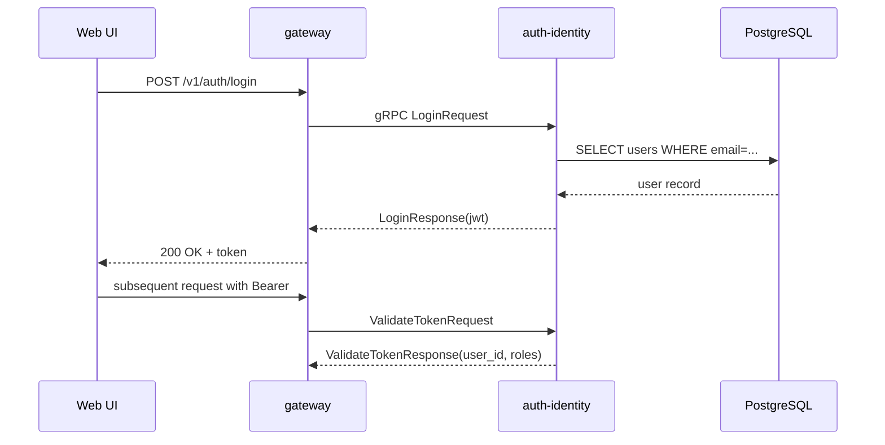

# SEQ-F01-UC-F01-01-services. Authentication: service view

## Type

Service Interaction Sequence

## Feature

- [F-01](../../02-system/features/F-01-auth-and-identity/)

## Use Case

- [UC-F01-01](../../02-system/use-cases/UC-F01-01-authenticate-user/use-case.md)

## Purpose

Внутренний путь login-запроса. Auth & Identity — планируемый сервис; gateway — текущая точка входа.

## Participants

- Web UI / API client
- gateway
- auth-identity (planned)
- PostgreSQL (planned)

## Diagram

## Contract Binding Table

| Step | Transport | Contract | Location |
| --- | --- | --- | --- |
| UI → GW | REST | `POST /v1/auth/login` | (planned) `docs/06-api/rest/` |
| GW → AUTH | gRPC | `AuthService/Login` (planned) | [../../06-api/grpc/auth-login.md](../../06-api/grpc/auth-login.md) |
| GW → AUTH | gRPC | `AuthService/ValidateToken` (planned) | [../../06-api/grpc/auth-validate-token.md](../../06-api/grpc/auth-validate-token.md) |

## Data Binding Table

| Data Object | Storage | Location |
| --- | --- | --- |
| `users` | PostgreSQL | (planned) `docs/07-data/oltp-schema.md#users` |
| `sessions` | PostgreSQL / Redis | (planned) `docs/07-data/oltp-schema.md#sessions` |

## Related Components

- [gateway](../gateway/overview.md)
- [auth-identity](../auth-identity/overview.md) (planned)
