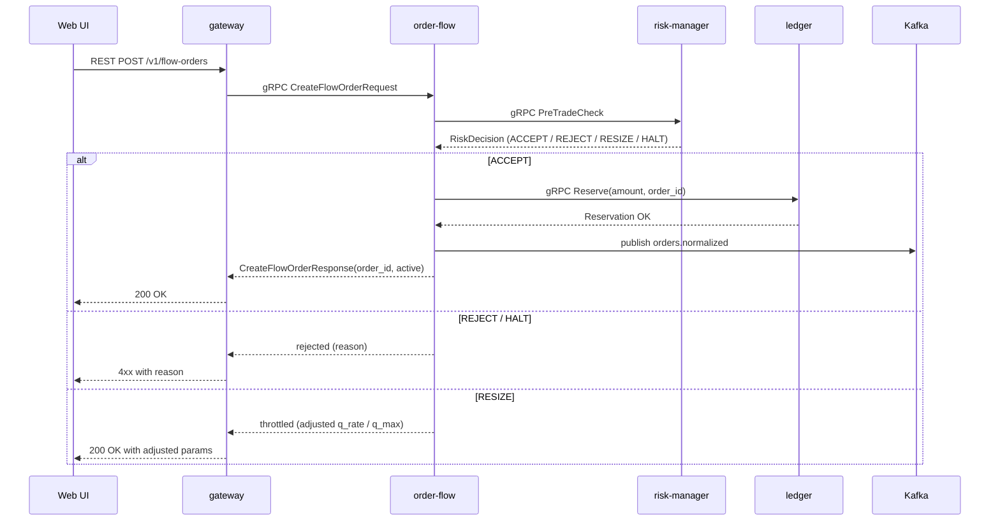

# SEQ-F02-UC-F02-01-services. Create FlowOrder: service view

## Type

Service Interaction Sequence

## Feature

- [F-02](../../02-system/features/F-02-create-floworder/)

## Use Case

- [UC-F02-01](../../02-system/use-cases/UC-F02-01-create-flow-order/use-case.md)

## Purpose

Полный путь команды CreateFlowOrder через все сервисы: REST → gRPC → Risk → Ledger → Kafka.

## Participants

- Web UI / API client
- gateway
- order-flow
- risk-manager
- ledger
- Kafka (`orders.normalized`)

## Diagram

## Contract Binding Table

| Step | Transport | Contract | Location |
| --- | --- | --- | --- |
| UI → GW | REST | `POST /v1/flow-orders` | [../../06-api/rest/](../../06-api/rest/) |
| GW → OF | gRPC | `fob.orders.v1.OrderFlowService/CreateFlowOrder` | [../../06-api/grpc/order-flow-create-flow-order.md](../../06-api/grpc/order-flow-create-flow-order.md) |
| OF → RISK | gRPC | `fob.risk.v1.RiskService/CheckNewOrder` (alias `PreTradeCheck`) | [../../06-api/grpc/risk-check-new-order.md](../../06-api/grpc/risk-check-new-order.md) |
| OF → LDG | gRPC | `fob.ledger.v1.LedgerService/ReserveFunds` (alias `Reserve`) | [../../06-api/grpc/ledger-reserve-funds.md](../../06-api/grpc/ledger-reserve-funds.md) |
| OF → Kafka | Kafka | `orders.normalized` | [../../06-api/messaging/orders-normalized.md](../../06-api/messaging/orders-normalized.md) |

## Data Binding Table

| Data Object | Storage | Location |
| --- | --- | --- |
| `flow_orders` | PostgreSQL (planned) | [../../07-data/data-overview.md](../../07-data/data-overview.md) |
| `accounts` / `reservations` | PostgreSQL (planned) | [../../07-data/data-overview.md](../../07-data/data-overview.md) |
| `risk_limits` | PostgreSQL (planned) | [../../07-data/data-overview.md](../../07-data/data-overview.md) |

## Related Components

- [gateway](../gateway/overview.md)
- [order-flow](../order-flow/overview.md)
- [risk-manager](../risk-manager/overview.md)
- [ledger](../ledger/overview.md)
