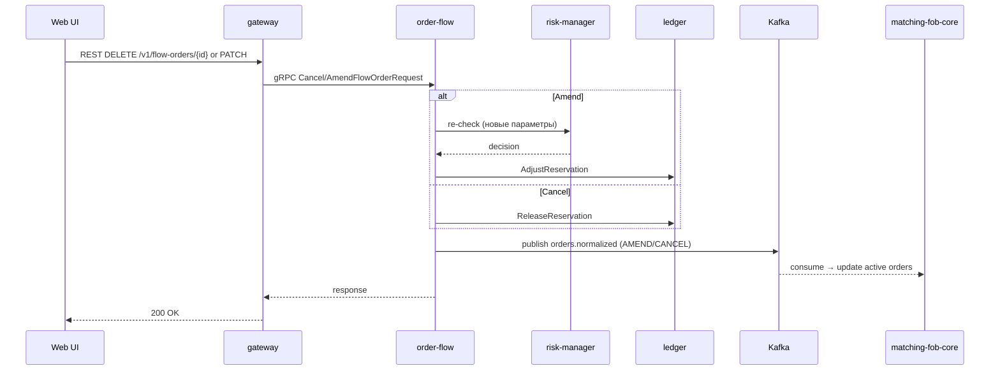

# SEQ-F03-UC-F03-01-services. Amend/Cancel FlowOrder: service view

## Type

Service Interaction Sequence

## Feature

- [F-03](../../02-system/features/F-03-order-lifecycle/)

## Use Case

- [UC-F03-01](../../02-system/use-cases/UC-F03-01-amend-cancel-order/use-case.md)

## Participants

- Web UI
- gateway
- order-flow
- risk-manager
- ledger
- matching-fob-core
- Kafka

## Diagram

## Contract Binding Table

| Step | Transport | Contract | Location |
| --- | --- | --- | --- |
| UI → GW | REST | `PATCH/DELETE /v1/flow-orders/{id}` | [../../06-api/rest/](../../06-api/rest/) |
| GW → OF | gRPC | `OrderFlowService/AmendFlowOrder` (planned) / `OrderFlowService/CancelFlowOrder` | [amend (planned)](../../06-api/grpc/order-flow-amend-flow-order.md), [cancel](../../06-api/grpc/order-flow-cancel-flow-order.md) |
| OF → RISK | gRPC | `RiskService/CheckNewOrder` (re-check) | [../../06-api/grpc/risk-check-new-order.md](../../06-api/grpc/risk-check-new-order.md) |
| OF → LDG | gRPC | `LedgerService/AdjustReservation` (planned) / `LedgerService/ReleaseFunds` (alias `ReleaseReservation`) | [adjust (planned)](../../06-api/grpc/ledger-adjust-reservation.md), [release](../../06-api/grpc/ledger-release-funds.md) |
| OF → Kafka | Kafka | `orders.normalized` (AMEND/CANCEL) | [../../06-api/messaging/orders-normalized.md](../../06-api/messaging/orders-normalized.md) |

## Data Binding Table

| Data Object | Storage | Location |
| --- | --- | --- |
| `flow_orders` | PostgreSQL | [../../07-data/data-overview.md](../../07-data/data-overview.md) |
| `reservations` | PostgreSQL | [../../07-data/data-overview.md](../../07-data/data-overview.md) |

## Related Components

- [gateway](../gateway/overview.md)
- [order-flow](../order-flow/overview.md)
- [risk-manager](../risk-manager/overview.md)
- [ledger](../ledger/overview.md)
- [matching-fob-core](../matching-fob-core/overview.md)
