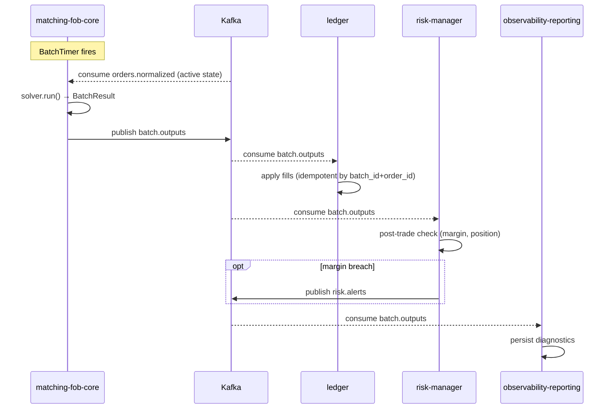

# SEQ-F04-UC-F04-01-services. Batch Clearing: service view

## Type

Service Interaction Sequence

## Feature

- [F-04](../../02-system/features/F-04-batch-clearing/)

## Use Case

- [UC-F04-01](../../02-system/use-cases/UC-F04-01-run-batch-clearing/use-case.md)

## Purpose

Внутренний цикл клиринга. Триггер — внутренний Scheduler внутри matching-fob-core (срабатывает каждые `solver_config.batch_interval_ms`). Распространение результатов через Kafka в ledger, risk и observability.

Внутренние шаги solver (RunBatch, loadActiveFlowOrders, getReferencePrices, solveBatch, saveBatchResult, saveFills) — см. [SEQ-MATCHING-001-solver-cycle](../matching-fob-core/sequences/SEQ-MATCHING-001-solver-cycle.md).

## Participants

- matching-fob-core
- Kafka (`orders.normalized` → matching; `batch.outputs` → ledger/risk/observability)
- ledger
- risk-manager
- observability-reporting

## Diagram

## Contract Binding Table

| Step | Transport | Contract | Location |
| --- | --- | --- | --- |
| M consumes | Kafka | `orders.normalized` | [../../06-api/messaging/orders-normalized.md](../../06-api/messaging/orders-normalized.md) |
| M produces | Kafka | `batch.outputs` (BatchResult, Fill, OrderUpdate) | [../../06-api/messaging/batch-outputs.md](../../06-api/messaging/batch-outputs.md) |
| RISK produces | Kafka | `risk.alerts` | [../../06-api/messaging/risk-alerts.md](../../06-api/messaging/risk-alerts.md) |

## Data Binding Table

| Data Object | Storage | Location |
| --- | --- | --- |
| `fills` | ClickHouse (planned) | [../../07-data/data-overview.md](../../07-data/data-overview.md) |
| `batch_results` | ClickHouse (planned) | [../../07-data/data-overview.md](../../07-data/data-overview.md) |
| `positions` | PostgreSQL (planned) | [../../07-data/data-overview.md](../../07-data/data-overview.md) |
| `accounts` | PostgreSQL (planned) | [../../07-data/data-overview.md](../../07-data/data-overview.md) |

## Related Components

- [matching-fob-core](../matching-fob-core/overview.md)
- [ledger](../ledger/overview.md)
- [risk-manager](../risk-manager/overview.md)
- [observability-reporting](../observability-reporting/overview.md)
