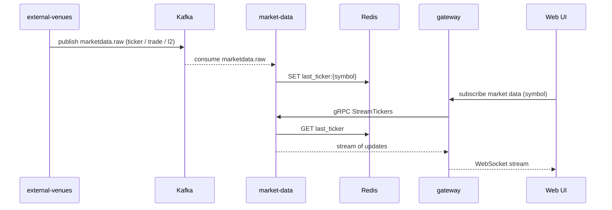

# SEQ-F05-UC-F05-01-services. Live Market Data: service view

## Type

Service Interaction Sequence

## Feature

- [F-05](../../02-system/features/F-05-live-market-data/)

## Use Case

- [UC-F05-01](../../02-system/use-cases/UC-F05-01-stream-market-data/use-case.md)

## Participants

- Web UI
- gateway
- market-data
- external-venues
- Kafka (`marketdata.raw`)
- Redis (ticker cache)

## Diagram

## Contract Binding Table

| Step | Transport | Contract | Location |
| --- | --- | --- | --- |
| V → Kafka | Kafka | `marketdata.raw` | [../../06-api/messaging/marketdata-raw.md](../../06-api/messaging/marketdata-raw.md) |
| GW → MD | gRPC | `fob.marketdata.v1.MarketDataService/StreamTickers` (planned) | [../../06-api/grpc/marketdata-stream-tickers.md](../../06-api/grpc/marketdata-stream-tickers.md) |
| (snapshot) | gRPC | `fob.marketdata.v1.MarketDataService/GetLastTicker` | [../../06-api/grpc/marketdata-get-last-ticker.md](../../06-api/grpc/marketdata-get-last-ticker.md) |
| MD ↔ Redis | Redis | `last_ticker:{symbol}` | [../../07-data/data-overview.md](../../07-data/data-overview.md) |
| GW → UI | WebSocket | tick stream (planned) | [../../06-api/rest/](../../06-api/rest/) |

## Data Binding Table

| Data Object | Storage | Location |
| --- | --- | --- |
| ticker cache | Redis | [../../07-data/data-overview.md](../../07-data/data-overview.md) |
| `marketdata` history | ClickHouse (planned) | [../../07-data/data-overview.md](../../07-data/data-overview.md) |

## Related Components

- [external-venues](../external-venues/overview.md)
- [market-data](../market-data/overview.md)
- [gateway](../gateway/overview.md)
