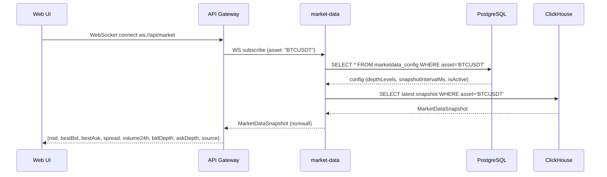
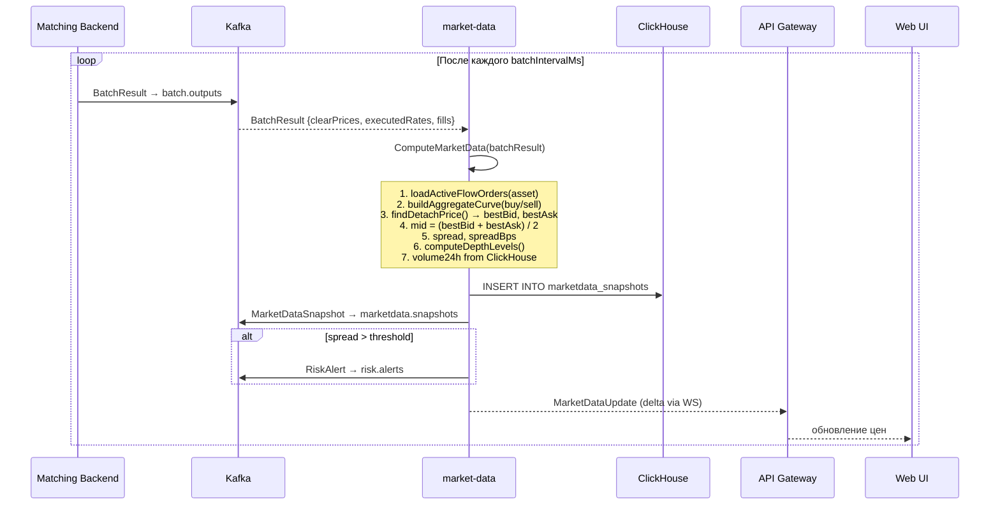
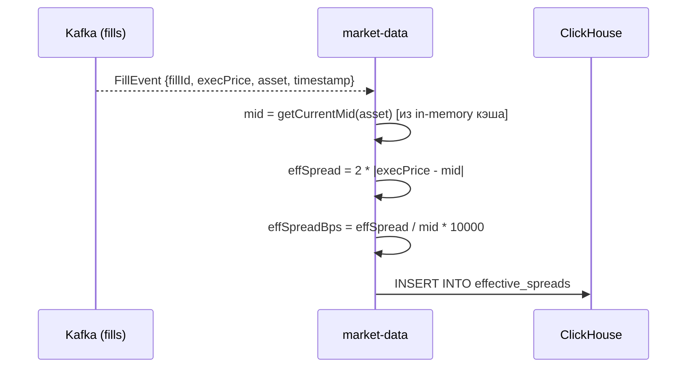
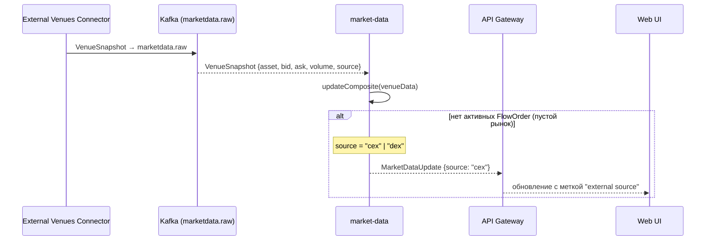
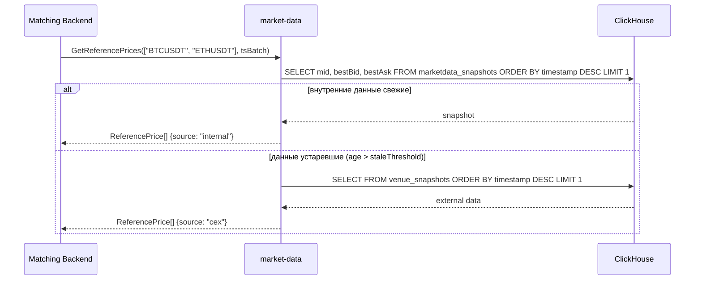

# SEQ-F05-UC-F05-01-services. Live Market Data: service view

## Type

Service Interaction Sequence

## Feature

- [F-05](../../02-system/features/F-05-live-market-data/)

## Use Case

- [UC-F05-01](../../02-system/use-cases/UC-F05-01-stream-market-data/use-case.md)

## Participants

- Web UI
- API Gateway
- market-data (Market Data Service)
- Matching Backend
- External Venues Connector
- Kafka (`batch.outputs`, `fills`, `marketdata.raw`, `marketdata.snapshots`, `risk.alerts`)
- ClickHouse (`marketdata_snapshots`, `effective_spreads`)
- PostgreSQL (`marketdata_config`)

## Diagram 1: Подключение и начальный snapshot

```mermaid
sequenceDiagram
    participant UI as Web UI
    participant GW as API Gateway
    participant MDS as market-data
    participant PG as PostgreSQL
    participant CH as ClickHouse

    UI->>GW: WebSocket connect ws://api/market
    GW->>MDS: WS subscribe {asset: "BTCUSDT"}
    MDS->>PG: SELECT * FROM marketdata_config WHERE asset='BTCUSDT'
    PG-->>MDS: config (depthLevels, snapshotIntervalMs, isActive)
    MDS->>CH: SELECT latest snapshot WHERE asset='BTCUSDT'
    CH-->>MDS: MarketDataSnapshot
    MDS-->>GW: MarketDataSnapshot (полный)
    GW-->>UI: {mid, bestBid, bestAsk, spread, volume24h, bidDepth, askDepth, source}
```

## Diagram 2: Обновление после batch-clearing (основной цикл)

```mermaid
sequenceDiagram
    participant MB as Matching Backend
    participant K as Kafka
    participant MDS as market-data
    participant CH as ClickHouse
    participant GW as API Gateway
    participant UI as Web UI

    loop После каждого batchIntervalMs
        MB->>K: BatchResult → batch.outputs
        K-->>MDS: BatchResult {clearPrices, executedRates, fills}
        MDS->>MDS: ComputeMarketData(batchResult)
        Note over MDS: 1. loadActiveFlowOrders(asset)<br/>2. buildAggregateCurve(buy/sell)<br/>3. findDetachPrice() → bestBid, bestAsk<br/>4. mid = (bestBid + bestAsk) / 2<br/>5. spread, spreadBps<br/>6. computeDepthLevels()<br/>7. volume24h from ClickHouse
        MDS->>CH: INSERT INTO marketdata_snapshots
        MDS->>K: MarketDataSnapshot → marketdata.snapshots
        alt spread > threshold
            MDS->>K: RiskAlert → risk.alerts
        end
        MDS-->>GW: MarketDataUpdate (delta via WS)
        GW-->>UI: обновление цен
    end
```

## Diagram 3: Расчёт effective spread (post-trade)

```mermaid
sequenceDiagram
    participant K as Kafka (fills)
    participant MDS as market-data
    participant CH as ClickHouse

    K-->>MDS: FillEvent {fillId, execPrice, asset, timestamp}
    MDS->>MDS: mid = getCurrentMid(asset)  [из in-memory кэша]
    MDS->>MDS: effSpread = 2 * |execPrice - mid|
    MDS->>MDS: effSpreadBps = effSpread / mid * 10000
    MDS->>CH: INSERT INTO effective_spreads
```

## Diagram 4: Внешние котировки и fallback

```mermaid
sequenceDiagram
    participant EV as External Venues Connector
    participant K as Kafka (marketdata.raw)
    participant MDS as market-data
    participant GW as API Gateway
    participant UI as Web UI

    EV->>K: VenueSnapshot → marketdata.raw
    K-->>MDS: VenueSnapshot {asset, bid, ask, volume, source}
    MDS->>MDS: updateComposite(venueData)
    alt нет активных FlowOrder (пустой рынок)
        Note over MDS: source = "cex" | "dex"
        MDS-->>GW: MarketDataUpdate {source: "cex"}
        GW-->>UI: обновление с меткой "external source"
    end
```

## Diagram 5: GetReferencePrices для Matching Backend

```mermaid
sequenceDiagram
    participant MB as Matching Backend
    participant MDS as market-data
    participant CH as ClickHouse

    MB->>MDS: GetReferencePrices(["BTCUSDT", "ETHUSDT"], tsBatch)
    MDS->>CH: SELECT mid, bestBid, bestAsk FROM marketdata_snapshots ORDER BY timestamp DESC LIMIT 1
    alt внутренние данные свежие
        CH-->>MDS: snapshot
        MDS-->>MB: ReferencePrice[] {source: "internal"}
    else данные устаревшие (age > staleThreshold)
        MDS->>CH: SELECT FROM venue_snapshots ORDER BY timestamp DESC LIMIT 1
        CH-->>MDS: external data
        MDS-->>MB: ReferencePrice[] {source: "cex"}
    end
```

## Contract Binding Table

| Шаг | Транспорт | Контракт | Документ |
|-----|-----------|----------|---------|
| UI → GW | WebSocket | subscribe `{action, asset}` | [../../06-api/rest/ws-market.md](../../06-api/rest/ws-market.md) |
| GW → MDS | gRPC stream | `MarketDataService/SubscribeMarketData` | [../../06-api/grpc/marketdata-stream-tickers.md](../../06-api/grpc/marketdata-stream-tickers.md) |
| GW → MDS | gRPC | `MarketDataService/GetMarketDataSnapshot` | [../../06-api/grpc/marketdata-get-market-snapshot.md](../../06-api/grpc/marketdata-get-market-snapshot.md) |
| MB → K | Kafka | `batch.outputs` → `BatchResult` | [../../06-api/messaging/batch-outputs.md](../../06-api/messaging/batch-outputs.md) |
| K → MDS | Kafka consumer | `fills` → `FillEvent` | [../../06-api/messaging/fills.md](../../06-api/messaging/fills.md) |
| K → MDS | Kafka consumer | `marketdata.raw` → `VenueSnapshot` | [../../06-api/messaging/marketdata-raw.md](../../06-api/messaging/marketdata-raw.md) |
| MDS → K | Kafka producer | `marketdata.snapshots` → `MarketDataSnapshot` | [../../06-api/messaging/marketdata-snapshots.md](../../06-api/messaging/marketdata-snapshots.md) |
| MDS → K | Kafka producer | `risk.alerts` → `RiskAlert` | [../../06-api/messaging/risk-alerts.md](../../06-api/messaging/risk-alerts.md) |
| MB → MDS | gRPC | `MarketDataService/GetReferencePrices` | [../../06-api/grpc/marketdata-get-reference-prices.md](../../06-api/grpc/marketdata-get-reference-prices.md) |
| MDS → CH | SQL/HTTP | INSERT `marketdata_snapshots` | [../../07-data/marketdata-snapshots.md](../../07-data/marketdata-snapshots.md) |
| MDS → CH | SQL/HTTP | INSERT `effective_spreads` | [../../07-data/effective-spreads.md](../../07-data/effective-spreads.md) |
| MDS → PG | SQL | SELECT `marketdata_config` | [../../07-data/marketdata-config.md](../../07-data/marketdata-config.md) |

## Data Binding Table

| Объект данных | Хранилище | Документ |
|--------------|-----------|---------|
| MarketDataSnapshot | ClickHouse `marketdata_snapshots` | [../../07-data/marketdata-snapshots.md](../../07-data/marketdata-snapshots.md) |
| EffectiveSpreadRecord | ClickHouse `effective_spreads` | [../../07-data/effective-spreads.md](../../07-data/effective-spreads.md) |
| marketdata_config | PostgreSQL | [../../07-data/marketdata-config.md](../../07-data/marketdata-config.md) |
| In-memory snapshot cache | memory (per asset) | [../../05-components/market-data/overview.md](../../05-components/market-data/overview.md) |

## Related Components

- [market-data](../market-data/overview.md)
- [gateway](../gateway/overview.md)
- [external-venues](../external-venues/overview.md)
- [matching-fob-core](../matching-fob-core/overview.md)
