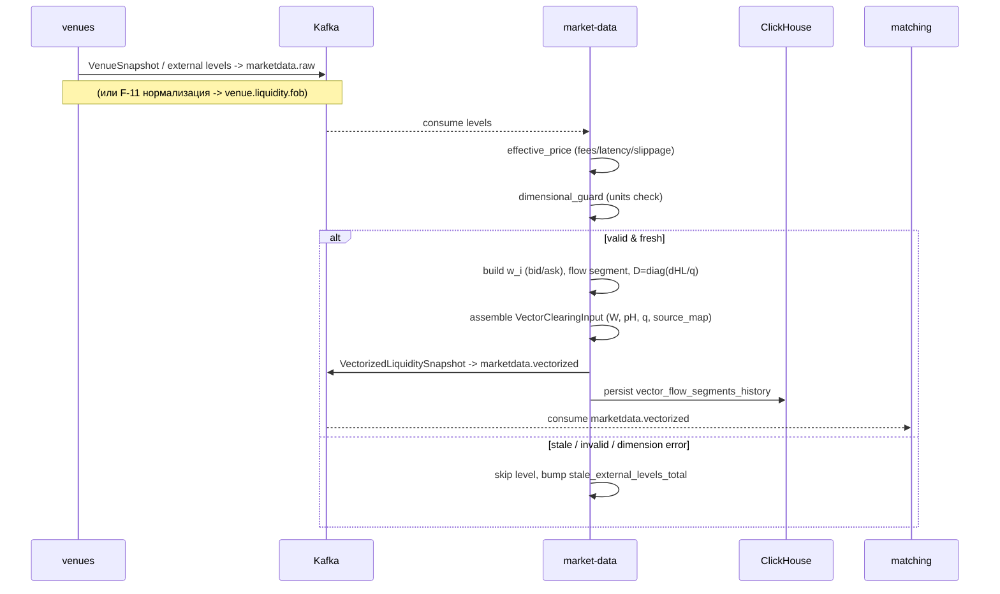

<!--
---
id: SEQ-F05A-UC-F05A-01-services
level: sea
---
-->

# SEQ-F05A-UC-F05A-01-services. Vectorize External Order Book: service view

## Type

Service Interaction Sequence (L1 🌊)

## Feature

- [F-05A. Vectorized External Liquidity](../../02-system/features/F-05-live-market-data/addendum-F05A-vectorized-external-liquidity.md)

## Use Case

- [UC-F05A-01. Vectorize External Order Book](../../02-system/use-cases/UC-F05A-01-vectorize-external-orderbook/use-case.md)

## Purpose

Детализирует прохождение внешнего стакана через компоненты: `venues` → Kafka →
`market-data` (нормализация, построение `w_i`, сборка `W`) → публикация
`marketdata.vectorized` + персист сегментов. Показывает ветки skip (stale/invalid).

## Participants

- venues (External Venues Connector)
- Kafka (`marketdata.raw`, `venue.liquidity.fob`, `marketdata.vectorized`)
- market-data
- ClickHouse (`vector_flow_segments_history`)
- matching (consumer)

## Diagram

## Related Contracts

- `contracts/proto/fob/marketdata/v1/vector_liquidity.proto` (planned)
- Kafka [marketdata.vectorized](../../06-api/messaging/marketdata-vectorized.md) (planned); consumes `marketdata.raw`, `venue.liquidity.fob`

## Related Components

- [market-data](../../05-components/), venues, matching

## Related Data

- CH `vector_flow_segments_history`; PG `asset_basis`, `vector_flow_segments`, `vectorization_runs` (planned)

## Contract binding

| Arrow | Transport | Contract |
| --- | --- | --- |
| venues → Kafka | Kafka | `marketdata.raw` (`VenueSnapshot`) / `venue.liquidity.fob` (F-11) |
| market-data → Kafka | Kafka | `marketdata.vectorized` (`VectorizedLiquiditySnapshot`) — planned |
| market-data → ClickHouse | SQL/HTTP | `vector_flow_segments_history` — planned |
