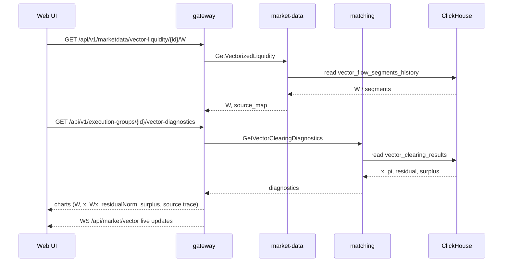

<!--
---
id: SEQ-F05A-UC-F05A-03-services
level: sea
---
-->

# SEQ-F05A-UC-F05A-03-services. Display Vector Liquidity: service view

## Type

Service Interaction Sequence (L1 🌊)

## Feature

- [F-05A. Vectorized External Liquidity](../../02-system/features/F-05-live-market-data/addendum-F05A-vectorized-external-liquidity.md)

## Use Case

- [UC-F05A-03. Display Vector Liquidity in UI](../../02-system/use-cases/UC-F05A-03-display-vector-liquidity/use-case.md)

## Purpose

Детализирует чтение vector-диагностики: Web UI → gateway (REST/WS) → market-data /
matching / ClickHouse и обратно.

## Participants

- Web UI
- gateway
- market-data
- matching
- ClickHouse (`vector_clearing_results`, `vector_flow_segments_history`)

## Diagram

## Related Contracts

- REST `/api/v1/marketdata/vector-liquidity*` (planned); gRPC `GetVectorizedLiquidity`, `GetVectorClearingDiagnostics`; WS `/api/market/vector`

## Related Components

- gateway, market-data, matching

## Related Data

- CH `vector_clearing_results`, `vector_flow_segments_history` (planned)

## Contract binding

| Arrow | Transport | Contract |
| --- | --- | --- |
| UI → gateway | REST/WS | `/api/v1/marketdata/vector-liquidity*`, `/api/market/vector` (planned) |
| gateway → market-data | gRPC | `MarketDataService.GetVectorizedLiquidity` (planned) |
| gateway → matching | gRPC | `GetVectorClearingDiagnostics` (planned) |
| market-data/matching → ClickHouse | SQL | `vector_clearing_results`, `vector_flow_segments_history` (planned) |
