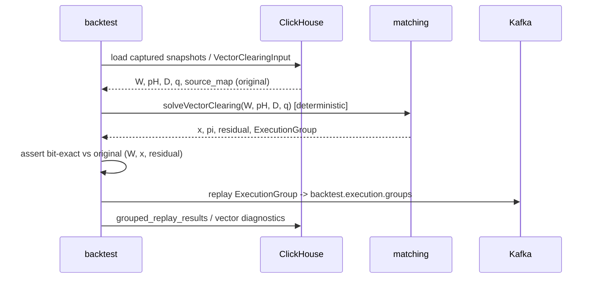

<!--
---
id: SEQ-F05A-UC-F05A-05-services
level: sea
---
-->

# SEQ-F05A-UC-F05A-05-services. Replay Vector Clearing: service view

## Type

Service Interaction Sequence (L1 🌊)

## Feature

- [F-05A. Vectorized External Liquidity](../../02-system/features/F-05-live-market-data/addendum-F05A-vectorized-external-liquidity.md)

## Use Case

- [UC-F05A-05. Replay Vector Clearing Scenario](../../02-system/use-cases/UC-F05A-05-replay-vector-clearing/use-case.md)

## Purpose

Детализирует replay: backtest (shadow namespace) воспроизводит vectorization + QP
через тот же matching-solver и сравнивает с оригиналом. Изолировано от live истории.

## Participants

- backtest (Replay Service)
- ClickHouse (captured `vector_flow_segments_history` / `vector_clearing_results`)
- matching (`vector_qp_solver`, deterministic)
- Kafka (`backtest.execution.groups`, replay-isolated)

## Diagram

## Related Contracts

- `backtest.execution.groups` (replay-isolated); `contracts/proto/fob/marketdata/v1/vector_liquidity.proto` (planned)

## Related Components

- backtest, matching, market-data

## Related Data

- CH `vector_clearing_results`, `grouped_replay_results`, `vector_flow_segments_history`

## Related ADR

- [ADR-048 QP solver backend (determinism)](../../03-architecture/adr/ADR-048-qp-solver-backend.md)

## Contract binding

| Arrow | Transport | Contract |
| --- | --- | --- |
| backtest → ClickHouse | SQL | `vector_flow_segments_history`, `vector_clearing_results` |
| backtest → matching | in-process / gRPC | `solveVectorClearing` (deterministic) |
| backtest → Kafka | Kafka | `backtest.execution.groups` (replay-isolated) |
