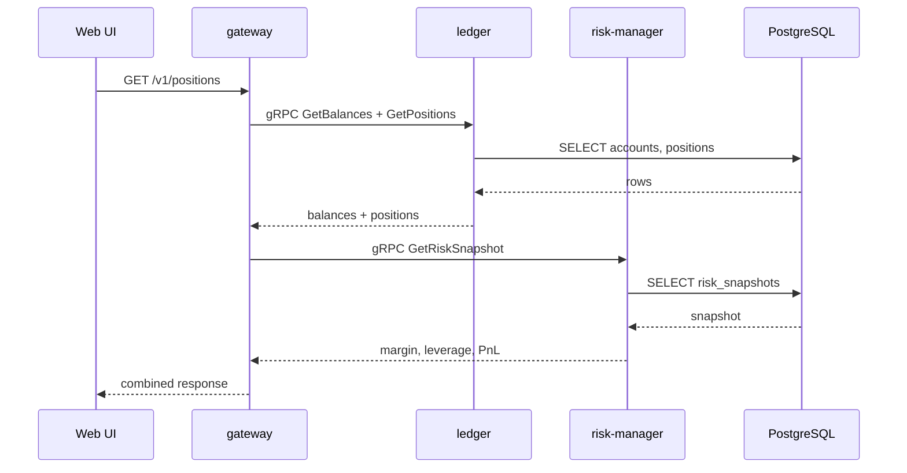

# SEQ-F06-UC-F06-01-services. Positions / PnL / Margin: service view

## Type

Service Interaction Sequence

## Feature

- [F-06](../../02-system/features/F-06-positions-pnl-margin/)

## Use Case

- [UC-F06-01](../../02-system/use-cases/UC-F06-01-show-positions/use-case.md)

## Participants

- Web UI
- gateway
- ledger
- risk-manager
- PostgreSQL

## Diagram

## Contract Binding Table

| Step | Transport | Contract | Location |
| --- | --- | --- | --- |
| UI → GW | REST | `GET /v1/positions` | [../../06-api/rest/](../../06-api/rest/) |
| GW → LDG | gRPC | `fob.ledger.v1.LedgerService/GetBalances` | [../../06-api/grpc/ledger-get-balances.md](../../06-api/grpc/ledger-get-balances.md) |
| GW → LDG | gRPC | `fob.ledger.v1.LedgerService/GetPositions` (planned) | [../../06-api/grpc/ledger-get-positions.md](../../06-api/grpc/ledger-get-positions.md) |
| GW → RISK | gRPC | `fob.risk.v1.RiskService/GetRiskSnapshot` (planned) | [../../06-api/grpc/risk-get-risk-snapshot.md](../../06-api/grpc/risk-get-risk-snapshot.md) |

## Data Binding Table

| Data Object | Storage | Location |
| --- | --- | --- |
| `accounts` | PostgreSQL | [../../07-data/data-overview.md](../../07-data/data-overview.md) |
| `positions` | PostgreSQL | [../../07-data/data-overview.md](../../07-data/data-overview.md) |
| `risk_snapshots` | PostgreSQL | [../../07-data/data-overview.md](../../07-data/data-overview.md) |

## Related Components

- [gateway](../gateway/overview.md)
- [ledger](../ledger/overview.md)
- [risk-manager](../risk-manager/overview.md)
