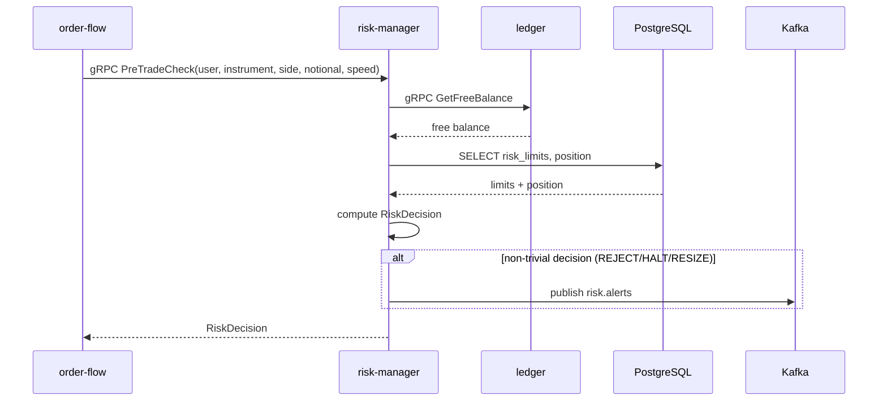

# SEQ-F07-UC-F07-01-services. Pre-trade Risk: service view

## Type

Service Interaction Sequence

## Feature

- [F-07](../../02-system/features/F-07-pretrade-risk/)

## Use Case

- [UC-F07-01](../../02-system/use-cases/UC-F07-01-pretrade-risk-check/use-case.md)

## Participants

- order-flow
- risk-manager
- ledger
- PostgreSQL
- Kafka (`risk.alerts`)

## Diagram

## Contract Binding Table

| Step | Transport | Contract | Location |
| --- | --- | --- | --- |
| OF → RISK | gRPC | `fob.risk.v1.RiskService/CheckNewOrder` (alias `PreTradeCheck`) | [../../06-api/grpc/risk-check-new-order.md](../../06-api/grpc/risk-check-new-order.md) |
| RISK → LDG | gRPC | `fob.ledger.v1.LedgerService/GetFreeBalance` (planned) | [../../06-api/grpc/ledger-get-free-balance.md](../../06-api/grpc/ledger-get-free-balance.md) |
| RISK → Kafka | Kafka | `risk.alerts` | [../../06-api/messaging/risk-alerts.md](../../06-api/messaging/risk-alerts.md) |

## Data Binding Table

| Data Object | Storage | Location |
| --- | --- | --- |
| `risk_limits` | PostgreSQL | [../../07-data/data-overview.md](../../07-data/data-overview.md) |
| `positions` | PostgreSQL | [../../07-data/data-overview.md](../../07-data/data-overview.md) |
| `accounts` | PostgreSQL | [../../07-data/data-overview.md](../../07-data/data-overview.md) |

## Related Components

- [order-flow](../order-flow/overview.md)
- [risk-manager](../risk-manager/overview.md)
- [ledger](../ledger/overview.md)
