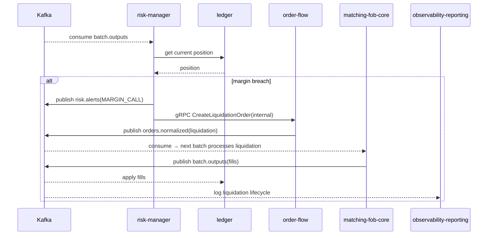

# SEQ-F08-UC-F08-01-services. Liquidation: service view

## Type

Service Interaction Sequence

## Feature

- [F-08](../../02-system/features/F-08-posttrade-risk-and-liquidations/)

## Use Case

- [UC-F08-01](../../02-system/use-cases/UC-F08-01-liquidate-position/use-case.md)

## Participants

- Kafka (`batch.outputs`, `risk.alerts`, `orders.normalized`)
- risk-manager
- ledger
- order-flow
- matching-fob-core
- observability-reporting

## Diagram

## Contract Binding Table

| Step | Transport | Contract | Location |
| --- | --- | --- | --- |
| K → RISK | Kafka | `batch.outputs` | [../../06-api/messaging/batch-outputs.md](../../06-api/messaging/batch-outputs.md) |
| RISK → Kafka | Kafka | `risk.alerts` | [../../06-api/messaging/risk-alerts.md](../../06-api/messaging/risk-alerts.md) |
| RISK → OF | gRPC | `OrderFlowService/CreateFlowOrder` (internal liquidation) | [../../06-api/grpc/order-flow-create-flow-order.md](../../06-api/grpc/order-flow-create-flow-order.md) |
| OF → Kafka | Kafka | `orders.normalized` | [../../06-api/messaging/orders-normalized.md](../../06-api/messaging/orders-normalized.md) |

## Data Binding Table

| Data Object | Storage | Location |
| --- | --- | --- |
| `positions` | PostgreSQL | [../../07-data/data-overview.md](../../07-data/data-overview.md) |
| `risk_snapshots` | PostgreSQL | [../../07-data/data-overview.md](../../07-data/data-overview.md) |
| `risk_events` | ClickHouse (planned) | [../../07-data/data-overview.md](../../07-data/data-overview.md) |

## Related Components

- [risk-manager](../risk-manager/overview.md)
- [ledger](../ledger/overview.md)
- [order-flow](../order-flow/overview.md)
- [matching-fob-core](../matching-fob-core/overview.md)
- [observability-reporting](../observability-reporting/overview.md)
