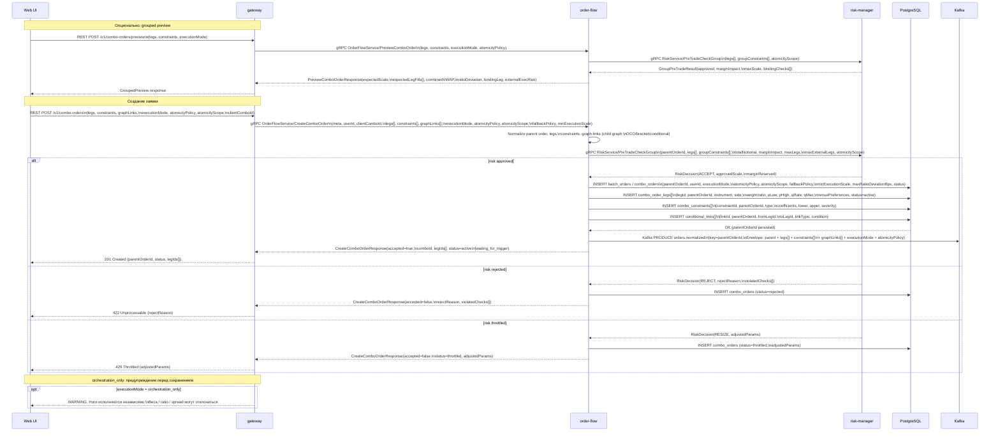

<!-- IN-013 frontmatter — Cockburn decomposition level.
---
id: SEQ-F09-UC-F09-01-services
level: sea
---
-->

# SEQ-F09-UC-F09-01-services. Create Combo / Batch Order: service view

## Type

Service Interaction Sequence

## Feature

- [F-09. Batch, Combo and Multi-leg Orders](../../02-system/features/F-09-batch-combo-orders/)

## Use Case

- [UC-F09-01. Создать combo / multi-leg order](../../02-system/use-cases/UC-F09-01-create-combo-order/use-case.md)

## Purpose

Детализирует прохождение команды `CreateComboOrder` / `CreateBatchOrder` через компоненты: от Web UI до публикации в `orders.normalized`. Включает grouped pre-trade risk check, persistence в PostgreSQL, опциональный grouped preview. Показывает ветки approve / reject / throttle.

## Participants

- Web UI
- gateway
- order-flow
- risk-manager
- PostgreSQL
- Kafka (`orders.normalized`)

## Diagram

```mermaid
sequenceDiagram
    participant UI as Web UI
    participant GW as gateway
    participant OF as order-flow
    participant RISK as risk-manager
    participant DB as PostgreSQL
    participant K as Kafka

    note over UI,GW: Опционально: grouped preview
    UI->>GW: REST POST /v1/combo-orders/preview\n(legs, constraints, executionMode)
    GW->>OF: gRPC OrderFlowService/PreviewComboOrder\n(legs, constraints, executionMode, atomicityPolicy)
    OF->>RISK: gRPC RiskService/PreTradeCheckGroup\n(legs[], groupConstraints[], atomicityScope)
    RISK-->>OF: GroupPreTradeResult(approved, marginImpact,\nmaxScale, bindingChecks[])
    OF-->>GW: PreviewComboOrderResponse(expectedScale,\nexpectedLegFills[], combinedVWAP,\nratioDeviation, bindingLeg, externalExecRisk)
    GW-->>UI: GroupedPreview response

    note over UI,GW: Создание заявки
    UI->>GW: REST POST /v1/combo-orders\n(legs, constraints, graphLinks,\nexecutionMode, atomicityPolicy, atomicityScope,\nclientComboId)
    GW->>OF: gRPC OrderFlowService/CreateComboOrder\n(meta, userId, clientComboId,\nlegs[], constraints[], graphLinks[],\nexecutionMode, atomicityPolicy, atomicityScope,\nfallbackPolicy, minExecutionScale)

    OF->>OF: Normalize parent order, legs,\nconstraints, graph links (child graph:\nOCO/bracket/conditional)

    OF->>RISK: gRPC RiskService/PreTradeCheckGroup\n(parentOrderId, legs[], groupConstraints[],\ntotalNotional, marginImpact, maxLegs,\nmaxExternalLegs, atomicityScope)

    alt risk approved
        RISK-->>OF: RiskDecision(ACCEPT, approvedScale,\nmarginReserved)
        OF->>DB: INSERT batch_orders / combo_orders\n(parentOrderId, userId, executionMode,\natomicityPolicy, atomicityScope, fallbackPolicy,\nminExecutionScale, maxRatioDeviationBps, status)
        OF->>DB: INSERT combo_order_legs[]\n(legId, parentOrderId, instrument, side,\nweight/ratio, pLow, pHigh, qRate, qMax,\nvenuePreferences, status=active)
        OF->>DB: INSERT combo_constraints[]\n(constraintId, parentOrderId, type,\ncoefficients, lower, upper, severity)
        OF->>DB: INSERT conditional_links[]\n(linkId, parentOrderId, fromLegId,\ntoLegId, linkType, condition)
        DB-->>OF: OK (parentOrderId persisted)
        OF->>K: Kafka PRODUCE orders.normalized\n(key=parentOrderId,\nEnvelope: parent + legs[] + constraints[]\n+ graphLinks[] + executionMode + atomicityPolicy)
        OF-->>GW: CreateComboOrderResponse(accepted=true,\ncomboId, legIds[], status=active\n|waiting_for_trigger)
        GW-->>UI: 201 Created (parentOrderId, status, legIds[])
    else risk rejected
        RISK-->>OF: RiskDecision(REJECT, rejectReason,\nviolatedChecks[])
        OF->>DB: INSERT combo_orders (status=rejected)
        OF-->>GW: CreateComboOrderResponse(accepted=false,\nrejectReason, violatedChecks[])
        GW-->>UI: 422 Unprocessable (rejectReason)
    else risk throttled
        RISK-->>OF: RiskDecision(RESIZE, adjustedParams)
        OF->>DB: INSERT combo_orders (status=throttled,\nadjustedParams)
        OF-->>GW: CreateComboOrderResponse(accepted=false,\nstatus=throttled, adjustedParams)
        GW-->>UI: 429 Throttled (adjustedParams)
    end

    note over UI,GW: orchestration_only: предупреждение перед сохранением
    opt executionMode = orchestration_only
        GW-->>UI: WARNING. Ноги исполняются независимо.\nВеса / ratio / spread могут отклониться
    end
```

## Contract Binding Table

| Step | Transport | Contract / Message | Location |
| --- | --- | --- | --- |
| UI → GW (preview) | REST | `POST /v1/combo-orders/preview` | docs/06-api/rest/combo-orders.md (TODO contract) |
| GW → OF (preview) | gRPC | `OrderFlowService/PreviewComboOrder` | docs/06-api/grpc/order-flow-preview-combo-order.md (TODO contract) |
| UI → GW (create) | REST | `POST /v1/combo-orders` | docs/06-api/rest/combo-orders.md (TODO contract) |
| GW → OF (create) | gRPC | `OrderFlowService/CreateComboOrder` | docs/06-api/grpc/order-flow-create-combo-order.md |
| OF → RISK (pre-trade group) | gRPC | `RiskService/PreTradeCheckGroup` | docs/06-api/grpc/risk-pre-trade-check-group.md (TODO contract) |
| OF → DB (parent) | SQL | INSERT `batch_orders` / `combo_orders` | docs/07-data/oltp-schema.md |
| OF → DB (legs) | SQL | INSERT `combo_order_legs` | docs/07-data/oltp-schema.md |
| OF → DB (constraints) | SQL | INSERT `combo_constraints` | docs/07-data/oltp-schema.md |
| OF → DB (graph) | SQL | INSERT `conditional_links` | docs/07-data/oltp-schema.md |
| OF → Kafka | Kafka | `orders.normalized` (key=`parentOrderId`) | docs/06-api/messaging/orders-normalized.md |

## Data Binding Table

| Data Object | Storage | Location |
| --- | --- | --- |
| `batch_orders` | PostgreSQL | docs/07-data/oltp-schema.md |
| `combo_orders` | PostgreSQL | docs/07-data/oltp-schema.md |
| `combo_order_legs` | PostgreSQL | docs/07-data/oltp-schema.md |
| `combo_constraints` | PostgreSQL | docs/07-data/oltp-schema.md |
| `conditional_links` | PostgreSQL | docs/07-data/oltp-schema.md |

## Related Components

- [gateway](../gateway/overview.md)
- [order-flow](../order-flow/overview.md)
- [risk-manager](../risk-manager/overview.md)
- [matching-fob-core](../matching-fob-core/overview.md)
- [ledger](../ledger/overview.md)

## Related Contracts

- [OrderFlowService/CreateComboOrder | PreviewComboOrder](../../06-api/grpc/order-flow-create-combo-order.md)
- `RiskService/PreTradeCheckGroup` — docs/06-api/grpc/risk-pre-trade-check-group.md (TODO contract)
- [orders.normalized](../../06-api/messaging/orders-normalized.md)

## Related Data Objects

- [oltp-schema.md — batch_orders, combo_orders, combo_order_legs, combo_constraints, conditional_links](../../07-data/oltp-schema.md)

## Source

- IN-011 §7 UC-F09-001, §11.1, §11.2, §12.2, §12.3, §12.4, §13.1, §16
- ADR-031, ADR-032
