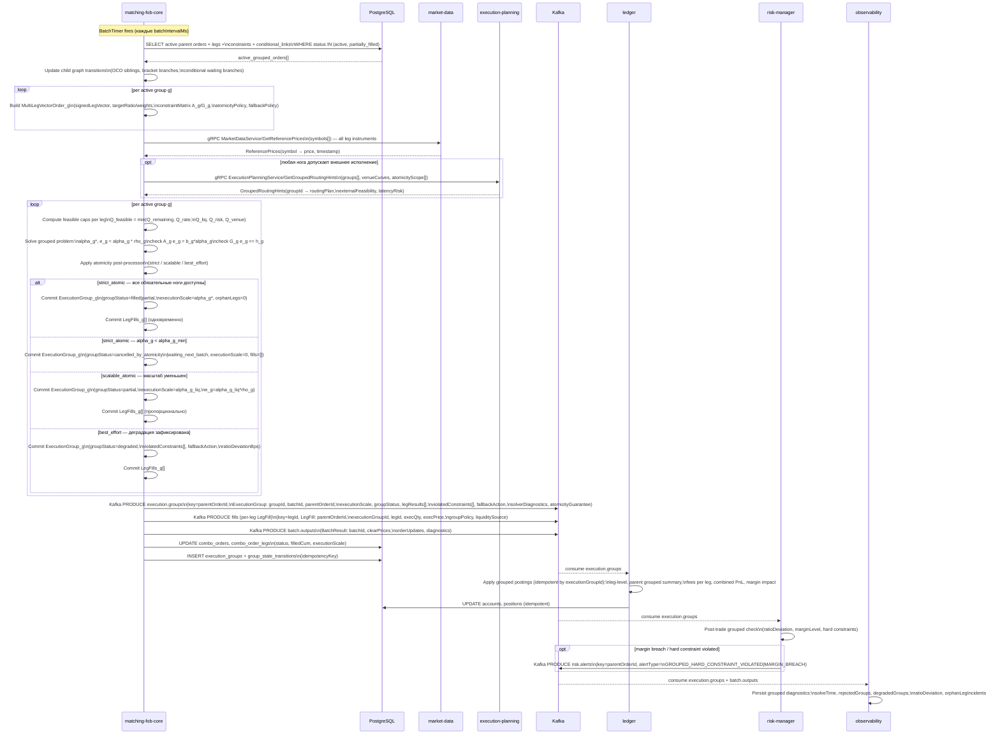

# SEQ-F09-UC-F09-02-services. Grouped Matching (batch cycle): service view

## Type

Service Interaction Sequence

## Feature

- [F-09. Batch, Combo and Multi-leg Orders](../../02-system/features/F-09-batch-combo-orders/)

## Use Case

- [UC-F09-02. Grouped matching внутри batch cycle](../../02-system/use-cases/UC-F09-02-grouped-matching/use-case.md)

## Purpose

Детализирует внутренний цикл grouped matching внутри matching-fob-core: загрузку активных групповых заявок из PostgreSQL, получение reference prices от market-data, routing hints от execution-planning, построение `MultiLegVectorOrder`, grouped solve, применение atomicity/fallback policy, публикацию `execution.groups` и per-leg `fills`, применение grouped postings в ledger, post-trade grouped risk check, observability.

Триггер: внутренний BatchTimer в matching-fob-core (каждые `batchIntervalMs`).

## Participants

- matching-fob-core
- PostgreSQL
- market-data
- execution-planning
- Kafka (`execution.groups`, `fills`, `batch.outputs`, `risk.alerts`)
- ledger
- risk-manager
- observability

## Diagram

## Contract Binding Table

| Step | Transport | Contract / Message | Location |
| --- | --- | --- | --- |
| M → DB (load orders) | SQL | SELECT `batch_orders`, `combo_orders`, `combo_order_legs`, `combo_constraints`, `conditional_links` | docs/07-data/oltp-schema.md |
| M → MDS | gRPC | `MarketDataService/GetReferencePrices` | docs/06-api/grpc/marketdata-get-reference-prices.md |
| M → EP | gRPC | `ExecutionPlanningService/GetGroupedRoutingHints` | docs/06-api/grpc/execution-planning-routing-hints.md (TODO contract) |
| M → Kafka (groups) | Kafka | `execution.groups` (key=`parentOrderId`, schema=`fob.matching.v1.ExecutionGroup`) | docs/06-api/messaging/execution-groups.md |
| M → Kafka (fills) | Kafka | `fills` (key=`legId`, LegFill extended) | docs/06-api/messaging/topics.md |
| M → Kafka (batch) | Kafka | `batch.outputs` (BatchResult) | docs/06-api/messaging/batch-outputs.md |
| M → DB (persist groups) | SQL | INSERT `execution_groups`, `group_state_transitions`; UPDATE `combo_orders`, `combo_order_legs` | docs/07-data/oltp-schema.md |
| LDG consumes | Kafka | `execution.groups` (idempotent by `executionGroupId`) | docs/06-api/messaging/execution-groups.md |
| RISK consumes | Kafka | `execution.groups` | docs/06-api/messaging/execution-groups.md |
| RISK → Kafka (alerts) | Kafka | `risk.alerts` (key=`parentOrderId`) | docs/06-api/messaging/risk-alerts.md |
| OBS consumes | Kafka | `execution.groups`, `batch.outputs` | docs/06-api/messaging/execution-groups.md |

## Data Binding Table

| Data Object | Storage | Location |
| --- | --- | --- |
| `batch_orders`, `combo_orders`, `combo_order_legs`, `combo_constraints`, `conditional_links` | PostgreSQL | docs/07-data/oltp-schema.md |
| `execution_groups` | PostgreSQL | docs/07-data/oltp-schema.md |
| `group_state_transitions` | PostgreSQL | docs/07-data/oltp-schema.md |
| `accounts`, `positions` | PostgreSQL | docs/07-data/oltp-schema.md |
| `grouped_execution_events`, `grouped_leg_fills`, `grouped_quality_metrics` | ClickHouse | docs/07-data/olap-schema.md |

## Related Components

- [matching-fob-core](../matching-fob-core/overview.md)
- [market-data](../market-data/overview.md)
- [execution-planning](../execution-planning/overview.md)
- [ledger](../ledger/overview.md)
- [risk-manager](../risk-manager/overview.md)
- [observability](../observability/overview.md)

## Related Contracts

- [MarketDataService/GetReferencePrices](../../06-api/grpc/marketdata-get-reference-prices.md)
- `ExecutionPlanningService/GetGroupedRoutingHints` — docs/06-api/grpc/execution-planning-routing-hints.md (TODO contract)
- [execution.groups](../../06-api/messaging/execution-groups.md)
- [batch.outputs](../../06-api/messaging/batch-outputs.md)
- [topics.md (fills, risk.alerts)](../../06-api/messaging/topics.md)

## Related Data Objects

- [oltp-schema.md](../../07-data/oltp-schema.md)
- [olap-schema.md](../../07-data/olap-schema.md)

## Source

- IN-011 §7 UC-F09-002, §9, §11.3–§11.6, §12.5, §12.9, §13.2, §13.3, §14, §16
- ADR-031, ADR-032, ADR-033
