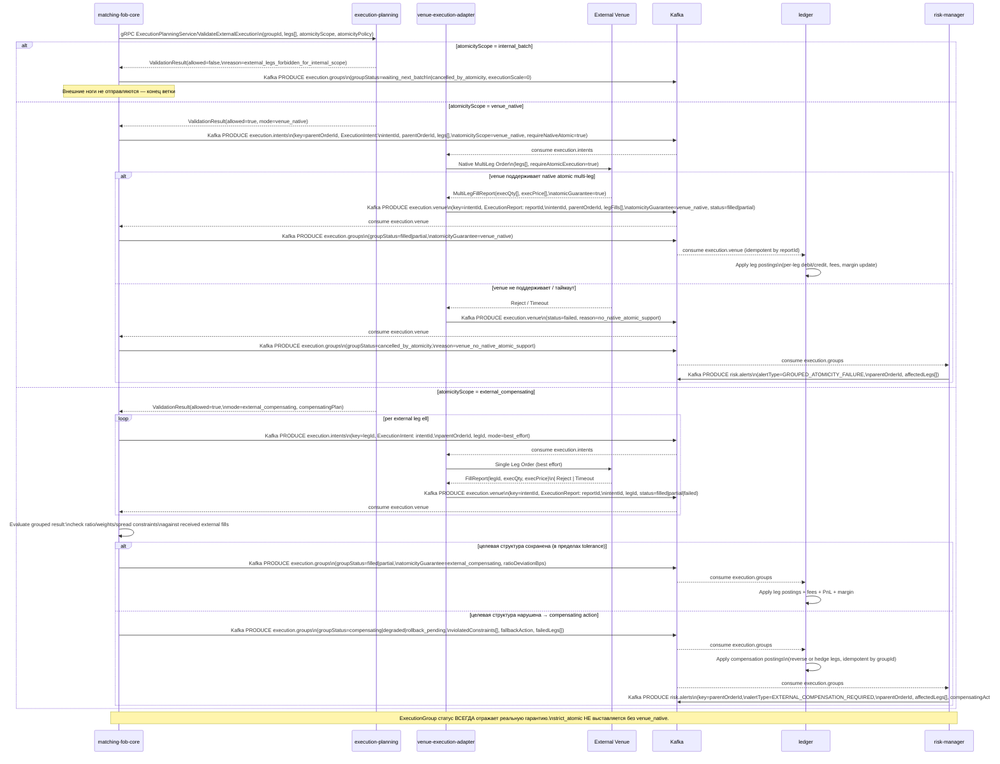

<!-- IN-013 frontmatter — Cockburn decomposition level.
---
id: SEQ-F09-UC-F09-03-services
level: sea
---
-->

# SEQ-F09-UC-F09-03-services. External Leg Execution / Compensating: service view

## Type

Service Interaction Sequence

## Feature

- [F-09. Batch, Combo and Multi-leg Orders](../../02-system/features/F-09-batch-combo-orders/)

## Use Case

- [UC-F09-03. External leg execution / compensating](../../02-system/use-cases/UC-F09-03-external-leg-execution/use-case.md)

## Purpose

Детализирует прохождение внешних ног многоногой заявки через execution-planning → venue-execution-adapter → External Venue. Ветвление по `atomicityScope` (internal_batch запрещает внешние ноги; venue_native отправляет нативный multi-leg order; external_compensating — best-effort + compensating action). Включает ledger compensation postings и публикацию risk.alerts при необходимости компенсации.

Триггер: в grouped solve ([UC-F09-02](../../02-system/use-cases/UC-F09-02-grouped-matching/use-case.md)) matching-fob-core определяет ноги с `venuePreferences != only_internal`.

## Participants

- matching-fob-core
- execution-planning
- venue-execution-adapter
- External Venue
- Kafka (`execution.intents`, `execution.venue`, `execution.groups`, `risk.alerts`)
- ledger
- risk-manager

## Diagram

## Contract Binding Table

| Step | Transport | Contract / Message | Location |
| --- | --- | --- | --- |
| M → EP (validate) | gRPC | `ExecutionPlanningService/ValidateExternalExecution` | docs/06-api/grpc/execution-planning-validate-external.md (TODO contract) |
| M → Kafka (intents) | Kafka | `execution.intents` (key=`parentOrderId`\|`legId`) | docs/06-api/messaging/topics.md |
| VEA → External Venue | External API | Venue-specific REST/FIX (venue_native or single-leg) | docs/06-api/rest/external-venue-adapter.md (TODO contract) |
| VEA → Kafka (reports) | Kafka | `execution.venue` (key=`intentId`, `ExecutionReport`) | docs/06-api/messaging/topics.md |
| M → Kafka (groups) | Kafka | `execution.groups` (key=`parentOrderId`, `ExecutionGroup`) | docs/06-api/messaging/execution-groups.md |
| LDG consumes | Kafka | `execution.groups` (idempotent by `executionGroupId`) | docs/06-api/messaging/execution-groups.md |
| RISK consumes | Kafka | `execution.groups` | docs/06-api/messaging/execution-groups.md |
| RISK → Kafka (alerts) | Kafka | `risk.alerts` (key=`parentOrderId`) | docs/06-api/messaging/risk-alerts.md |

## Data Binding Table

| Data Object | Storage | Location |
| --- | --- | --- |
| `execution_groups` | PostgreSQL | docs/07-data/oltp-schema.md |
| `group_state_transitions` | PostgreSQL | docs/07-data/oltp-schema.md |
| `combo_order_legs` (status=failed_external\|compensated) | PostgreSQL | docs/07-data/oltp-schema.md |
| `accounts`, `positions` (compensation postings) | PostgreSQL | docs/07-data/oltp-schema.md |
| `grouped_execution_events` (external_compensating history) | ClickHouse | docs/07-data/olap-schema.md |

## Related Components

- [matching-fob-core](../matching-fob-core/overview.md)
- [execution-planning](../execution-planning/overview.md)
- [venue-execution-adapter](../venue-execution-adapter/overview.md)
- [ledger](../ledger/overview.md)
- [risk-manager](../risk-manager/overview.md)

## Related Contracts

- `ExecutionPlanningService/ValidateExternalExecution` — docs/06-api/grpc/execution-planning-validate-external.md (TODO contract)
- [execution.intents / execution.venue](../../06-api/messaging/topics.md)
- [execution.groups](../../06-api/messaging/execution-groups.md)
- [topics.md (risk.alerts)](../../06-api/messaging/topics.md)

## Related Data Objects

- [oltp-schema.md](../../07-data/oltp-schema.md)
- [olap-schema.md](../../07-data/olap-schema.md)

## Source

- IN-011 §7 UC-F09-003, §2.2, §10.5, §12.7, §12.8, §13.4, §15.2, §15.3
- ADR-031 (atomicityScope), ADR-033 (execution.groups)
