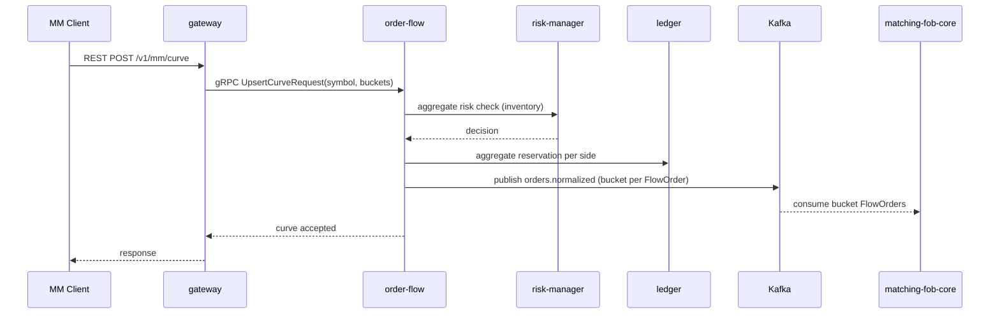

# SEQ-F10-UC-F10-01-services. MM Curve: service view

## Type

Service Interaction Sequence

## Feature

- [F-10](../../02-system/features/F-10-mm-curves/)

## Use Case

- [UC-F10-01](../../02-system/use-cases/UC-F10-01-publish-mm-curve/use-case.md)

## Participants

- Web UI / MM Client
- gateway
- order-flow
- risk-manager
- ledger
- matching-fob-core
- Kafka

## Diagram

## Contract Binding Table

| Step | Transport | Contract | Location |
| --- | --- | --- | --- |
| MM → GW | REST | `POST /v1/mm/curve` (planned) | [../../06-api/rest/](../../06-api/rest/) |
| GW → OF | gRPC | `OrderFlowService/UpsertCurve` (planned) | [../../06-api/grpc/order-flow-upsert-curve.md](../../06-api/grpc/order-flow-upsert-curve.md) |
| OF → Kafka | Kafka | `orders.normalized` (mm tag) | [../../06-api/messaging/orders-normalized.md](../../06-api/messaging/orders-normalized.md) |

## Data Binding Table

| Data Object | Storage | Location |
| --- | --- | --- |
| `flow_orders` (mm tag) | PostgreSQL | [../../07-data/data-overview.md](../../07-data/data-overview.md) |

## Related Components

- [gateway](../gateway/overview.md)
- [order-flow](../order-flow/overview.md)
- [risk-manager](../risk-manager/overview.md)
- [ledger](../ledger/overview.md)
- [matching-fob-core](../matching-fob-core/overview.md)
