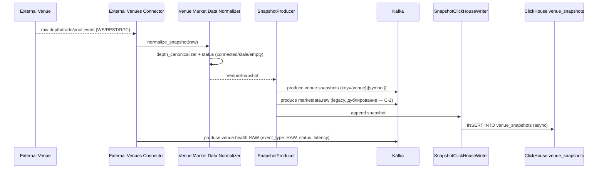

# SEQ-F11-02-publish-snapshot-services. Publish VenueSnapshot: service view

## Type

Service Interaction Sequence

## Feature

- [F-11](../../02-system/features/F-11-external-venues-lob-to-fob/)

## Use Case

- [UC-F11-02](../../02-system/use-cases/UC-F11-02-publish-snapshot/use-case.md)

## Purpose

Поток нормализации сырых данных от внешней площадки и публикации `VenueSnapshot` в Kafka + ClickHouse + RAW heartbeat в `venue.health`.

## Participants

- External Venue (CEX / DEX / AMM)
- External Venues Connector (cpp/venues — adapter)
- Venue Market Data Normalizer (cpp/venues — domain)
- SnapshotProducer (cpp/venues — app)
- Kafka (`venue.snapshots`, legacy `marketdata.raw`, `venue.health`)
- SnapshotClickHouseWriter (cpp/venues — infra)
- ClickHouse `venue_snapshots`

## Diagram

## Contract Binding Table

| Step                          | Transport | Contract                                                                     | Location                                                                                                              |
| ----------------------------- | --------- | ---------------------------------------------------------------------------- | --------------------------------------------------------------------------------------------------------------------- |
| Venue → Connector             | venue SDK | venue-native                                                                 | venue docs (Binance/Coinbase/Uniswap)                                                                                 |
| Connector → Normalizer        | in-proc   | `normalize_snapshot(raw) → VenueSnapshot`                                    | [cpp/venues/src/domain/normalize_snapshot.cpp](../../../cpp/venues/src/domain/normalize_snapshot.cpp)                 |
| SnapshotProducer → Kafka      | Kafka     | `venue.snapshots`, `fob.venue.v1.VenueSnapshot`                              | [docs/06-api/messaging/venue-topics.md#venue-snapshots](../../06-api/messaging/venue-topics.md#venue-snapshots)       |
| SnapshotProducer → Kafka      | Kafka     | `marketdata.raw` (legacy), `fob.marketdata.v1.MarketDataRaw`                 | [docs/06-api/messaging/marketdata-raw.md](../../06-api/messaging/marketdata-raw.md)                                   |
| Connector → Kafka             | Kafka     | `venue.health` (RAW), `fob.venue.v1.VenueHealth`                             | [docs/06-api/messaging/venue-topics.md#venue-health](../../06-api/messaging/venue-topics.md#venue-health)             |
| Writer → ClickHouse           | HTTP      | `INSERT INTO venue_snapshots`                                                | [docs/07-data/venue-snapshots.md](../../07-data/venue-snapshots.md)                                                   |

## Data Binding Table

| Data Object         | Storage     | Notes                                                              |
| ------------------- | ----------- | ------------------------------------------------------------------ |
| `venue.snapshots`   | Kafka       | retention ≈ 1 h (см. `infra/kafka/create_topics.sh`)               |
| `venue_snapshots`   | ClickHouse  | retention ≥ 90 дней (env `VENUES_CLICKHOUSE_RETENTION_DAYS=90`)    |
| last snapshot cache | in-memory   | `VenuesLoop::last_snapshots_` для `GET /api/v1/venues/{id}`        |

## Related Components

- [external-venues-connector](../external-venues-connector/overview.md)
- [venue-market-data-normalizer](../venue-market-data-normalizer/overview.md)
