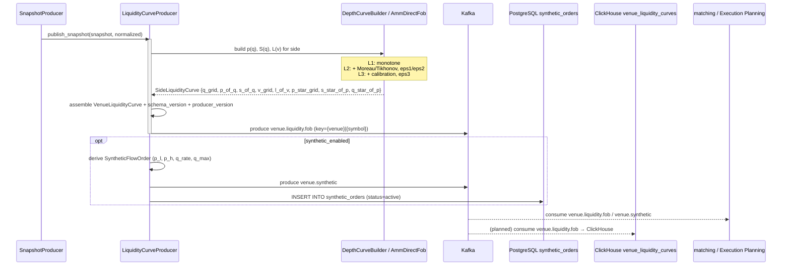

# SEQ-F11-03-build-curve-services. Build VenueLiquidityCurve: service view

## Type

Service Interaction Sequence

## Feature

- [F-11](../../02-system/features/F-11-external-venues-lob-to-fob/)

## Use Case

- [UC-F11-03](../../02-system/use-cases/UC-F11-03-build-liquidity-curve/use-case.md)

## Purpose

Поток LOB → FOB: SnapshotProducer передаёт VenueSnapshot в LiquidityCurveProducer, который строит p(q)/S(q)/L(v), публикует `VenueLiquidityCurve` в Kafka + опционально материализует `SyntheticFlowOrder` (Kafka + PostgreSQL).

## Participants

- SnapshotProducer (cpp/venues, см. SEQ-F11-02)
- LiquidityCurveProducer (cpp/venues — app)
- DepthCurveBuilder / AmmDirectFob (cpp/venues — domain)
- Kafka (`venue.liquidity.fob`, `venue.synthetic`)
- PostgresSyntheticOrderRepository (cpp/venues — infra)
- PostgreSQL `synthetic_orders`
- ClickHouse `venue_liquidity_curves` (ingestion pending)
- Matching / Execution Planning (consumers, см. F-04 / F-12)

## Diagram

## Contract Binding Table

| Step                              | Transport | Contract                                                                                | Location                                                                                                                          |
| --------------------------------- | --------- | --------------------------------------------------------------------------------------- | --------------------------------------------------------------------------------------------------------------------------------- |
| LCP → Kafka                       | Kafka     | `venue.liquidity.fob`, `fob.venue.v1.VenueLiquidityCurve`                               | [docs/06-api/messaging/venue-topics.md#venue-liquidity-fob](../../06-api/messaging/venue-topics.md#venue-liquidity-fob)            |
| LCP → Kafka                       | Kafka     | `venue.synthetic`, `fob.orders.v1.SyntheticFlowOrder`                                   | [docs/06-api/messaging/venue-topics.md#venue-synthetic](../../06-api/messaging/venue-topics.md#venue-synthetic)                    |
| LCP → PostgreSQL                  | SQL       | `INSERT INTO synthetic_orders … status='active'`                                        | [docs/07-data/synthetic-orders.md](../../07-data/synthetic-orders.md)                                                              |
| (planned) Kafka → ClickHouse      | Kafka     | `venue.liquidity.fob` → `venue_liquidity_curves`                                        | [docs/07-data/venue-liquidity-curves.md](../../07-data/venue-liquidity-curves.md)                                                  |
| matching ← Kafka                  | Kafka     | `venue.liquidity.fob` consumer-group `matching-external-venues`                          | [cpp/matching/tests/app/external_venue_filter_test.cpp](../../../cpp/matching/tests/app/external_venue_filter_test.cpp) (filter)   |

## Data Binding Table

| Data Object                  | Storage     | Notes                                                                                |
| ---------------------------- | ----------- | ------------------------------------------------------------------------------------ |
| `venue_liquidity_curves`     | ClickHouse  | history с retention ≥ 90 дней                                                        |
| `synthetic_orders`           | PostgreSQL  | lifecycle `active` → `expired` (по TTL) → `used` (после matching)                    |
| last curve cache             | in-memory   | `VenuesLoop::last_curves_` для `GET /api/v1/venues/{id}/curves`                      |

## Related Components

- [venue-liquidity-curve-builder](../venue-liquidity-curve-builder/overview.md)
- [venue-market-data-normalizer](../venue-market-data-normalizer/overview.md)
