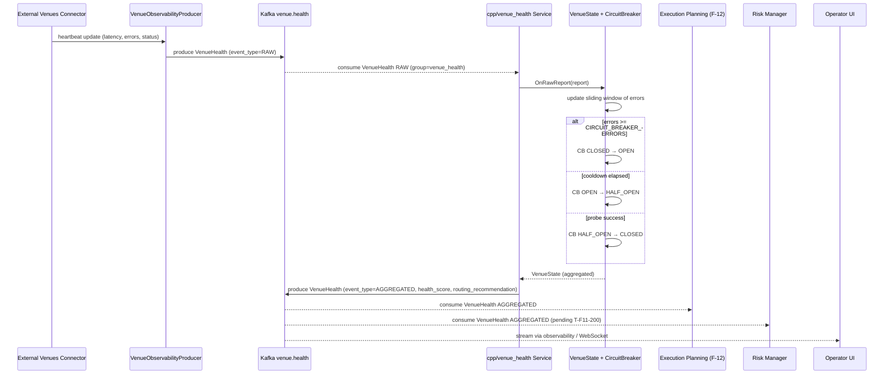

<!-- IN-013 frontmatter — Cockburn decomposition level.
---
id: SEQ-F11-04-health-routing-services
level: sea
---
-->

# SEQ-F11-04-health-routing-services. Venue health & routing: service view

## Type

Service Interaction Sequence

## Feature

- [F-11](../../02-system/features/F-11-external-venues-lob-to-fob/)

## Use Case

- [UC-F11-04](../../02-system/use-cases/UC-F11-04-venue-health-degradation/use-case.md)

## Purpose

Поток вычисления aggregated health-score и реакции системы на деградацию площадки. Включает stale detection (cpp/venues), circuit breaker FSM (cpp/venue_health), публикацию AGGREGATED VenueHealth и реакцию consumers (matching/Execution Planning).

## Participants

- External Venues Connector (cpp/venues)
- VenueObservabilityProducer (cpp/venues — infra)
- Kafka `venue.health`
- cpp/venue_health Service (Kafka consumer + state machine)
- VenueState + CircuitBreaker (cpp/venue_health — domain)
- KafkaProducer health publisher (cpp/venue_health — infra)
- Execution Planning (consumer, F-12)
- Risk Manager (consumer, pending)
- Observability / Operator UI

## Diagram

## Contract Binding Table

| Step                                  | Transport | Contract                                                                                                            | Location                                                                                                              |
| ------------------------------------- | --------- | ------------------------------------------------------------------------------------------------------------------- | --------------------------------------------------------------------------------------------------------------------- |
| Connector → VenueObservabilityProducer | in-proc   | `VenueHeartbeat → fob.venue.v1.VenueHealth`                                                                          | [cpp/venues/src/infra/venue_observability_producer.cpp](../../../cpp/venues/src/infra/venue_observability_producer.cpp) |
| Producer → Kafka                      | Kafka     | `venue.health` (event_type=RAW), `fob.venue.v1.VenueHealth`                                                          | [docs/06-api/messaging/venue-topics.md#venue-health](../../06-api/messaging/venue-topics.md#venue-health)             |
| Health Service → Kafka                | Kafka     | `venue.health` (event_type=AGGREGATED), `fob.venue.v1.VenueHealth`                                                   | [docs/06-api/messaging/venue-topics.md#venue-health](../../06-api/messaging/venue-topics.md#venue-health)             |
| Execution Planning ← Kafka            | Kafka     | filter `event_type=AGGREGATED`, использовать `routing_recommendation`                                                 | F-12 cross-link; см. [cpp/matching/tests/app/planner_inputs_cache_test.cpp](../../../cpp/matching/tests/app/planner_inputs_cache_test.cpp) |

## Data Binding Table

| Data Object                | Storage     | Notes                                                       |
| -------------------------- | ----------- | ----------------------------------------------------------- |
| `VenueState`               | in-memory   | per-venue в `cpp/venue_health` Service                      |
| RAW heartbeat              | in-memory   | `VenuesLoop::last_heartbeats_` (cpp/venues, для admin API)  |

## Related Components

- [venue-health-routing](../venue-health-routing/overview.md)
- [external-venues-connector](../external-venues-connector/overview.md)
