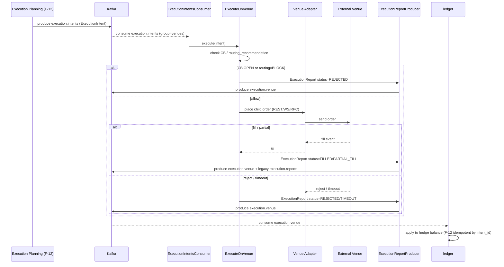

# SEQ-F11-05-execute-on-venue-services. Execute on venue: service view

## Type

Service Interaction Sequence

## Feature

- [F-11](../../02-system/features/F-11-external-venues-lob-to-fob/) (adapter уровня)
- [F-12](../../02-system/features/F-12-execution-hedge/) (business logic)

## Use Case

- [UC-F11-05](../../02-system/use-cases/UC-F11-05-execute-hedge-on-venue/use-case.md)
- [UC-F12-01](../../02-system/use-cases/UC-F12-01-execute-hedge/use-case.md) (cross-link)

## Purpose

Cross-component поток исполнения child-orders на внешней площадке. Source — Execution Planning (F-12), sink — Ledger через `execution.venue`.

## Participants

- Execution Planning (F-12) — producer `execution.intents`
- Kafka `execution.intents`
- ExecutionIntentsConsumer (cpp/venues)
- ExecuteOnVenue use case (cpp/venues — app)
- Venue Adapter (cpp/venues — infra)
- External Venue (CEX / DEX / AMM)
- ExecutionReportProducer (cpp/venues — infra)
- Kafka `execution.venue` / `execution.reports`
- Ledger (consumer)
- CircuitBreaker check (cpp/venues runtime via venue health cache)

## Diagram

## Contract Binding Table

| Step                            | Transport | Contract                                                                                          | Location                                                                                                              |
| ------------------------------- | --------- | ------------------------------------------------------------------------------------------------- | --------------------------------------------------------------------------------------------------------------------- |
| EP → Kafka                      | Kafka     | `execution.intents`, `fob.execution.v1.ExecutionIntent`                                            | [docs/06-api/messaging/execution-intents.md](../../06-api/messaging/execution-intents.md)                             |
| CONS ← Kafka                    | Kafka     | same                                                                                              | [cpp/venues/src/infra/execution_intents_consumer.cpp](../../../cpp/venues/src/infra/execution_intents_consumer.cpp)   |
| Adapter → Venue                 | venue SDK | venue-native                                                                                      | venue docs                                                                                                            |
| REP → Kafka                     | Kafka     | `execution.venue`, `fob.execution.v1.ExecutionReport`                                              | [docs/06-api/messaging/venue-topics.md#execution-venue](../../06-api/messaging/venue-topics.md#execution-venue)       |
| REP → Kafka (legacy)            | Kafka     | `execution.reports`                                                                                | [docs/06-api/messaging/execution-reports.md](../../06-api/messaging/execution-reports.md)                             |
| Ledger ← Kafka                  | Kafka     | `execution.venue`; idempotent by `intent_id`                                                       | [docs/06-api/grpc/ledger-apply-execution-report.md](../../06-api/grpc/ledger-apply-execution-report.md)               |

## Data Binding Table

| Data Object                  | Storage     | Notes                                                                  |
| ---------------------------- | ----------- | ---------------------------------------------------------------------- |
| `execution.venue` history    | Kafka       | retention 7 days (см. `infra/kafka/create_topics.sh`)                  |
| hedge balance                | PostgreSQL  | внутри ledger; F-12 owns                                               |
| backtest.execution.venue     | Kafka       | используется только при backtest session                               |

## Related Components

- [venue-execution-adapter](../venue-execution-adapter/overview.md)
- [external-venues-connector](../external-venues-connector/overview.md)
- [ledger](../ledger/overview.md)
