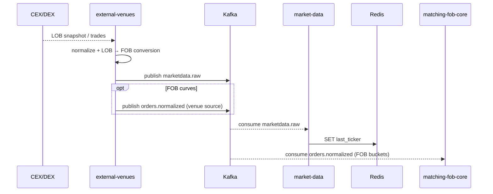

# SEQ-F11-UC-F11-01-services. External Market Data: service view

## Type

Service Interaction Sequence

## Feature

- [F-11](../../02-system/features/F-11-external-venues-lob-to-fob/)

## Use Case

- [UC-F11-01](../../02-system/use-cases/UC-F11-01-ingest-external-marketdata/use-case.md)

## Participants

- CEX / DEX
- external-venues
- Kafka (`marketdata.raw`, `orders.normalized`)
- market-data
- matching-fob-core
- Redis (ticker cache)

## Diagram

## Contract Binding Table

| Step | Transport | Contract | Location |
| --- | --- | --- | --- |
| V → EV | venue SDK | venue-specific | (out of scope) |
| EV → Kafka | Kafka | `marketdata.raw` | [../../06-api/messaging/marketdata-raw.md](../../06-api/messaging/marketdata-raw.md) |
| EV → Kafka | Kafka | `orders.normalized` (venue tag) | [../../06-api/messaging/orders-normalized.md](../../06-api/messaging/orders-normalized.md) |

## Data Binding Table

| Data Object | Storage | Location |
| --- | --- | --- |
| ticker cache | Redis | [../../07-data/data-overview.md](../../07-data/data-overview.md) |
| `marketdata` history | ClickHouse (planned) | [../../07-data/data-overview.md](../../07-data/data-overview.md) |

## Related Components

- [external-venues](../external-venues/overview.md)
- [market-data](../market-data/overview.md)
- [matching-fob-core](../matching-fob-core/overview.md)
