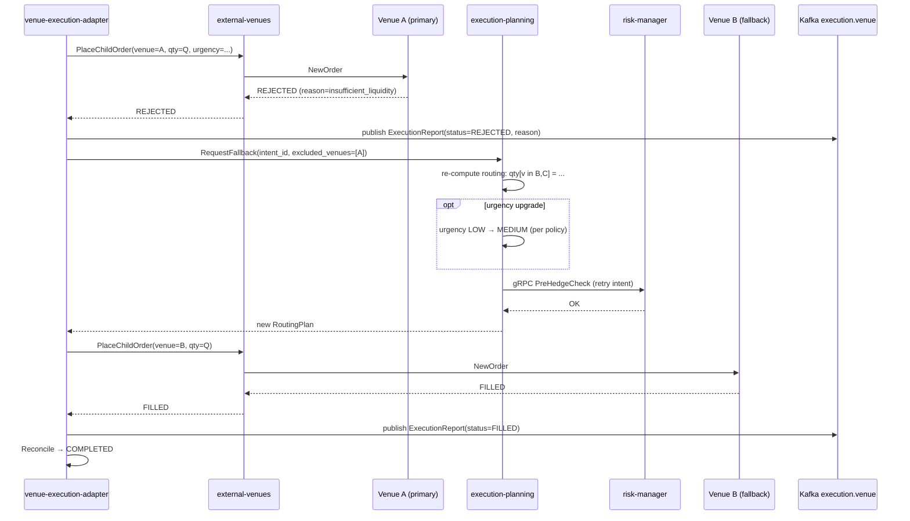

# SEQ-F12-02-rejection-fallback-services. Rejection + Fallback: service view

## Type

Service Interaction Sequence

## Feature

- [F-12](../../02-system/features/F-12-execution-hedge/)

## Use Case

- [UC-F12-04](../../02-system/use-cases/UC-F12-04-rejection-fallback/use-case.md)

## Purpose

Сценарий, когда primary venue отклоняет child order, Execution Planning формирует fallback routing с исключённым venue, Adapter повторно размещает order на альтернативном venue.

## Participants

- venue-execution-adapter
- external-venues (EVC)
- External Venue A (primary, REJECTED)
- External Venue B (fallback, FILLED)
- execution-planning
- risk-manager
- Kafka (`execution.intents`, `execution.venue`)

## Diagram

## Contract Binding Table

| Step | Transport | Contract | Location |
| --- | --- | --- | --- |
| EVC → VA / VB | venue SDK | venue-specific REST/WS/RPC | (out of repo scope) |
| ADP → K | Kafka | `execution.venue` (`fob.execution.v1.ExecutionReport` with status=REJECTED) | [../../06-api/messaging/execution-venue.md](../../06-api/messaging/execution-venue.md) |
| ADP → PLAN | internal | `RequestFallback(intent_id, excluded_venues)` (planned IPC) | (internal interface) |
| PLAN → RISK | gRPC | `fob.risk.v1.RiskService.PreHedgeCheck` | [../../06-api/grpc/risk-pre-hedge-check.md](../../06-api/grpc/risk-pre-hedge-check.md) |
| ADP → K (FILLED) | Kafka | `execution.venue` (`ExecutionReport` with status=FILLED) | [../../06-api/messaging/execution-venue.md](../../06-api/messaging/execution-venue.md) |

## Data Binding Table

| Data Object | Storage | Location | Note |
| --- | --- | --- | --- |
| `child_orders` | PostgreSQL | [../../07-data/child-orders.md](../../07-data/child-orders.md) | две записи: на venue A (REJECTED) и venue B (FILLED); обе ссылаются на тот же `hedge_flow_id` |
| `hedgeflows` | PostgreSQL | [../../07-data/hedgeflows.md](../../07-data/hedgeflows.md) | агрегаты обновляются после второго fill |
| `execution_reports` | ClickHouse | [../../07-data/execution-reports.md](../../07-data/execution-reports.md) | две строки: REJECTED + FILLED |

## Related Components

- [venue-execution-adapter](../venue-execution-adapter/overview.md)
- [execution-planning](../execution-planning/overview.md)
- [external-venues](../external-venues/overview.md)
- [risk-manager](../risk-manager/overview.md)

## Source Fragments

- IN-005 §3 «Sequence diagram — rejection + fallback»
- IN-005 §7 F12-12
- IN-005 §10.1 U4
