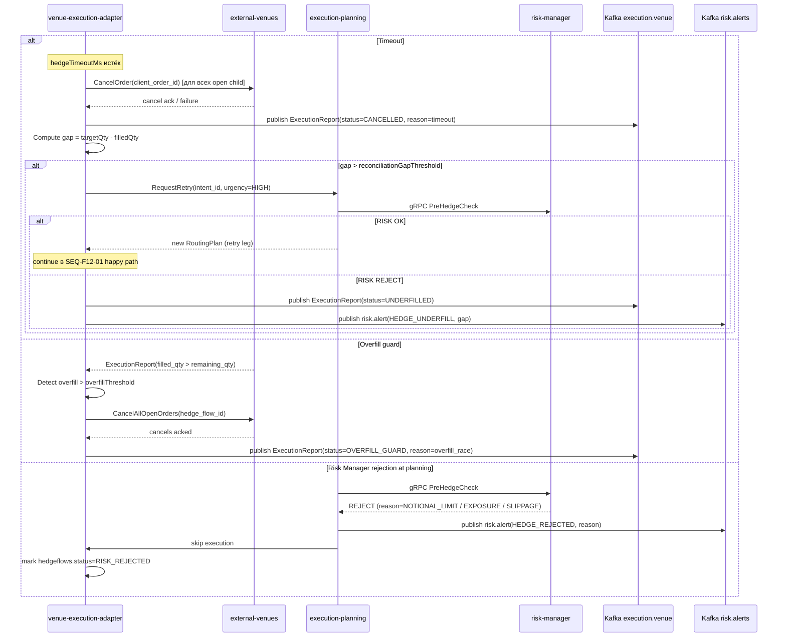

# SEQ-F12-03-error-scenarios-services. Error Scenarios (Timeout / Overfill / Risk Reject): service view

## Type

Service Interaction Sequence (error branches)

## Feature

- [F-12](../../02-system/features/F-12-execution-hedge/)

## Use Case

- [UC-F12-03](../../02-system/use-cases/UC-F12-03-partial-fill-retry/use-case.md) (partial fill leg may converge here on timeout)
- [UC-F12-05](../../02-system/use-cases/UC-F12-05-timeout-underfilled-reconciliation/use-case.md)

## Purpose

Три ошибочных ветки, описанных в IN-005 §4: Timeout (cancel + retry/underfill), Overfill guard, Risk Manager rejection.

## Participants

- venue-execution-adapter
- external-venues (EVC)
- execution-planning
- risk-manager
- Kafka (`execution.venue`, `risk.alerts`)

## Diagram

## Contract Binding Table

| Step | Transport | Contract | Location |
| --- | --- | --- | --- |
| ADP → EVC CancelOrder | internal | `domain::VenueAdapter::CancelOrder(client_order_id)` | [`cpp/venues/src/domain/venue_adapter.hpp`](../../../cpp/venues/src/domain/venue_adapter.hpp) |
| ADP → K | Kafka | `execution.venue` (status=CANCELLED / OVERFILL_GUARD / UNDERFILLED) | [../../06-api/messaging/execution-venue.md](../../06-api/messaging/execution-venue.md) |
| ADP → KR | Kafka | `risk.alerts` (`type=HEDGE_UNDERFILL` / `HEDGE_REJECTED` / `HEDGE_STUCK`) | [../../06-api/messaging/risk-alerts.md](../../06-api/messaging/risk-alerts.md) |
| PLAN → RISK | gRPC | `fob.risk.v1.RiskService.PreHedgeCheck` | [../../06-api/grpc/risk-pre-hedge-check.md](../../06-api/grpc/risk-pre-hedge-check.md) |

## Data Binding Table

| Data Object | Storage | Location | Note |
| --- | --- | --- | --- |
| `hedgeflows` | PostgreSQL | [../../07-data/hedgeflows.md](../../07-data/hedgeflows.md) | финальные статусы: COMPLETED / UNDERFILLED / REJECTED / RISK_REJECTED / CANCELLED |
| `child_orders` | PostgreSQL | [../../07-data/child-orders.md](../../07-data/child-orders.md) | open → CANCELLED on timeout |
| `execution_reports` | ClickHouse | [../../07-data/execution-reports.md](../../07-data/execution-reports.md) | каждое событие отдельной строкой |

## Related Components

- [venue-execution-adapter](../venue-execution-adapter/overview.md)
- [external-venues](../external-venues/overview.md)
- [execution-planning](../execution-planning/overview.md)
- [risk-manager](../risk-manager/overview.md)

## Source Fragments

- IN-005 §4 «Sequence diagram — error scenarios» (alt Timeout / Overfill guard / Risk Manager rejection)
- IN-005 §5 «Reconciliation алгоритм»
- IN-005 §6 «Overfill Guard», «Reconciliation Gap»
- IN-005 §10.1 U3 (overfill), U5 (timeout), U10 (risk rejection)
