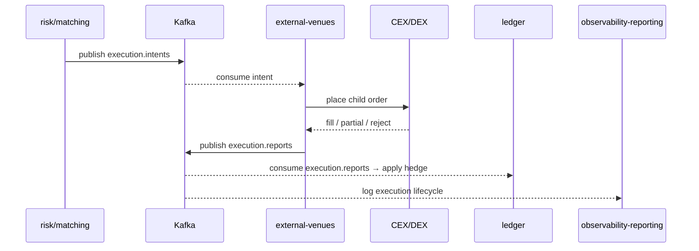

# SEQ-F12-UC-F12-01-services. Execution Hedge: service view

## Type

Service Interaction Sequence

## Feature

- [F-12](../../02-system/features/F-12-execution-hedge/)

## Use Case

- [UC-F12-01](../../02-system/use-cases/UC-F12-01-execute-hedge/use-case.md)

## Participants

- risk-manager / matching-fob-core (issuer)
- Kafka (`execution.intents`, `execution.reports`)
- external-venues
- CEX / DEX
- ledger
- observability-reporting

## Diagram

## Contract Binding Table

| Step | Transport | Contract | Location |
| --- | --- | --- | --- |
| SRC → Kafka | Kafka | `execution.intents` (ExecutionIntent) | [../../06-api/messaging/execution-intents.md](../../06-api/messaging/execution-intents.md) |
| EV → Kafka | Kafka | `execution.reports` (ExecutionReport) | [../../06-api/messaging/execution-reports.md](../../06-api/messaging/execution-reports.md) |
| EV → V | venue SDK | venue-specific | (out of scope) |

## Data Binding Table

| Data Object | Storage | Location |
| --- | --- | --- |
| `execution_reports` | ClickHouse (planned) | [../../07-data/data-overview.md](../../07-data/data-overview.md) |
| `positions` | PostgreSQL | [../../07-data/data-overview.md](../../07-data/data-overview.md) |
| `accounts` | PostgreSQL | [../../07-data/data-overview.md](../../07-data/data-overview.md) |

## Related Components

- [external-venues](../external-venues/overview.md)
- [risk-manager](../risk-manager/overview.md)
- [matching-fob-core](../matching-fob-core/overview.md)
- [ledger](../ledger/overview.md)
- [observability-reporting](../observability-reporting/overview.md)
