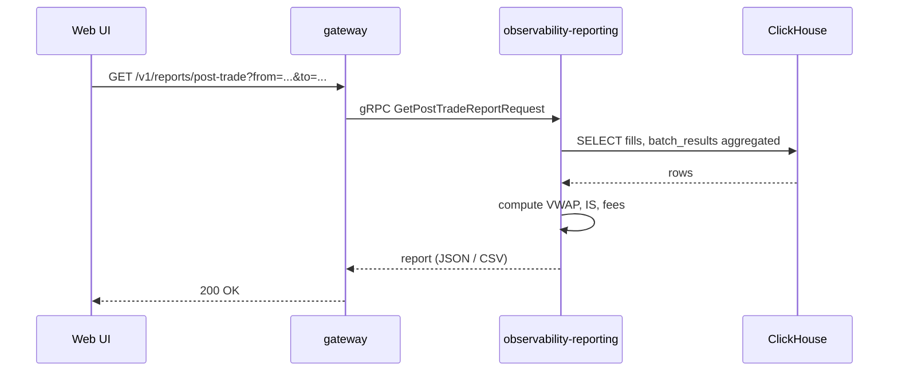

# SEQ-F13-UC-F13-01-services. Post-Trade Report: service view

## Type

Service Interaction Sequence

## Feature

- [F-13](../../02-system/features/F-13-posttrade-report/)

## Use Case

- [UC-F13-01](../../02-system/use-cases/UC-F13-01-generate-posttrade-report/use-case.md)

## Participants

- Web UI / Compliance Client
- gateway
- observability-reporting
- ClickHouse

## Diagram

## Contract Binding Table

| Step | Transport | Contract | Location |
| --- | --- | --- | --- |
| UI → GW | REST | `GET /v1/reports/post-trade` (planned) | [../../06-api/rest/](../../06-api/rest/) |
| GW → OBS | gRPC | `ObservabilityService/GetPostTradeReport` (planned) | [../../06-api/grpc/observability-get-post-trade-report.md](../../06-api/grpc/observability-get-post-trade-report.md) |
| OBS → CH | SQL | `fills`, `batch_results` queries | [../../07-data/data-overview.md](../../07-data/data-overview.md) |

## Data Binding Table

| Data Object | Storage | Location |
| --- | --- | --- |
| `fills` | ClickHouse (planned) | [../../07-data/data-overview.md](../../07-data/data-overview.md) |
| `batch_results` | ClickHouse (planned) | [../../07-data/data-overview.md](../../07-data/data-overview.md) |

## Related Components

- [gateway](../gateway/overview.md)
- [observability-reporting](../observability-reporting/overview.md)
