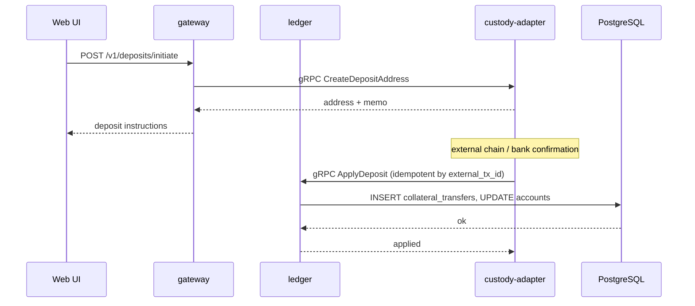

# SEQ-F14-UC-F14-01-services. Deposit: service view

## Type

Service Interaction Sequence

## Feature

- [F-14](../../02-system/features/F-14-deposit-withdraw/)

## Use Case

- [UC-F14-01](../../02-system/use-cases/UC-F14-01-deposit-funds/use-case.md)

## Participants

- Web UI
- gateway
- ledger
- (planned) custody-adapter
- PostgreSQL

## Diagram

## Contract Binding Table

| Step | Transport | Contract | Location |
| --- | --- | --- | --- |
| UI → GW | REST | `POST /v1/deposits/initiate` (planned) | [../../06-api/rest/](../../06-api/rest/) |
| GW → CUST | gRPC | `CustodyService/CreateDepositAddress` (planned) | [../../06-api/grpc/custody-create-deposit-address.md](../../06-api/grpc/custody-create-deposit-address.md) |
| CUST → LDG | gRPC | `LedgerService/ApplyDeposit` (planned) | [../../06-api/grpc/ledger-apply-deposit.md](../../06-api/grpc/ledger-apply-deposit.md) |

## Data Binding Table

| Data Object | Storage | Location |
| --- | --- | --- |
| `collateral_transfers` | PostgreSQL (planned) | [../../07-data/data-overview.md](../../07-data/data-overview.md) |
| `accounts` | PostgreSQL (planned) | [../../07-data/data-overview.md](../../07-data/data-overview.md) |

## Related Components

- [gateway](../gateway/overview.md)
- [ledger](../ledger/overview.md)
