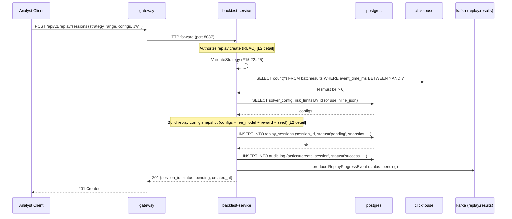

<!-- IN-013 frontmatter — Cockburn decomposition level.
---
id: SEQ-F15-01-create-session-services
level: sea
---
-->

# SEQ-F15-01-create-session-services. Replay: create session — service view

## Type

Service Interaction Sequence

## Feature

- [F-15](../../02-system/features/F-15-backtest-replay/)

## Use Case

- [UC-F15-01](../../02-system/use-cases/UC-F15-01-create-replay-session/use-case.md)

## Purpose

Создание ReplaySession через REST/Kafka и быстрый возврат `pending`.
Длительный replay-цикл — см. [SEQ-F15-02](SEQ-F15-02-replay-cycle-services.md).

## Participants

- gateway (REST edge)
- backtest-service (cpp/backtest)
- postgres (`replay_sessions`, RBAC tables)
- clickhouse (read-only coverage check)
- kafka (`replay.results` для progress events)

## Diagram

## Contract Binding Table

| Step | Transport | Contract | Location |
| --- | --- | --- | --- |
| Client → GW | REST | `POST /api/v1/replay/sessions` | [../../06-api/rest/replay.md](../../06-api/rest/replay.md) |
| GW → BS | HTTP | same REST schema | [contracts/openapi/fob/replay/v1/api/replay.yaml](../../../contracts/openapi/fob/replay/v1/api/replay.yaml) |
| BS → CH | SQL | `SELECT batchresults` | [../../07-data/data-overview.md](../../07-data/data-overview.md) |
| BS → PG | SQL | `INSERT replay_sessions`, `INSERT audit_log` | [../../07-data/replay-sessions.md](../../07-data/replay-sessions.md), [../../07-data/replay-rbac.md](../../07-data/replay-rbac.md) |
| BS → K | Kafka | `replay.results` (`ReplayProgressEvent`) | [../../06-api/messaging/replay-topics.md](../../06-api/messaging/replay-topics.md) |

## Data Binding Table

| Data Object | Storage | Location |
| --- | --- | --- |
| `replay_sessions` | PostgreSQL | [../../07-data/replay-sessions.md](../../07-data/replay-sessions.md) |
| `audit_log` | PostgreSQL | [../../07-data/replay-rbac.md](../../07-data/replay-rbac.md) |
| `batchresults` | ClickHouse (read-only) | [../../07-data/data-overview.md](../../07-data/data-overview.md) |

## Related Components

- [backtest-service](../backtest-service/overview.md)
- [gateway](../gateway/overview.md)
