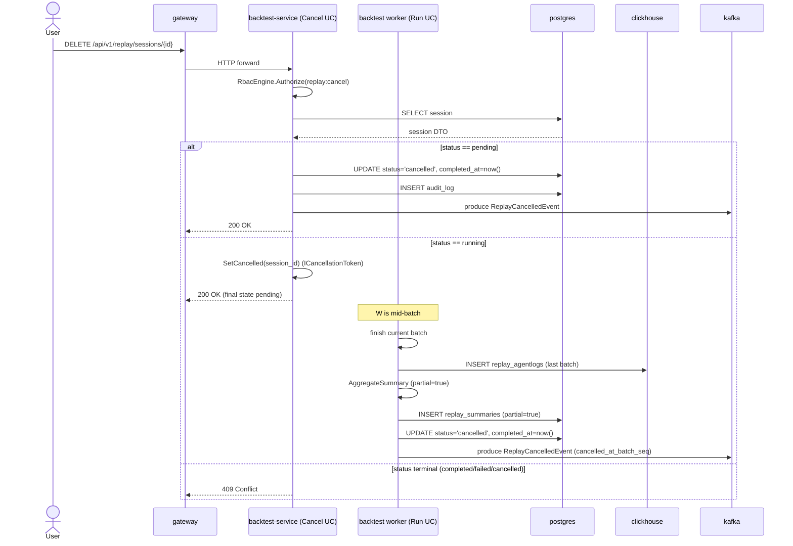

# SEQ-F15-03-cancel-services. Replay: cancel session — service view

## Type

Service Interaction Sequence

## Feature

- [F-15](../../02-system/features/F-15-backtest-replay/)

## Use Case

- [UC-F15-02](../../02-system/use-cases/UC-F15-02-cancel-replay-session/use-case.md)

## Participants

- gateway (REST edge)
- backtest-service (`CancelReplaySessionUC`)
- backtest-service worker (`RunReplaySessionUC` running session)
- postgres (`replay_sessions`, `replay_summaries`, `audit_log`)
- clickhouse (partial `replay_agentlogs`)
- kafka (`replay.results`)

## Diagram

## Contract Binding Table

| Step | Transport | Contract | Location |
| --- | --- | --- | --- |
| User → GW | REST | `DELETE /api/v1/replay/sessions/{id}` | [../../06-api/rest/replay.md](../../06-api/rest/replay.md) |
| BS ↔ PG | SQL | `UPDATE replay_sessions`, `INSERT audit_log` | [../../07-data/replay-sessions.md](../../07-data/replay-sessions.md), [../../07-data/replay-rbac.md](../../07-data/replay-rbac.md) |
| BS internal token | C++ | `ICancellationToken` | [cpp/backtest/src/app/cancel_replay_session_uc.hpp](../../../cpp/backtest/src/app/cancel_replay_session_uc.hpp) |
| Worker → CH | HTTP | `INSERT replay_agentlogs` | [../../07-data/replay-agentlogs.md](../../07-data/replay-agentlogs.md) |
| Worker → K | Kafka | `replay.results` (`ReplayCancelledEvent`) | [../../06-api/messaging/replay-topics.md](../../06-api/messaging/replay-topics.md) |

## Data Binding Table

| Data Object | Storage | Location |
| --- | --- | --- |
| `replay_sessions` | PostgreSQL | [../../07-data/replay-sessions.md](../../07-data/replay-sessions.md) |
| `replay_summaries` (partial=true) | PostgreSQL | [../../07-data/replay-summaries.md](../../07-data/replay-summaries.md) |
| `replay_agentlogs` (partial) | ClickHouse | [../../07-data/replay-agentlogs.md](../../07-data/replay-agentlogs.md) |
| `audit_log` | PostgreSQL | [../../07-data/replay-rbac.md](../../07-data/replay-rbac.md) |

## Related Components

- [backtest-service](../backtest-service/overview.md)
