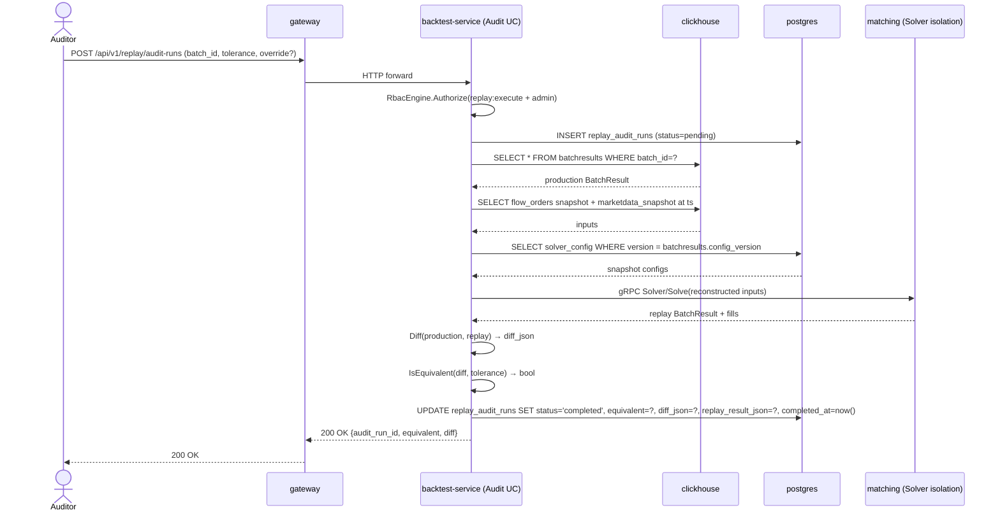

<!-- IN-013 frontmatter — Cockburn decomposition level.
---
id: SEQ-F15-04-audit-mode-services
level: sea
---
-->

# SEQ-F15-04-audit-mode-services. Replay: audit-mode — service view

## Type

Service Interaction Sequence

## Feature

- [F-15](../../02-system/features/F-15-backtest-replay/)

## Use Case

- [UC-F15-04](../../02-system/use-cases/UC-F15-04-audit-mode-replay/use-case.md)

## Participants

- gateway
- backtest-service (`RunReplayAuditBatchUC`)
- clickhouse (`batchresults`, `fills`, `marketdata_snapshots`)
- postgres (`solver_config`, `risk_limits`, `replay_audit_runs`)
- matching-fob-core (Solver isolation)

## Diagram

## Contract Binding Table

| Step | Transport | Contract | Location |
| --- | --- | --- | --- |
| User → GW | REST | `POST /api/v1/replay/audit-runs` | [../../06-api/rest/replay.md](../../06-api/rest/replay.md) |
| BS → CH | SQL | `SELECT batchresults`, `SELECT marketdata_snapshots` | [../../07-data/data-overview.md](../../07-data/data-overview.md) |
| BS → PG (config) | SQL | `solver_config @version`, `risk_limits @version` | [../../07-data/oltp-schema.md](../../07-data/oltp-schema.md) |
| BS → MB | gRPC | `fob.matching.v1.Solver/Solve` | [contracts/proto/fob/matching/v1/solver.proto](../../../contracts/proto/fob/matching/v1/solver.proto) |
| BS → PG (audit row) | SQL | `INSERT/UPDATE replay_audit_runs` | [../../07-data/replay-sessions.md](../../07-data/replay-sessions.md) |

## Data Binding Table

| Data Object | Storage | Location |
| --- | --- | --- |
| `replay_audit_runs` | PostgreSQL | [../../07-data/replay-sessions.md](../../07-data/replay-sessions.md#таблица-replay_audit_runs) |
| `batchresults` (read) | ClickHouse | [../../07-data/data-overview.md](../../07-data/data-overview.md) |

## Related Components

- [backtest-service](../backtest-service/overview.md)
- [matching-fob-core](../matching-fob-core/overview.md)
