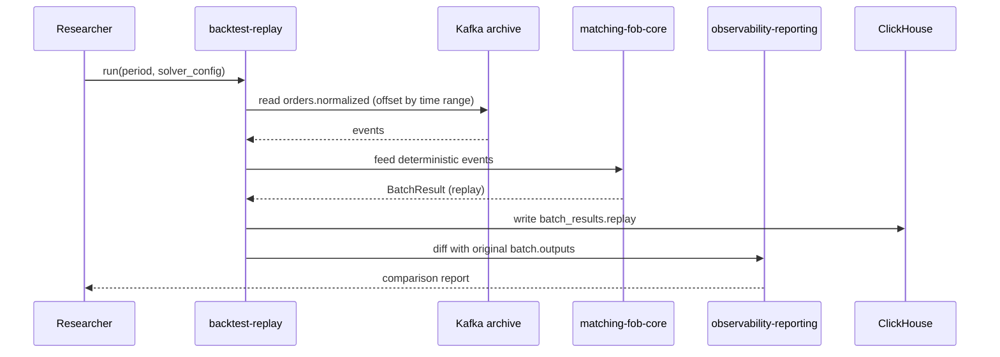

# SEQ-F15-UC-F15-01-services. Replay: service view

## Type

Service Interaction Sequence

## Feature

- [F-15](../../02-system/features/F-15-backtest-replay/)

## Use Case

- [UC-F15-01](../../02-system/use-cases/UC-F15-01-replay-historical-batch/use-case.md)

## Participants

- Researcher Client
- (planned) backtest-replay
- Kafka archive (`orders.normalized`, `batch.outputs`)
- matching-fob-core (deterministic mode)
- ClickHouse
- observability-reporting

## Diagram

## Contract Binding Table

| Step | Transport | Contract | Location |
| --- | --- | --- | --- |
| BT consume | Kafka | `orders.normalized` archive | [../../06-api/messaging/orders-normalized.md](../../06-api/messaging/orders-normalized.md) |
| BT consume | Kafka | `batch.outputs` archive | [../../06-api/messaging/batch-outputs.md](../../06-api/messaging/batch-outputs.md) |
| BT → CH | SQL | INSERT `batch_results_replay` | [../../07-data/data-overview.md](../../07-data/data-overview.md) |

## Data Binding Table

| Data Object | Storage | Location |
| --- | --- | --- |
| `batch_results_replay` | ClickHouse (planned) | [../../07-data/data-overview.md](../../07-data/data-overview.md) |
| `agent_logs` | ClickHouse (planned) | [../../07-data/data-overview.md](../../07-data/data-overview.md) |

## Related Components

- [backtest-replay](../backtest-replay/overview.md) (planned)
- [matching-fob-core](../matching-fob-core/overview.md)
- [observability-reporting](../observability-reporting/overview.md)
