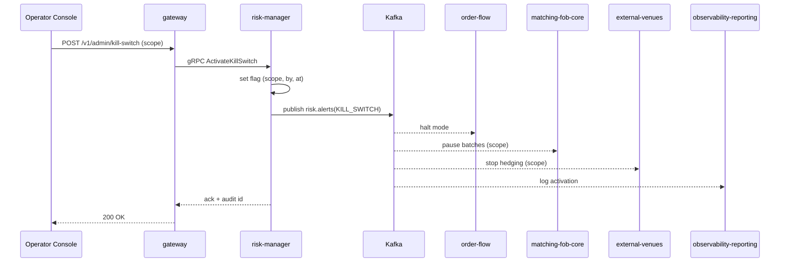

# SEQ-F16-UC-F16-01-services. Kill-Switch: service view

## Type

Service Interaction Sequence

## Feature

- [F-16](../../02-system/features/F-16-operator-console/)

## Use Case

- [UC-F16-01](../../02-system/use-cases/UC-F16-01-trigger-kill-switch/use-case.md)

## Participants

- Operator Console
- gateway
- risk-manager
- Kafka (`risk.alerts`)
- order-flow
- matching-fob-core
- external-venues
- observability-reporting

## Diagram

## Contract Binding Table

| Step | Transport | Contract | Location |
| --- | --- | --- | --- |
| OP → GW | REST | `POST /v1/admin/kill-switch` (planned) | [../../06-api/rest/](../../06-api/rest/) |
| GW → RISK | gRPC | `RiskService/SetKillSwitch` (canonical; alias `ActivateKillSwitch`/`DeactivateKillSwitch` = `halt=true`/`halt=false`) | [../../06-api/grpc/risk-set-kill-switch.md](../../06-api/grpc/risk-set-kill-switch.md) |
| RISK → Kafka | Kafka | `risk.alerts(KILL_SWITCH)` | [../../06-api/messaging/risk-alerts.md](../../06-api/messaging/risk-alerts.md) |

## Data Binding Table

| Data Object | Storage | Location |
| --- | --- | --- |
| kill-switch state | Redis / PostgreSQL (planned) | [../../07-data/data-overview.md](../../07-data/data-overview.md) |
| audit log | PostgreSQL / ClickHouse (planned) | [../../07-data/data-overview.md](../../07-data/data-overview.md) |

## Related Components

- [gateway](../gateway/overview.md)
- [risk-manager](../risk-manager/overview.md)
- [order-flow](../order-flow/overview.md)
- [matching-fob-core](../matching-fob-core/overview.md)
- [external-venues](../external-venues/overview.md)
- [observability-reporting](../observability-reporting/overview.md)
