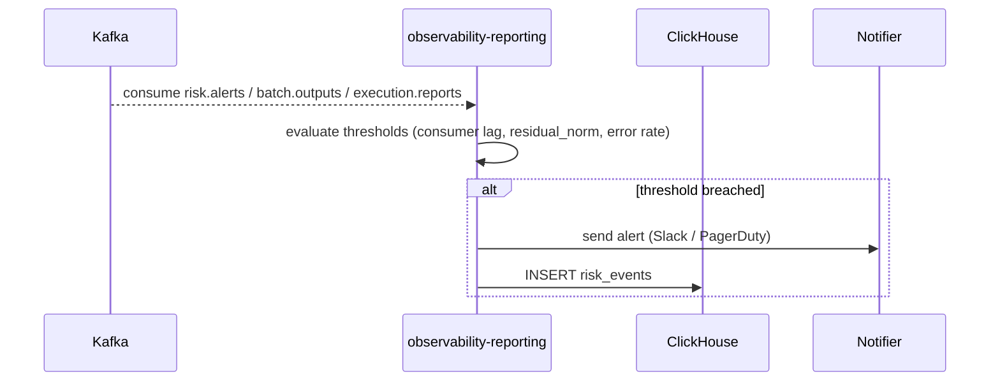

# SEQ-F17-UC-F17-01-services. Alert: service view

## Type

Service Interaction Sequence

## Feature

- [F-17](../../02-system/features/F-17-monitoring-and-alerts/)

## Use Case

- [UC-F17-01](../../02-system/use-cases/UC-F17-01-fire-alert/use-case.md)

## Participants

- Kafka (`risk.alerts`, `batch.outputs`, `execution.reports`)
- observability-reporting
- (planned) notifier (Slack / PagerDuty)
- ClickHouse

## Diagram

## Contract Binding Table

| Step | Transport | Contract | Location |
| --- | --- | --- | --- |
| K → OBS | Kafka | `risk.alerts`, `batch.outputs`, `execution.reports` | [../../06-api/messaging/](../../06-api/messaging/) |
| OBS → N | HTTPS webhook | Slack / PagerDuty (planned) | (out of scope) |
| OBS → CH | SQL | INSERT `risk_events` | [../../07-data/data-overview.md](../../07-data/data-overview.md) |

## Data Binding Table

| Data Object | Storage | Location |
| --- | --- | --- |
| `risk_events` | ClickHouse (planned) | [../../07-data/data-overview.md](../../07-data/data-overview.md) |

## Related Components

- [observability-reporting](../observability-reporting/overview.md)
- [risk-manager](../risk-manager/overview.md)
