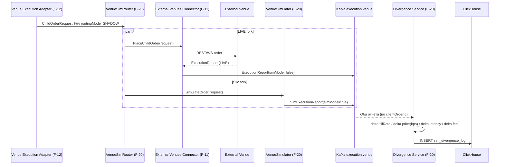

# SEQ-F20-UC-F20-02-services — SHADOW compare (service-level)

- Feature: [F-20](../../02-system/features/F-20-live-venue-simulator/README.md)
- Use case: [UC-F20-02](../../02-system/use-cases/UC-F20-02-shadow-compare/use-case.md)
- Level: L1
- Components: VenueSimRouter, VenueSimulator, Divergence Service (F-20), EVC (F-11), ClickHouse.

## Contract binding

| Стрелка | Transport | Contract | Doc |
|---|---|---|---|
| Router → EVC (LIVE fork) | gRPC | PlaceChildOrder | F-11 EVC |
| EVC → `execution.venue` | Kafka | ExecutionReport (simMode=false) | [messaging/sim-topics](../../06-api/messaging/sim-topics.md) |
| Simulator → `execution.venue` | Kafka | SimExecutionReport (simMode=true) | [messaging/sim-topics](../../06-api/messaging/sim-topics.md) |
| `execution.venue` → Divergence | Kafka | LIVE+SIM пары по clientOrderId | [messaging/sim-topics](../../06-api/messaging/sim-topics.md) |
| Divergence → ClickHouse | HTTP insert | sim_divergence_log | [07-data/sim-execution-reports](../../07-data/sim-execution-reports.md) |

