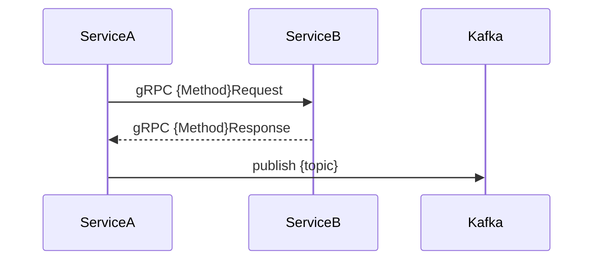

# SEQ-FXX-UC-FXX-NN-services. {Заголовок}

> **Template.** При копировании замените плейсхолдеры `{slug}`, `XX`, `NN`, имена сервисов на конкретные значения. Пути ниже — шаблонные, не клики.

## Type

Service Interaction Sequence

## Feature

- `../../../02-system/features/F-XX-{slug}/`

## Use Case

- `../../../02-system/use-cases/UC-FXX-NN-{slug}/use-case.md`

## Purpose

Показать внутреннюю реализацию сценария через сервисы, БД, брокер сообщений и контракты.

## Participants

- {Web UI / API Gateway / Order Flow / Matching / Risk / Ledger / Market Data / Venues / Observability / Kafka / PostgreSQL / ClickHouse / Redis}

## Diagram

## Contract Binding Table

| Step | Transport | Contract | Location |
| --- | --- | --- | --- |
| A → B | gRPC | `{Method}Request` | `docs/06-api/grpc/...` |
| A → Kafka | Kafka | `{topic}` | `docs/06-api/messaging/...` |

## Data Binding Table

| Data Object | Storage | Location |
| --- | --- | --- |
| `{table}` | PostgreSQL / ClickHouse / Redis | `docs/07-data/...` |

## Related Components

- {ссылки на docs/05-components/.../overview.md}
