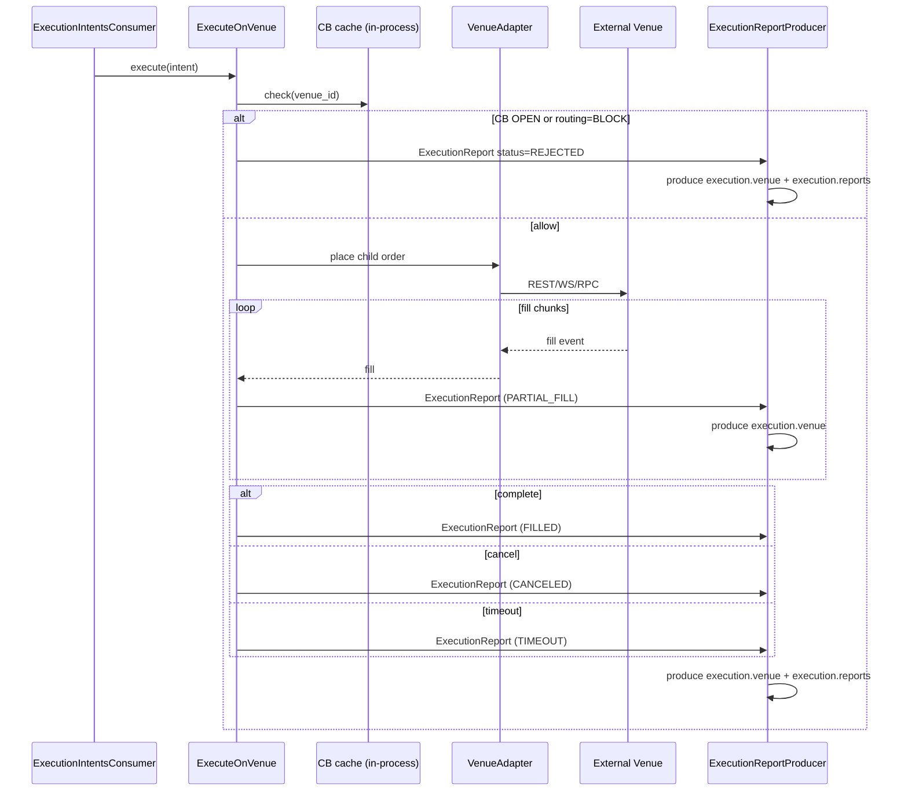

# SEQ-EXEC-ADAPT-001. ExecutionIntent → ExecutionReport (adapter view)

## Type

Internal Component Sequence (venue-execution-adapter)

## Feature

- [F-12](../../../02-system/features/F-12-execution-hedge/) (primary)
- [F-11](../../../02-system/features/F-11-external-venues-lob-to-fob/) (adapter implementation)

## Use Case

- [UC-F11-05](../../../02-system/use-cases/UC-F11-05-execute-hedge-on-venue/use-case.md) (adapter-side, F-11)
- [UC-F12-01](../../../02-system/use-cases/UC-F12-01-auto-hedge-after-batch/use-case.md) (auto-hedge business flow)
- [UC-F12-03](../../../02-system/use-cases/UC-F12-03-partial-fill-retry/use-case.md), [UC-F12-04](../../../02-system/use-cases/UC-F12-04-rejection-fallback/use-case.md), [UC-F12-05](../../../02-system/use-cases/UC-F12-05-timeout-underfilled-reconciliation/use-case.md) (error branches)

## Purpose

Adapter-уровень внутреннего цикла: одна ExecutionIntent → один или несколько ExecutionReport.

## Participants

- ExecutionIntentsConsumer (infra)
- ExecuteOnVenue (app)
- VenueAdapter (one of: cex_ws_rest, dex_amm_rpc, simulator)
- ExecutionReportProducer (infra)
- External Venue
- CB state check (via venue_health cache, in-process)

## Diagram

## Related

- Service sequence: [SEQ-F11-05-execute-on-venue-services](../../sequences/SEQ-F11-05-execute-on-venue-services.md)
