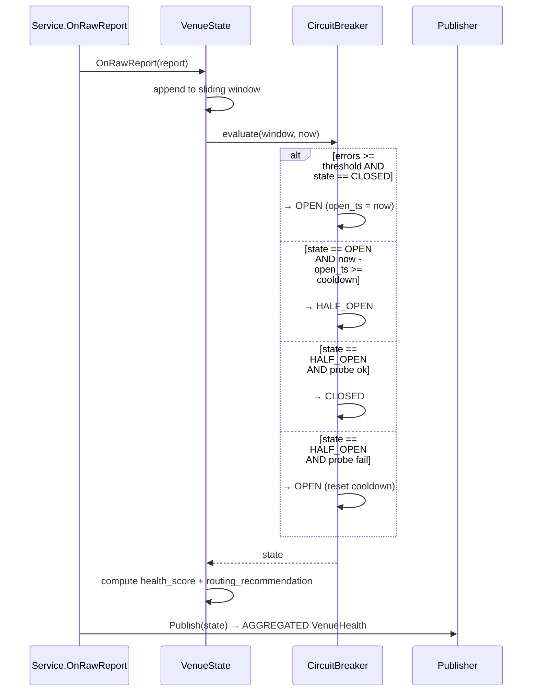

<!-- IN-013 frontmatter — Cockburn decomposition level.
---
id: SEQ-HEALTH-001-circuit-breaker-fsm
level: fish
component: venue-health-routing
---
-->

# SEQ-HEALTH-001. Circuit Breaker FSM

## Type

Internal Component Sequence (venue-health-routing)

## Feature

- [F-11](../../../02-system/features/F-11-external-venues-lob-to-fob/)

## Use Case

- [UC-F11-04](../../../02-system/use-cases/UC-F11-04-venue-health-degradation/use-case.md)

## Purpose

Внутренний FSM circuit breaker и реакция на новые RAW reports.

## Participants

- Service (app)
- VenueState (domain)
- CircuitBreaker (domain)
- KafkaProducer venue.health (AGGREGATED)

## Diagram

## Related

- Service sequence: [SEQ-F11-04-health-routing-services](../../sequences/SEQ-F11-04-health-routing-services.md)
