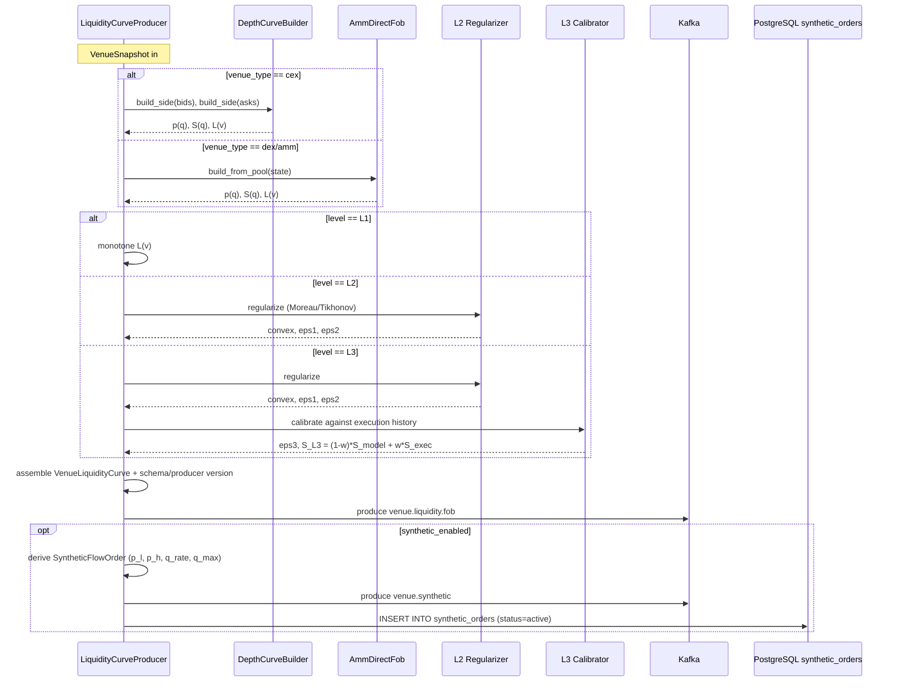

# SEQ-CURVE-001. LOB → FOB cycle (внутренний)

## Type

Internal Component Sequence (venue-liquidity-curve-builder)

## Feature

- [F-11](../../../02-system/features/F-11-external-venues-lob-to-fob/)

## Use Case

- [UC-F11-03](../../../02-system/use-cases/UC-F11-03-build-liquidity-curve/use-case.md)

## Purpose

Внутренний цикл построения VenueLiquidityCurve из одной VenueSnapshot: per-side $p(q)$ → $S(q)$ → $L(v)$ + dual, опционально SyntheticFlowOrder.

## Participants

- LiquidityCurveProducer (app)
- DepthCurveBuilder (domain)
- AmmDirectFob (domain, для DEX/AMM)
- L2 Regularizer
- L3 Calibrator (history of execution reports)
- KafkaProducer (venue.liquidity.fob, venue.synthetic)
- PostgresSyntheticOrderRepository

## Diagram

## Related

- Service sequence: [SEQ-F11-03-build-curve-services](../../sequences/SEQ-F11-03-build-curve-services.md)
