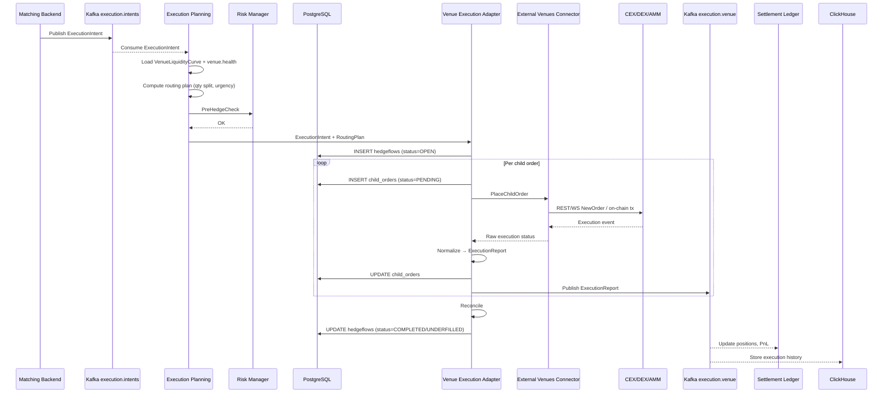
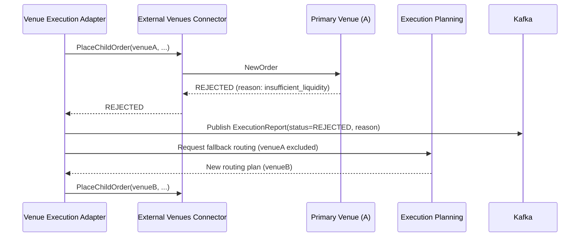
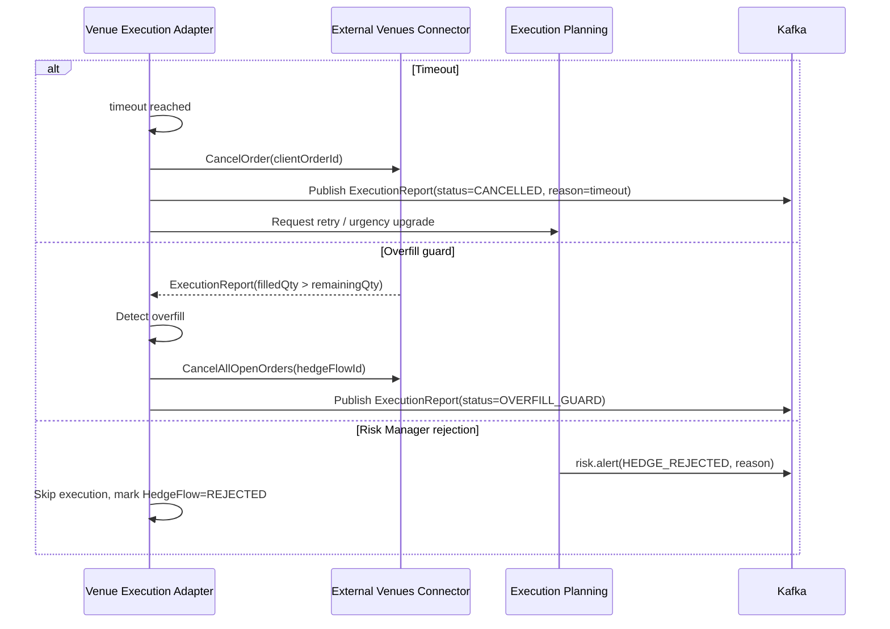

# Note on encoding

This document was received via chat attachment on 2026-05-20. The Cyrillic content arrived as UTF-8 mojibake (rendered as Latin-1). Structural content is intact; prose is decoded by mapping latin1→utf8.

Original title: **F-12. Хеджирование на внешних площадках (Execution Hedge)**

This is the immutable archive of decoded structural content. Normalized artifacts live under `docs/02-system/features/F-12-execution-hedge/` etc.

---

## Канонические сущности и термины

### F-12 Execution Hedge

Фича автоматического хеджирования нетто-позиций провайдера на внешних площадках (CEX/DEX/AMM) после внутреннего матчинга через цепочку:

```
нетто-позиция → ExecutionIntent → child-ордера → ExecutionReport → обновление позиций и PnL в Ledger
```

Параметры:
- `scopeInstruments` — перечень инструментов
- `supportedVenues` — список поддерживаемых venues
- `hedgeModes` — auto после батча / ручной операторский / backtest
- `dependencies` — F-11, F-04, F-06, Risk, Ledger, Kafka, ClickHouse

### ExecutionIntent (Kafka `execution.intents`)

Внутренний контракт/сообщение на хедж.

| Поле | Тип | Описание |
|------|-----|----------|
| `hedgeFlowId` | UUID | Уникальный ID сессии хеджа |
| `batchId` | string | Идентификатор батча Matching Backend |
| `providerId` | string | Идентификатор провайдера |
| `symbol` | string | Внутренний идентификатор инструмента |
| `side` | string | BUY/SELL |
| `targetQty` | number | Целевой объём хеджа |
| `targetNotional` | number | Целевой notional (qty × referenceMid) |
| `referenceMid` | number | Эталонная внутренняя цена (clearing-price) |
| `urgency` | string | LOW/MEDIUM/HIGH |
| `priceConstraint` | number\|null | Верхняя/нижняя граница цены |
| `timeoutMs` | integer | Дедлайн на исполнение |
| `allowedVenues` | string[] | Белый список venues |
| `createdAt` | ISO8601 | Время создания |

### HedgeFlow (PostgreSQL `hedgeflows`)

Сессия хеджирования одного ExecutionIntent.

```sql
CREATE TABLE hedgeflows (
    hedgeflowid     UUID PRIMARY KEY,
    intentid        UUID NOT NULL,
    providerid      VARCHAR(64) NOT NULL,
    symbol          VARCHAR(32) NOT NULL,
    side            VARCHAR(4) NOT NULL,
    targetqty       NUMERIC(24,8) NOT NULL,
    filledqty       NUMERIC(24,8) NOT NULL DEFAULT 0,
    avgfillprice    NUMERIC(24,8),
    totfee          NUMERIC(24,8) NOT NULL DEFAULT 0,
    referencemd     NUMERIC(24,8),
    hedgepnl        NUMERIC(24,8),
    status          VARCHAR(16) NOT NULL,  -- OPEN/COMPLETED/UNDERFILLED/REJECTED
    createdat       TIMESTAMPTZ NOT NULL,
    completedat     TIMESTAMPTZ,
    timeoutms       INT NOT NULL
);
```

### ChildOrder (PostgreSQL `child_orders`)

```sql
CREATE TABLE child_orders (
    childorderid    UUID PRIMARY KEY,
    hedgeflowid     UUID NOT NULL REFERENCES hedgeflows(hedgeflowid),
    venueid         VARCHAR(32) NOT NULL,
    symbol          VARCHAR(32) NOT NULL,
    side            VARCHAR(4) NOT NULL,
    ordertype       VARCHAR(16) NOT NULL,  -- LIMIT/MARKET/IOC/POST_ONLY
    qty             NUMERIC(24,8) NOT NULL,
    price           NUMERIC(24,8),
    filledqty       NUMERIC(24,8) NOT NULL DEFAULT 0,
    avgprice        NUMERIC(24,8),
    fee             NUMERIC(24,8),
    status          VARCHAR(20) NOT NULL,
    clientorderid   VARCHAR(64) NOT NULL,
    createdat       TIMESTAMPTZ NOT NULL,
    updatedat       TIMESTAMPTZ
);
```

### ExecutionReports (ClickHouse `execution_reports`)

```sql
CREATE TABLE execution_reports (
    executionid     String,
    hedgeflowid     String,
    childorderid    String,
    venueid         String,
    symbol          String,
    side            String,
    filledqty       Float64,
    avgprice        Float64,
    fee             Float64,
    feecurrency     String,
    status          String,
    slippagebps     Float64,
    referencemid    Float64,
    hedgepnl        Float64,
    timestamp       DateTime64(3, 'UTC'),
    batchid         String,
    providerid      String
) ENGINE = MergeTree()
PARTITION BY toYYYYMM(timestamp)
ORDER BY (symbol, venueid, timestamp);
```

### Urgency

| Уровень | Тип ордера | TimeInForce | Цель |
|---------|-----------|-------------|------|
| LOW | POST_ONLY/LIMIT | GTC | Минимальный slippage |
| MEDIUM | LIMIT/IOC | GTC/IOC | Сбалансированно |
| HIGH | MARKET/IOC | IOC | Приоритет скорости |

## Sequence diagram — основной happy path



## Sequence diagram — rejection + fallback



## Sequence diagram — error scenarios



## Reconciliation алгоритм

```
remainingQty = targetQty - filledQty
if remainingQty > reconciliationGapThreshold:
    if fallbackVenueAvailable:
        create new ExecutionIntent for remainingQty with urgency=HIGH
    else:
        publish risk.alert(type=HEDGE_UNDERFILL, hedgeFlowId, gap=remainingQty)
        update HedgeFlow status = UNDERFILLED
else:
    update HedgeFlow status = COMPLETED
```

## Формулы расчётов

### Hedge Trigger
$\text{triggerNotional} = |\text{netQty}| \times \text{clearingPrice}$
$\text{trigger} = (|\text{netQty}| \geq \text{thresholdQty}[\text{symbol}]) \;\text{OR}\; (\text{triggerNotional} \geq \text{thresholdNotional})$

### targetNotional
$\text{targetNotional} = \text{targetQty} \times \text{referenceMid}$

### Routing Plan
$\text{qty}[v] = \frac{L(v)}{\sum_{v'} L(v')} \times \text{targetQty}$

### Pre-hedge Risk Check (×3)
1. $\text{targetNotional} \leq \text{maxNotionalPerHedge}$
2. $\text{currentHedgeExposure}[\text{symbol}] + \text{targetQty} \leq \text{hedgeExposureLimit}[\text{symbol}]$
3. $\text{expectedSlippage} \leq \text{maxSlippage}[\text{urgency}]$

### Child Order price (с tick rounding)
$\text{rawPrice} = \text{referenceMid} \pm \delta$ (passive offset)
$\text{price} = \text{round}\!\left(\frac{\text{rawPrice}}{\text{tickSize}}\right) \times \text{tickSize}$

### Child Order qty (lot rounding)
$\text{childQty} = \min\!\left(\text{floor}\!\left(\frac{\text{qty}}{\text{lotSize}}\right) \times \text{lotSize},\; \text{maxOrderSize}\right)$

### slippageBps
$\text{slippageBps} = \frac{|\text{avgPrice} - \text{referenceMid}|}{\text{referenceMid}} \times 10^4$

### avgFillPrice (VWAP fills)
$\text{avgFillPrice} = \frac{\sum_i (\text{filledQty}_i \times \text{avgPrice}_i)}{\sum_i \text{filledQty}_i}$

### remainingQty
$\text{remainingQty} = \text{targetQty} - \text{filledQty}$

### Overfill Guard
$\text{overfill} = \text{accumulatedFilledQty} - \text{targetQty}$
$\text{guard\_triggered} = \text{overfill} > \text{overfillThreshold}$

### Reconciliation Gap
$\text{gap} = \text{targetQty} - \text{filledQty}$

### HedgePnL
SELL: $\text{hedgePnL} = (\text{avgFillPrice} - \text{referenceMid}) \times \text{filledQty} - \text{feesTotal}$
BUY: $\text{hedgePnL} = (\text{referenceMid} - \text{avgFillPrice}) \times \text{filledQty} - \text{feesTotal}$

### FillRatio
$\text{FillRatio} = \frac{\text{filledQty}}{\text{targetQty}} \times 100\%$

### GapAbs / GapPct
$\text{GapAbs} = \text{targetQty} - \text{filledQty}$
$\text{GapPct} = \frac{\text{GapAbs}}{\text{targetQty}} \times 100\%$

## Acceptance Criteria (F12-1..F12-12)

- **F12-1.** ExecutionIntent генерируется автоматически при нетто-позиции > hedgeTriggerThreshold
- **F12-2.** Поддержка urgency LOW/MEDIUM/HIGH с соответствующими типами ордеров
- **F12-3.** Мульти-venue routing на основе VenueLiquidityCurve и healthscore
- **F12-4.** Overfill guard: отмена лишних child-ордеров при превышении targetQty
- **F12-5.** Reconciliation по истечении hedgeTimeoutMs; fallback при gap > threshold
- **F12-6.** Все ExecutionReport публикуются в execution.venue (Kafka)
- **F12-7.** HedgeFlow, child_orders, execution_reports хранятся в PostgreSQL и ClickHouse
- **F12-8.** Pre-hedge risk check через Risk Manager
- **F12-9.** Backtest-режим через VenueSim без изменения кода Adapter
- **F12-10.** p95 latency ExecutionIntent → first child order ≤ 100 ms (CEX)
- **F12-11.** Hedge PnL рассчитывается Settlement Ledger и доступен в UI
- **F12-12.** Rejection fallback: автоматическая маршрутизация на альтернативный venue

## Non-functional

- Fill rate для urgency HIGH: ≥ 95 % targetQty за hedgeTimeoutMs
- Slippage: LOW ≤ 5 bps, MEDIUM ≤ 15 bps, HIGH ≤ 30 bps
- Reconciliation gap: ≤ 0.01 % targetQty
- Latency Intent → first child order: CEX p95 ≤ 100 ms, DEX/AMM p95 ≤ 1 000 ms
- HedgeFlow audit trail: 100 % HedgeFlow имеют полный trail в PostgreSQL и ClickHouse
- Overfill guard: 0 случаев overfill > 1 % targetQty в production
- Backtest parity: execution logic идентична production при замене EVC на VenueSim
- Risk pre-check: 0 случаев исполнения ExecutionIntent без проверки Risk Manager

## REST API

| Метод | Endpoint | Описание |
|-------|----------|----------|
| GET | /api/v1/hedgeflows | Список HedgeFlow с фильтрами |
| GET | /api/v1/hedgeflows/{id} | Полная карточка HedgeFlow |
| GET | /api/v1/hedgeflows/{id}/child-orders | Child orders HedgeFlow |
| GET | /api/v1/hedgeflows/{id}/execution-timeline | Timeline ExecutionReport |
| POST | /api/v1/hedgeflows/manual | Ручное создание ExecutionIntent (operator override) |

## Kafka topics

- `execution.intents` — Producer: Matching Backend; Consumers: Execution Planning, Observability
- `execution.venue` — Producer: Venue Execution Adapter; Consumers: Settlement Ledger, Risk Manager, ClickHouse, Observability, Backtest
- `venue.liquidity.fob` (из F-11) — Consumers: Execution Planning, Matching Backend, Risk
- `venue.health` (из F-11) — Consumers: Execution Planning, Risk, Observability
- `risk.alerts` — Producer: Risk Manager; Consumers: UI, Observability

## UI экраны

1. **HedgeFlow Monitor** — список HedgeFlow со статусами, drilldown в child_orders + Execution Timeline
2. **Execution Live Feed** — real-time поток ExecutionReport
3. **Hedge PnL Dashboard** — equity curve, clearingPrice vs avgFillPrice
4. **Reconciliation Alerts** — UNDERFILLED HedgeFlow с gap
5. **Manual Override** — форма ручного ExecutionIntent
6. **Policy Config** — редактирование hedgeUrgencyPolicy, hedgeTriggerThreshold, maxSlippage

## Тестовые кейсы

### Unit-тесты (U1-U10)
- U1: Базовый happy path (FILLED)
- U2: Partial fill + retry
- U3: Overfill guard
- U4: Rejection + fallback
- U5: Timeout → UNDERFILLED
- U6: Urgency → orderType маппинг
- U7: Reconciliation: filledQty vs targetQty
- U8: clientOrderId idempotency
- U9: Multi-venue split
- U10: Pre-hedge risk check rejection

### Integration-тесты (IT-1 .. IT-7)
- IT-1: Полный цикл E2E COMPLETED → Ledger
- IT-2: Partial fill + retry полный цикл
- IT-3: Rejection + fallback E2E
- IT-4: Timeout + UNDERFILLED + risk alert
- IT-5: SLA latency ≤ 100 ms CEX
- IT-6: Нагрузочный тест throughput
- IT-7: Backtest parity VenueSim vs production

## Definition of Done (F-12)

См. секцию 6 оригинала; ключевые пункты:
- Реализована публикация ExecutionIntent с полным контрактом
- Реализован Execution Planning с routing plan по VenueLiquidityCurve + venue.health
- Реализован Risk Manager pre-hedge check (3 проверки)
- Реализован Venue Execution Adapter с HedgeFlow + child_orders
- Реализована публикация ExecutionReport в Kafka execution.venue
- Settlement Ledger потребляет execution.venue и обновляет позиции + HedgePnL
- ClickHouse хранит execution_reports с retention 90+ дней
- Пройдены unit U1-U10 и integration IT-1..IT-7 тесты
- p95 latency CEX ≤ 100 ms
- Backtest parity confirmed
- HedgeFlow Monitor, Execution Live Feed, Hedge PnL Dashboard доступны в UI
- Метрики и алерты в Observability
- Operator runbook для инцидентов
- Архитектурная документация обновлена
