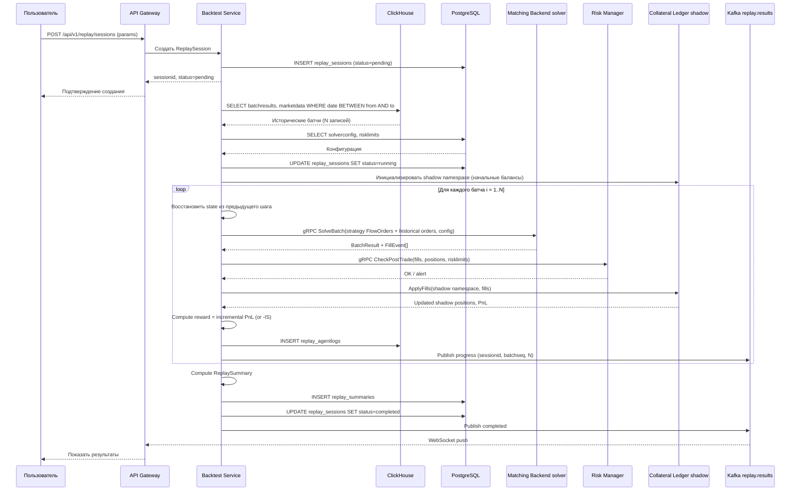
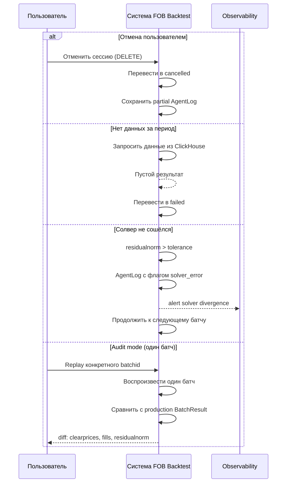

# Note on encoding

Received via chat attachment on 2026-05-20. Cyrillic arrived as UTF-8 mojibake. Decoded version is captured here as the immutable archive.

Original title: **F-15. Backtest / Replay**

---

## Канонические сущности и термины

### Fee model

Формальное описание расчёта комиссий при replay для корректного PnL/IS/VWAP.

```json
"feemodel": {
  "makerfeerate": 0.0002,
  "takerfeerate": 0.0005
}
```

Расширения: per-instrument/per-venue ставки, минимальная комиссия, gas (для DEX), скидки по объёму.

### Рыночные цены и объёмы

- **mid** — $\text{mid} = \frac{\text{bestBid} + \text{bestAsk}}{2}$ — decisionPrice/benchmark для IS
- **spread** — $\text{spread} = \text{bestAsk} - \text{bestBid}$
- **execqty** — фактически исполненный объём fill
- **Qmax (qmax)** — целевой объём FlowOrder

### Метрики качества исполнения

#### PnL
- `pnl` — incremental PnL на батче
- `totalpnl` — суммарный PnL по сессии
- `avgpnl`, `stdpnl` — среднее и std PnL по батчам
- `cumPnL` — кумулятивный PnL для max drawdown

Инкрементальный: $\Delta PnL_i = PnL^{after}_i - PnL^{before}_i$
Суммарный: $totalPnL = \sum_i \Delta PnL_i$

#### IS (Implementation Shortfall)
Простая форма: $IS = execPrice - decisionPrice$

Объёмно-взвешенная (Buy): $IS_i = (P^{avg}_i - decisionPrice_i) \cdot Q^{exec}_i$
Sell: $IS_i = (decisionPrice_i - P^{avg}_i) \cdot Q^{exec}_i$

#### VWAP
$VWAP = \frac{\sum_j execqty_j \cdot execprice_j}{\sum_j execqty_j}$

#### FillRate
$\text{FillRate} = \frac{\sum \text{execqty}}{\sum Q_{\max}} \times 100\%$

#### Sharpe
$\text{Sharpe} = \frac{E[\text{PnL}]}{\text{std}(\text{PnL})}$

#### Max Drawdown
$\text{MaxDD} = \max_t (\text{peak}(t) - \text{cumPnL}(t))$

### Параметры FlowOrder/стратегии

- $p_L$ — нижняя граница цены
- $p_H$ — верхняя граница цены
- `qrate` — скорость исполнения (объём в единицу времени)
- `qmax` / $Q_{\max}$ — максимальный обший объём

### BatchResult

Результат работы солвера для одного батча:
- `clearprices` — вектор clearing-цен по инструментам
- `executedrates` — объёмы/скорости исполнения
- `residualnorm` — норма остатка
- `solvetimems` — время решения

### FillEvent

Единичное исполнение заявки:
- `fillid`, `orderid`, `execqty`, `execprice`, `fees`, метки времени, источник ликвидности

### AgentLog (state-action-reward)

- `state` — JSON-снимок до батча: позиции, PnL, mid, spread, свободная маржа
- `action` — JSON-описание действия стратегии: набор активных FlowOrder
- `reward` — скалярная награда (incremental PnL или -IS)

### ReplaySession

Объект-сессия в PostgreSQL `replay_sessions`:

```sql
CREATE TABLE replay_sessions (
  sessionid        UUID PRIMARY KEY,
  userid           UUID,
  name             VARCHAR(255),
  strategy         JSONB,
  daterangefrom    TIMESTAMPTZ,
  daterangeto      TIMESTAMPTZ,
  solverconfigid   UUID,
  risklimitsid     UUID,
  feemodel         JSONB,
  status           VARCHAR(20),  -- pending|running|completed|failed|cancelled
  totalbatches     INTEGER,
  progressbatches  INTEGER,
  createdat        TIMESTAMPTZ,
  startedat        TIMESTAMPTZ,
  completedat      TIMESTAMPTZ,
  errordetails     TEXT
);
```

### replay_agentlogs (ClickHouse)

```sql
CREATE TABLE replay_agentlogs (
  logid            UUID,
  sessionid        UUID,
  batchseq         UInt32,
  originalbatchid  UUID,
  state            String,  -- JSON
  action           String,  -- JSON
  reward           Float64,
  pnl              Float64,
  is_value         Float64,
  fillrate         Float64,
  solvetime_ms     UInt32,
  residualnorm     Float64,
  fills            String,  -- JSON
  batchresult      String,  -- JSON
  timestamp        DateTime64(3)
) ENGINE = MergeTree() PARTITION BY toYYYYMM(timestamp) ORDER BY (sessionid, batchseq);
```

### replay_summaries (PostgreSQL)

```sql
CREATE TABLE replay_summaries (
  summaryid          UUID PRIMARY KEY,
  sessionid          UUID UNIQUE REFERENCES replay_sessions(sessionid),
  avgis              NUMERIC(18,8),
  totalpnl           NUMERIC(18,8),
  avgpnl             NUMERIC(18,8),
  stdpnl             NUMERIC(18,8),
  sharpe             NUMERIC(10,4),
  fillrate           NUMERIC(8,4),
  avgvwap            NUMERIC(18,8),
  avgsolvetime       NUMERIC(10,2),
  maxdrawdown        NUMERIC(18,8),
  totalbatches       INTEGER,
  totallfillevents   INTEGER,
  createdat          TIMESTAMPTZ
);
```

## Sequence diagram — happy path



## Sequence diagram — альтернативные сценарии



## Функциональные требования (F15-1..F15-47)

Полный список см. в оригинале; ключевые группы:

### API
- F15-1: POST /api/v1/replay/sessions создаёт ReplaySession
- F15-2: Валидация параметров (доступность данных в ClickHouse)
- F15-17: GET /api/v1/replay/sessions с фильтрами
- F15-18: GET /api/v1/replay/sessions/{id} полная карточка
- F15-19: GET /api/v1/replay/sessions/{id}/summary
- F15-20: GET /api/v1/replay/sessions/{id}/agentlogs с пагинацией и фильтрами
- F15-21: POST /api/v1/replay/sessions/{id}/retry — повторный запуск failed/cancelled
- F15-12: DELETE /api/v1/replay/sessions/{id} — отмена
- F15-14: GET /api/v1/replay/compare?sessionA&sessionB — A/B

### Replay logic
- F15-3: Загрузка batchresults/fills/marketdata_snapshots из ClickHouse
- F15-4: Загрузка solverconfig + risklimits + feemodel
- F15-5: Для каждого батча: подача FlowOrder в Matching Backend
- F15-6: Прогон через Risk Manager (pre/post-trade)
- F15-7: Shadow Collateral Ledger в изолированном namespace
- F15-8: Запись AgentLog в ClickHouse
- F15-9: ReplaySummary в PostgreSQL
- F15-13: Audit-mode: replay одного batchid с diff

### Метрики
- F15-10: Sharpe = E[PnL] / std(PnL)
- F15-11: FillRate = sum(execqty)/sum(Qmax) × 100%
- F15-22..F15-25: валидация strategy и логические ограничения FlowOrder
- F15-26..F15-32: формулы reward, totalPnL, avgIS, avgVWAP, maxdrawdown, avgsolvetime
- F15-33..F15-34: граничные условия (std=0 → Sharpe=0; Qmax=0 → fillrate=0)

### Жизненный цикл
- F15-15: Прогресс через WebSocket (Kafka replay.results → API Gateway → WS)
- F15-16: Детерминизм: повторный прогон с теми же данными → идентичный ReplaySummary
- F15-35..F15-39: soft failure (батч пропускается) vs hard failure (сессия failed)
- F15-40..F15-43: snapshot конфигов в ReplaySession, randomSeed для детерминизма
- F15-44..F15-47: audit mode diff, equivalent tolerance, A/B compare валидация

## Нефункциональные требования

- Replay 1 000 батчей < 60 сек wall clock
- Replay 10 000 батчей < 10 мин
- Запись AgentLog в ClickHouse: latency p95 < 50 ms на батч
- До 5 одновременных replay-сессий без деградации production
- Изоляция: shadow позиции не влияют на production Collateral Ledger
- ClickHouse retention для replay_agentlogs: 90 дней (настраиваемый)
- При crash Backtest Service: сессия → failed с сохранением partial AgentLog

## Компоненты

- **Web UI** — создание replay, просмотр результатов, equity curve, A/B
- **API Gateway** — маршрутизация, авторизация, WebSocket для прогресса
- **Backtest Service** — оркестратор replay (Go/Python)
- **Matching Backend** — тот же solver как в production, gRPC isolation mode
- **Risk Manager** — те же risk checks с конфигом из ReplaySession
- **Collateral Ledger (shadow mode)** — изолированный namespace
- **ClickHouse** — источник истории + хранилище AgentLog
- **PostgreSQL** — replay_sessions, replay_summaries, конфигурации
- **Kafka** — `replay.commands`, `replay.results`

## JSON-схемы

### POST /api/v1/replay/sessions — Request

```json
{
  "name": "BTC Strategy Test Q4",
  "daterangefrom": "2025-10-01T00:00:00Z",
  "daterangeto": "2025-12-31T23:59:59Z",
  "strategy": [
    {
      "symbol": "BTCUSDT",
      "side": "buy",
      "pL": 58000,
      "pH": 62000,
      "qrate": 0.5,
      "qmax": 100,
      "executionwindow": 3600
    }
  ],
  "solverconfigid": "cfg-001",
  "risklimitsid": "rlim-001",
  "feemodel": {
    "makerfeerate": 0.0002,
    "takerfeerate": 0.0005
  }
}
```

### POST /api/v1/replay/sessions — Response

```json
{
  "sessionid": "rpl-abc-123",
  "status": "pending",
  "totalbatches": 7890,
  "createdat": "2026-03-12T05:15:00Z"
}
```

### GET /api/v1/replay/sessions/{id}/summary — Response

```json
{
  "sessionid": "rpl-abc-123",
  "avgis": -0.00023,
  "totalpnl": 15420.50,
  "avgpnl": 1.95,
  "stdpnl": 12.30,
  "sharpe": 0.159,
  "fillrate": 94.2,
  "avgvwap": 60125.40,
  "avgsolvetime": 342.5,
  "maxdrawdown": 2100.00,
  "totalbatches": 7890,
  "totalfillevents": 31240
}
```

### GET /api/v1/replay/compare — Response

```json
{
  "sessionA": "rpl-001",
  "sessionB": "rpl-002",
  "diff": {
    "avgis": {"A": -0.00023, "B": -0.00018, "delta": 0.00005},
    "totalpnl": {"A": 15420.50, "B": 16800.30, "delta": 1379.80},
    "sharpe": {"A": 0.159, "B": 0.185, "delta": 0.026},
    "fillrate": {"A": 94.2, "B": 91.5, "delta": -2.7},
    "maxdrawdown": {"A": 2100.00, "B": 1850.00, "delta": -250.00}
  }
}
```

## UI экраны

1. **Backtest / Replay** — форма создания + таблица сессий
2. **Результаты replay** с вкладками:
   - Сводка (KPI cards)
   - Equity curve
   - По батчам (таблица AgentLog с фильтрами)
   - Сравнение A/B (side-by-side delta-матрица)
3. **Audit-mode** — diff replay vs production для batchid

## Тестовые кейсы

### Unit-тесты (16 сценариев)
- Sharpe ratio (включая граничный std=0)
- FillRate
- Max Drawdown
- IS (buy/sell)
- VWAP
- AgentLog формирование
- Детерминизм батча
- Пустой батч
- Solver не сошёлся
- Boundary-формулы
- Reward-режимы (PnL, -IS, hybrid)
- Volume-weighted avgIS
- Агрегация ReplaySummary с ошибочными батчами
- Корректность shadow-позиций
- Сериализация AgentLog
- Отсутствие marketdata

### Integration-тесты (10 сценариев)
- Полный цикл replay
- Shadow isolation (нет влияния на production)
- Kafka progress events
- Отмена replay
- A/B сравнение
- Audit mode
- Неполные исторические данные
- Retry + детерминизм
- Авторизация и роли
- Большой объём fills

### Нагрузочные тесты
- 1 000 батчей < 60 сек
- 10 000 батчей < 10 мин
- 5 параллельных сессий: solve time degradation < 20%
- 20 параллельных (stress): solve time p95 ≤ 2× single-session
- Запись AgentLog: throughput > 200 записей/сек

## Definition of Done (F-15)

См. секцию 6 оригинала; ключевые пункты:
- API POST/GET /api/v1/replay/sessions реализован
- API чтения сессий с фильтрами, пагинацией
- Backtest Service загружает данные из ClickHouse + конфиги из PostgreSQL
- Snapshot конфигов в ReplaySession для воспроизводимости
- Replay-цикл через тот же Matching Backend, Risk Manager, Collateral Ledger (shadow)
- Shadow isolation подтверждена
- AgentLog в ClickHouse с полным набором полей
- ReplaySummary по зафиксированным формулам в PostgreSQL
- Граничные случаи метрик обработаны
- Reward-режимы (PnL, -IS, hybrid) реализованы и зафиксированы
- Детерминизм: повторный прогон → идентичные AgentLog и ReplaySummary
- Отмена через DELETE с сохранением partial logs
- Audit-mode с diff replay vs production
- A/B compare endpoint
- Прогресс через WebSocket
- Web UI с экранами и вкладками
- Проверки прав/ролей
- Unit-тесты (16+), integration-тесты (10+)
- Нагрузочные тесты пройдены
- Метрики и логи для observability
- Документация (OpenAPI, user guide, tech description)
- Code review, CI green, релизные заметки
