# F‑09. Работа с пакетными, комбинированными и многоногими заявками


Версия: `v2 corrected`
Статус: `corrected draft`
Канонический компонент приёма заявок: `order_flow` (компонент жизненного цикла заявок; также выполняет роль Provider‑Client Backend — клиентско‑провайдерского backend‑компонента)
Связанные фичи: F‑02 Create FlowOrder (создание потоковой заявки), F‑04 Batch Clearing (пакетный клиринг), F‑05 Live Market Data (рыночные данные в реальном времени), F‑06 Positions/PnL/Margin (позиции, прибыль/убыток и маржа), F‑07 Pre‑trade Risk Control (предторговый риск‑контроль), F‑11 External Venues LOB→FOB (внешние площадки, перевод стакана лимитных заявок в потоковую книгу заявок), F‑12 Execution Hedge (внешнее хеджирующее исполнение), F‑15 Backtest Replay (историческое воспроизведение и тестирование стратегии).

---

## 1. Назначение фичи

F‑09 вводит поддержку заявок, в которых пользовательский торговый intent (намерение совершить торговую операцию) относится не к одному инструменту, а к связанной группе ног:

* `BatchOrder` (пакетная заявка);
* `ComboOrder` (комбинированная заявка);
* `MultiLegVectorOrder` (многоногая векторная заявка);
* `PairOrder` (парная заявка);
* `BasketOrder` (корзинная заявка);
* `SpreadOrder` (спредовая заявка);
* `OCO` / `One Cancels Other` (взаимоисключающие заявки: исполнение одной отменяет другую);
* `BracketOrder` (заявка со скобкой: входная заявка плюс связанные take‑profit и stop‑loss ветви);
* `TWAP container` (контейнер исполнения по средней цене во времени);
* `VWAP container` (контейнер исполнения по средневзвешенной цене объёма).

Главная цель F‑09 — обеспечить исполнение связанных заявок как единого бизнес‑объекта с общей логикой:

* жизненного цикла;
* предторгового риск‑контроля;
* клиринга;
* исполнения;
* отчётности;
* статусов;
* тестирования;
* воспроизведения в Backtest Replay (историческое воспроизведение и тестирование стратегии).

Ключевое правило:

> Настоящая многоногая заявка — это не набор независимых FlowOrder (потоковых заявок). Настоящая многоногая заявка — это один parent intent (родительское торговое намерение), внутри которого Matching Backend (backend‑компонент сопоставления заявок) выбирает согласованный вектор исполнений по ногам.

---

## 2. Принципиальное архитектурное решение

F‑09 должна явно различать два режима работы.

---

### 2.1. Режим `orchestration_only` (только оркестрация независимых заявок)

`orchestration_only` (только оркестрация независимых заявок) — это режим, в котором система создаёт удобный parent object (родительский объект) для группы заявок, но не гарантирует математически согласованное многоногое исполнение.

В этом режиме:

* пользователь задаёт несколько дочерних заявок;
* система один раз распределяет бюджет, объём или веса между ногами;
* каждая нога далее живёт как независимая FlowOrder (потоковая заявка);
* общий parent order (родительская заявка) используется для интерфейса, отчётности, отмены группы и отображения статусов;
* система не гарантирует сохранение целевых весов, ratio (соотношения), spread (спреда), factor exposure (факторной экспозиции) или portfolio risk (портфельного риска) на протяжении исполнения.

Этот режим допустим только если пользователь явно выбрал:

```yaml
executionMode: "orchestration_only" # Режим исполнения: только оркестрация независимых дочерних заявок без гарантии сохранения пропорций, весов или спреда.
```

Система должна показать предупреждение:

```text
Ноги исполняются независимо. Итоговые веса, ratio (соотношения), spread (спред) и portfolio exposure (портфельная экспозиция) могут отклониться от целевых значений.
```

---

### 2.2. Режим `multileg_vector_solver` (многоногий векторный решатель)

`multileg_vector_solver` (многоногий векторный решатель) — это режим настоящего многоногого исполнения.

В этом режиме:

* parent order (родительская заявка) хранит legs (ноги), constraints (ограничения), policies (политики) и graph links (связи графа);
* Matching Backend (backend‑компонент сопоставления заявок) решает grouped problem (групповую задачу);
* переменная исполнения — не независимый объём каждой ноги, а согласованный вектор исполнений:

$$
e_g = (e_{g,1}, \dots, e_{g,L_g})^T
$$

где:

* $e_g$ — вектор исполнений группы $g$;
* $e_{g,\ell}$ — исполнение ноги $\ell$ группы $g$;
* $L_g$ — количество ног в группе $g$.

Для ratio / basket / spread заявок вводится общий execution scale (масштаб исполнения):

$$
e_g = \alpha_g \rho_g
$$

где:

* $\alpha_g$ — общий масштаб исполнения группы;
* $\rho_g$ — целевой вектор ног группы;
* $e_g$ — фактический вектор исполнений.

Для более сложных случаев используется система линейных ограничений:

$$
A_g e_g = b_g \alpha_g
$$

$$
G_g e_g \le h_g
$$

где:

* $A_g$ — матрица равенств для ratio (соотношений), weights (весов), factor neutrality (факторной нейтральности);
* $G_g$ — матрица неравенств для риск‑, бюджетных, маржинальных и ликвидностных ограничений;
* $b_g$ — целевой вектор равенств;
* $h_g$ — верхние границы ограничений;
* $\alpha_g$ — общий масштаб исполнения.

Результат batch cycle (цикла пакетного клиринга) фиксируется как один `ExecutionGroup` (группа исполнения), а leg fills (исполнения ног) являются частями этой группы.

---

## 3. Когда обязателен `multileg_vector_solver` (многоногий векторный решатель)

Режим `multileg_vector_solver` (многоногий векторный решатель) обязателен, если заявка содержит хотя бы одно из условий:

* нужно сохранять target weights (целевые веса);
* нужно сохранять ratio (соотношение) между ногами;
* есть spread constraint (спредовое ограничение);
* есть index / basket constraint (индексное или корзинное ограничение);
* есть factor neutrality (факторная нейтральность);
* есть общий budget constraint (бюджетное ограничение);
* есть общий leverage constraint (ограничение плеча);
* есть общий margin constraint (маржинальное ограничение);
* запрещены orphan legs (осиротевшие ноги, исполненные без связанных ног);
* требуется `strict_atomic` (строгая атомарность);
* требуется `scalable_atomic` (масштабируемая атомарность);
* требуется единая grouped reporting (групповая отчётность) по ногам;
* требуется replay determinism (детерминированное воспроизведение) в F‑15.

---

## 4. Термины и определения

### 4.1. `BatchOrder` (пакетная заявка)

`BatchOrder` (пакетная заявка) — пользовательский parent object (родительский объект), объединяющий несколько дочерних заявок, ComboOrder (комбинированных заявок), conditional branches (условных ветвей) или FlowOrder (потоковых заявок).

Важно:

* `BatchOrder` (пакетная заявка) — это клиентский бизнес‑объект;
* `Batch` (батч, цикл пакетного клиринга) из F‑04 — это один цикл работы Matching Backend (backend‑компонента сопоставления заявок).

---

### 4.2. `ComboOrder` (комбинированная заявка)

`ComboOrder` (комбинированная заявка) — многоногая заявка, в которой ноги связаны общими условиями:

* ratio (соотношение);
* weights (веса);
* spread (спред);
* index (индекс);
* factor exposure (факторная экспозиция);
* budget (бюджет);
* margin (маржа);
* risk (риск);
* time condition (временное условие);
* activation graph (граф активации).

---

### 4.3. `MultiLegVectorOrder` (многоногая векторная заявка)

`MultiLegVectorOrder` (многоногая векторная заявка) — техническая нормализованная форма ComboOrder (комбинированной заявки), которую Matching Backend (backend‑компонент сопоставления заявок) использует в solver (решателе).

`MultiLegVectorOrder` (многоногая векторная заявка) содержит:

* список legs (ног);
* signed leg vector (знаковый вектор ног);
* target ratio (целевое соотношение);
* target weights (целевые веса);
* factor vector (факторный вектор);
* constraint matrix (матрицу ограничений);
* atomicity policy (политику атомарности);
* fallback policy (политику резервного поведения);
* risk constraints (риск‑ограничения);
* execution mode (режим исполнения).

---

### 4.4. `Leg` (нога)

`Leg` (нога) — один инструмент или одна сторона внутри многоногой заявки.

Нога содержит:

* instrument (инструмент);
* side (сторону);
* ratio (соотношение);
* weight (вес);
* price band (ценовой диапазон);
* max quantity (максимальный объём);
* max rate (максимальную скорость исполнения);
* filled quantity (исполненный объём);
* venue preferences (предпочтения по площадкам);
* status (статус).

---

### 4.5. `ExecutionGroup` (группа исполнения)

`ExecutionGroup` (группа исполнения) — результат исполнения parent order (родительской заявки) или ComboOrder (комбинированной заявки) в одном batch cycle (цикле пакетного клиринга).

`ExecutionGroup` (группа исполнения) содержит:

* executionGroupId (идентификатор группы исполнения);
* batchId (идентификатор батча);
* parentOrderId (идентификатор родительской заявки);
* executionScale (масштаб исполнения);
* groupStatus (статус группы);
* legResults (результаты по ногам);
* violatedConstraints (нарушенные ограничения);
* fallbackAction (действие резервного поведения);
* solverDiagnostics (диагностика решателя);
* atomicityGuarantee (фактическая гарантия атомарности).

---

### 4.6. `LegFill` (исполнение ноги)

`LegFill` (исполнение ноги) — FillEvent (событие исполнения) по конкретной ноге, связанное с ExecutionGroup (группой исполнения).

`LegFill` (исполнение ноги) не является самостоятельным бизнес‑исполнением. Оно является частью grouped execution (группового исполнения).

---

### 4.7. `Orphan leg` (осиротевшая нога)

`Orphan leg` (осиротевшая нога) — нога, которая была исполнена без обязательных связанных ног.

Для `strict_atomic` (строгой атомарности) и `scalable_atomic` (масштабируемой атомарности) осиротевшие ноги запрещены.

---

### 4.8. `Atomicity scope` (область атомарности)

`atomicityScope` (область атомарности) определяет, где реально обеспечивается атомарность исполнения.

Возможные значения:

```yaml
atomicityScope: "internal_batch" # Область атомарности: атомарность гарантируется внутри внутреннего batch cycle (цикла пакетного клиринга).
atomicityScope: "venue_native" # Область атомарности: атомарность гарантируется внешней площадкой, если она поддерживает native multi-leg order (нативную многоногую заявку).
atomicityScope: "external_compensating" # Область атомарности: атомарности нет; система выполняет компенсационные действия после частичного внешнего исполнения.
atomicityScope: "none" # Область атомарности: атомарность не заявляется и не гарантируется.
```

---

## 5. Бизнес‑требования

### BR‑F09‑001. Единый parent object (родительский объект)

Система должна позволять пользователю создавать заявку, состоящую из нескольких связанных legs (ног), и отслеживать её как один бизнес‑объект.

---

### BR‑F09‑002. Настоящее multi‑leg execution (многоногое исполнение)

Система должна поддерживать режим, в котором многоногая заявка исполняется как согласованный вектор, а не как набор независимых FlowOrder (потоковых заявок).

---

### BR‑F09‑003. Сохранение target ratio (целевого соотношения)

Для заявок с `strict_atomic` (строгой атомарностью) и `scalable_atomic` (масштабируемой атомарностью) система должна сохранять ratio (соотношение) или weights (веса) в пределах заданного tolerance (допуска).

---

### BR‑F09‑004. Защита от portfolio skew (перекоса портфеля)

Если пользователь указал, что target weights (целевые веса) являются жёсткой целью, система не должна позволять одной ноге исполняться существенно быстрее другой с нарушением целевой структуры портфеля.

---

### BR‑F09‑005. Поддержка spread / index / factor execution (спредового, индексного и факторного исполнения)

Система должна поддерживать заявки, где допустимость исполнения определяется не только ценами отдельных ног, но и линейной комбинацией цен:

$$
L_g \le c_g^T P \le U_g
$$

где:

* $L_g$ — нижняя граница допустимой цены комбинации;
* $U_g$ — верхняя граница допустимой цены комбинации;
* $c_g$ — вектор коэффициентов ног;
* $P$ — вектор текущих цен инструментов;
* $c_g^T P$ — цена комбинации.

---

### BR‑F09‑006. Единая отчётность по группе

Пользователь должен видеть:

* parent status (статус родительской заявки);
* leg status (статус каждой ноги);
* execution scale (масштаб исполнения);
* combined VWAP (совокупную средневзвешенную цену исполнения по объёму);
* combined IS / Implementation Shortfall (совокупное отклонение от эталонной цены);
* ratio deviation (отклонение соотношения);
* spread condition result (результат проверки спредового условия);
* fallback action (резервное действие);
* violated constraints (нарушенные ограничения);
* degraded status (статус деградации исполнения).

---

### BR‑F09‑007. Явное различение оркестрации и настоящего многоногого решателя

Система должна различать:

```yaml
executionMode: "orchestration_only" # Режим исполнения: только оркестрация независимых заявок без многоногих гарантий.
executionMode: "multileg_vector_solver" # Режим исполнения: настоящий многоногий векторный решатель с согласованным исполнением ног.
```

---

### BR‑F09‑008. Корректное поведение при внешнем исполнении

Если часть legs (ног) уходит на external venues (внешние площадки), система не должна заявлять `strict_atomic` (строгую атомарность), если эти площадки не поддерживают native atomic multi‑leg execution (нативное атомарное многоногое исполнение).

В таком случае допустимы только:

* `best_effort` (исполнение с максимальным усилием без строгой гарантии);
* `sequential_fallback` (последовательное резервное исполнение);
* `external_compensating` (внешнее компенсационное исполнение);
* `degraded` (деградированный результат);
* `rollback_pending` (ожидание компенсационного отката), но только как статус компенсации, а не как фактический откат уже совершённой сделки.

---

## 6. User Stories (пользовательские истории)

### US‑F09‑001. Pair order (парная заявка)

Как трейдер, я хочу создать pair order (парную заявку), например buy BTC / sell ETH (купить BTC / продать ETH), чтобы исполнять две ноги в заданном соотношении и не получить перекошенную позицию.

---

### US‑F09‑002. Basket order (корзинная заявка)

Как институциональный клиент, я хочу купить basket (корзину активов) с целевыми весами, чтобы итоговый портфель соответствовал заданной структуре.

---

### US‑F09‑003. Spread order (спредовая заявка)

Как трейдер, я хочу торговать spread (спред) между двумя инструментами, чтобы исполнение происходило только при допустимой цене комбинации.

---

### US‑F09‑004. OCO / One Cancels Other (взаимоисключающие заявки)

Как трейдер, я хочу создать взаимоисключающие ветви, чтобы исполнение одной ветви автоматически отменяло другую.

---

### US‑F09‑005. Bracket order (заявка со скобкой)

Как трейдер, я хочу создать entry order (входную заявку), take profit (фиксацию прибыли) и stop loss (ограничение убытка), чтобы выходные ветви активировались только на реально исполненный входной объём.

---

### US‑F09‑006. Контролируемый fallback (резервное поведение)

Как риск‑офицер, я хочу видеть, когда multi‑leg execution (многоногое исполнение) деградировало в best effort (исполнение с максимальным усилием) или compensating mode (компенсационный режим), чтобы отличать гарантированное атомарное исполнение от компенсационного.

---

## 7. Use Cases (варианты использования)

### UC‑F09‑001. Создание настоящей многоногой заявки

Actor (актор): Trader / API Client (трейдер / программный клиент).
Компонент: `order_flow` (компонент жизненного цикла заявок; Provider‑Client Backend — клиентско‑провайдерский backend‑компонент).

Основной поток:

1. Пользователь отправляет `CreateComboOrder` (создать комбинированную заявку).
2. API Gateway (API‑шлюз) маршрутизирует команду в `order_flow`.
3. `order_flow` нормализует legs (ноги), constraints (ограничения), policies (политики) и graph links (связи графа).
4. Risk Manager (компонент управления риском) выполняет pre‑trade check (предторговую проверку):

   * по каждой ноге;
   * по группе;
   * по margin impact (влиянию на маржу);
   * по notional (номинальному объёму);
   * по максимальному количеству ног;
   * по atomicity policy (политике атомарности).
5. Если проверка успешна, `order_flow` сохраняет parent order (родительскую заявку), legs (ноги), constraints (ограничения) и graph links (связи графа).
6. Parent order (родительская заявка) получает статус `active` (активна) или `waiting_for_trigger` (ожидает условия активации).

---

### UC‑F09‑002. Grouped matching (групповое сопоставление) внутри batch cycle (цикла пакетного клиринга)

Actor (актор): Matching Backend (backend‑компонент сопоставления заявок).

Основной поток:

1. Matching Backend (backend‑компонент сопоставления заявок) в начале batch cycle (цикла пакетного клиринга) читает active parent orders (активные родительские заявки).
2. Для каждой группы строится `MultiLegVectorOrder` (многоногая векторная заявка).
3. Компонент получает reference prices (эталонные цены).
4. Компонент рассчитывает feasible caps (допустимые верхние границы исполнения) по каждой ноге.
5. Компонент решает grouped problem (групповую задачу):

   * выбирает $\alpha_g$ (масштаб исполнения группы);
   * выбирает $e_g$ (вектор исполнений);
   * проверяет constraints (ограничения).
6. Компонент формирует `ExecutionGroup` (группу исполнения).
7. Компонент формирует leg fills (исполнения ног).
8. Компонент публикует события.
9. Ledger (реестр расчётов и проводок) применяет grouped execution (групповое исполнение).

---

### UC‑F09‑003. External leg execution (внешнее исполнение ног)

Actor (актор): Execution Planning (компонент планирования исполнения) / Venue Execution Adapter (адаптер исполнения на внешней площадке).

Основной поток:

1. Matching Backend (backend‑компонент сопоставления заявок) определяет, что часть legs (ног) требует внешней ликвидности.
2. Execution Planning (компонент планирования исполнения) строит grouped routing hints (подсказки групповой маршрутизации).
3. Если `atomicityScope = internal_batch` (область атомарности — внутренний батч), внешнее исполнение обязательных ног не допускается.
4. Если `atomicityScope = venue_native` (область атомарности — нативная атомарность площадки), заявка может быть отправлена только на venue (площадку), поддерживающую native atomic multi‑leg order (нативную атомарную многоногую заявку).
5. Если `atomicityScope = external_compensating` (область атомарности — внешняя компенсация), система исполняет ноги в режиме best effort (максимального усилия) и при частичном результате запускает compensating action (компенсационное действие).
6. `ExecutionGroup` (группа исполнения) получает точный статус:

   * `filled` (исполнена);
   * `partial` (частично исполнена);
   * `degraded` (деградирована);
   * `compensating` (в процессе компенсации);
   * `rollback_pending` (ожидает компенсационного отката);
   * `rolledback` (компенсационно откатана).

---

## 8. Доменная модель

### 8.1. `BatchOrder` (пакетная заявка)

```jsonc
{
  "batchOrderId": "bo_01", // Уникальный идентификатор BatchOrder (пакетной заявки).
  "userId": "u_01", // Идентификатор пользователя, создавшего пакетную заявку.
  "accountId": "acc_01", // Идентификатор счёта, от имени которого создана пакетная заявка.
  "type": "batch", // Тип parent order (родительской заявки): batch, combo, basket, spread, conditional, oco, bracket.
  "executionMode": "orchestration_only", // Режим исполнения: только оркестрация независимых дочерних заявок без многоногих гарантий.
  "status": "active", // Текущий статус пакетной заявки.
  "timeWindow": { // Временное окно активности пакетной заявки.
    "startAt": "2026-04-02T10:00:00Z", // Время начала активности заявки.
    "endAt": "2026-04-02T10:30:00Z" // Время окончания активности заявки.
  },
  "childRefs": [ // Ссылки на дочерние элементы пакетной заявки.
    {
      "childType": "combo", // Тип дочернего элемента: combo означает ComboOrder (комбинированную заявку).
      "childRef": "co_01" // Идентификатор дочерней ComboOrder (комбинированной заявки).
    }
  ]
}
```

---

### 8.2. `ComboOrder` (комбинированная заявка)

```jsonc
{
  "comboOrderId": "co_01", // Уникальный идентификатор ComboOrder (комбинированной заявки).
  "batchOrderId": "bo_01", // Идентификатор родительской BatchOrder (пакетной заявки), если ComboOrder вложена в пакет.
  "comboType": "basket", // Тип комбинации: pair, basket, spread, conditional, oco, bracket.
  "executionMode": "multileg_vector_solver", // Режим исполнения: настоящий многоногий векторный решатель.
  "status": "active", // Текущий статус комбинированной заявки.
  "ratioBasis": "notional_weight", // База расчёта соотношения: веса считаются по номинальной стоимости, а не по количеству единиц актива.
  "atomicityPolicy": "scalable_atomic", // Политика атомарности: ноги исполняются согласованно, но общий масштаб может быть уменьшен.
  "atomicityScope": "internal_batch", // Область атомарности: атомарность гарантируется внутри внутреннего batch cycle (цикла пакетного клиринга).
  "fallbackPolicy": "scale_down", // Политика резервного поведения: уменьшить общий масштаб исполнения.
  "minExecutionScale": 0.25, // Минимально допустимый масштаб исполнения группы.
  "maxRatioDeviationBps": 5, // Максимальное допустимое отклонение соотношения в базисных пунктах.
  "legs": [ // Список ног комбинированной заявки.
    {
      "legId": "leg_btc", // Уникальный идентификатор ноги BTC.
      "instrument": "BTCUSDT", // Инструмент ноги.
      "side": "buy", // Сторона ноги: покупка.
      "weight": 0.6, // Целевой вес ноги в корзине.
      "pLow": 59800, // Нижняя допустимая цена исполнения ноги.
      "pHigh": 60500, // Верхняя допустимая цена исполнения ноги.
      "qRate": 0.40, // Максимальная скорость исполнения ноги.
      "qMax": 0.1, // Максимальный объём исполнения ноги.
      "filledCum": 0.0, // Кумулятивно исполненный объём ноги.
      "venuePreferences": ["internal"] // Предпочтительные источники ликвидности для ноги.
    },
    {
      "legId": "leg_eth", // Уникальный идентификатор ноги ETH.
      "instrument": "ETHUSDT", // Инструмент ноги.
      "side": "buy", // Сторона ноги: покупка.
      "weight": 0.4, // Целевой вес ноги в корзине.
      "pLow": 2950, // Нижняя допустимая цена исполнения ноги.
      "pHigh": 3100, // Верхняя допустимая цена исполнения ноги.
      "qRate": 6.0, // Максимальная скорость исполнения ноги.
      "qMax": 1.3333, // Максимальный объём исполнения ноги.
      "filledCum": 0.0, // Кумулятивно исполненный объём ноги.
      "venuePreferences": ["internal"] // Предпочтительные источники ликвидности для ноги.
    }
  ],
  "constraints": [ // Общие ограничения комбинированной заявки.
    {
      "constraintId": "ctr_weight_dev", // Идентификатор ограничения отклонения весов.
      "type": "max_weight_deviation", // Тип ограничения: максимальное отклонение от целевых весов.
      "valueBps": 5, // Допустимое отклонение в базисных пунктах.
      "severity": "hard" // Жёсткость ограничения: hard означает обязательное ограничение.
    },
    {
      "constraintId": "ctr_total_budget", // Идентификатор бюджетного ограничения.
      "type": "max_total_notional", // Тип ограничения: максимальный общий номинальный объём.
      "value": 10000, // Максимальный общий номинальный объём.
      "severity": "hard" // Жёсткость ограничения: hard означает обязательное ограничение.
    }
  ]
}
```

---

### 8.3. `Leg` (нога)

```jsonc
{
  "legId": "leg_btc", // Уникальный идентификатор ноги.
  "parentOrderId": "co_01", // Идентификатор родительской ComboOrder (комбинированной заявки).
  "instrument": "BTCUSDT", // Торговый инструмент ноги.
  "side": "buy", // Сторона ноги: buy означает покупку.
  "ratio": null, // Целевое количественное соотношение; null, если используется weight (вес).
  "weight": 0.6, // Целевой вес ноги в корзине.
  "ratioBasis": "notional_weight", // База расчёта веса: по номинальной стоимости.
  "pLow": 59800, // Нижняя допустимая цена исполнения.
  "pHigh": 60500, // Верхняя допустимая цена исполнения.
  "qRate": 0.40, // Максимальная скорость исполнения.
  "qMax": 0.1, // Максимальный объём ноги.
  "filledCum": 0.03, // Кумулятивно исполненный объём ноги.
  "status": "partial" // Статус ноги: частично исполнена.
}
```

---

### 8.4. `MultiLegConstraint` (многоногое ограничение)

```jsonc
{
  "constraintId": "ctr_spread_01", // Уникальный идентификатор ограничения.
  "parentOrderId": "co_spread_01", // Идентификатор родительской ComboOrder (комбинированной заявки).
  "type": "spread_range", // Тип ограничения: допустимый диапазон спреда.
  "coefficients": { // Коэффициенты линейной комбинации цен.
    "BTCUSDT": 1.0, // Коэффициент цены BTCUSDT в формуле спреда.
    "ETHUSDT": -15.0 // Коэффициент цены ETHUSDT в формуле спреда.
  },
  "lower": -5000, // Нижняя допустимая граница значения спреда.
  "upper": 5000, // Верхняя допустимая граница значения спреда.
  "severity": "hard" // Жёсткость ограничения: hard означает обязательное ограничение.
}
```

---

### 8.5. `ExecutionGroup` (группа исполнения)

```jsonc
{
  "executionGroupId": "eg_5001", // Уникальный идентификатор группы исполнения.
  "batchId": "batch_20260402_100500_001", // Идентификатор batch cycle (цикла пакетного клиринга), в котором рассчитано исполнение.
  "parentOrderId": "co_01", // Идентификатор родительской ComboOrder (комбинированной заявки).
  "executionMode": "multileg_vector_solver", // Режим исполнения: многоногий векторный решатель.
  "groupStatus": "partial", // Статус группы исполнения: частично исполнена.
  "executionScale": 0.60, // Масштаб исполнения группы.
  "atomicityPolicy": "scalable_atomic", // Политика атомарности: согласованное исполнение с возможностью уменьшить масштаб.
  "atomicityScope": "internal_batch", // Область атомарности: внутренний batch cycle (цикл пакетного клиринга).
  "fallbackAction": "scale_down", // Применённое резервное действие: уменьшение масштаба исполнения.
  "violatedConstraints": [], // Список нарушенных ограничений; пустой список означает, что нарушения отсутствуют.
  "ratioDeviationBps": 0, // Отклонение от целевого соотношения в базисных пунктах.
  "legResults": [ // Результаты исполнения по ногам.
    {
      "legId": "leg_btc", // Идентификатор ноги BTC.
      "execQty": 0.06, // Исполненный объём ноги.
      "execPrice": 60120.5, // Цена исполнения ноги.
      "fillId": "fill_btc_001" // Идентификатор FillEvent (события исполнения) ноги.
    },
    {
      "legId": "leg_eth", // Идентификатор ноги ETH.
      "execQty": 0.80, // Исполненный объём ноги.
      "execPrice": 3010.4, // Цена исполнения ноги.
      "fillId": "fill_eth_001" // Идентификатор FillEvent (события исполнения) ноги.
    }
  ],
  "solverDiagnostics": { // Диагностика solver (решателя).
    "groupSolveTimeMs": 4, // Время решения групповой задачи в миллисекундах.
    "bindingLegs": ["leg_eth"], // Ноги, которые ограничили общий масштаб исполнения.
    "bindingConstraints": ["ctr_total_budget"] // Ограничения, которые стали активными при решении.
  },
  "createdAt": "2026-04-02T10:05:00.123Z" // Время создания группы исполнения.
}
```

---

## 9. Математическая модель

### 9.1. Общая постановка

Пусть в системе есть $n$ активов. Для группы $g$ задано $L_g$ ног.

Вектор исполнений по ногам:

$$
e_g = (e_{g,1}, \dots, e_{g,L_g})^T
$$

где:

* $e_g$ — вектор исполнений группы;
* $e_{g,\ell}$ — исполнение ноги $\ell$;
* $L_g$ — количество ног в группе.

Матрица перехода из пространства ног в пространство активов:

$$
\Delta x_g = B_g e_g
$$

где:

* $B_g$ — матрица отображения ног в активы;
* $\Delta x_g$ — изменение позиции по активам;
* $e_g$ — вектор исполнений ног.

Если $\Delta t$ — длительность batch cycle (цикла пакетного клиринга), поток группы:

$$
v_g = \frac{B_g e_g}{\Delta t}
$$

где:

* $v_g$ — поток позиции группы;
* $B_g e_g$ — изменение позиции по активам;
* $\Delta t$ — длительность батча.

---

### 9.2. Ratio / basket execution (исполнение по соотношению или корзине)

Для ratio group (группы с целевым соотношением):

$$
e_g = \alpha_g \rho_g
$$

где:

* $e_g$ — вектор фактических исполнений;
* $\alpha_g$ — общий масштаб исполнения;
* $\rho_g$ — целевой вектор ног.

Если веса заданы в notional basis (номинальной базе), целевые количества пересчитываются на каждом batch cycle (цикле пакетного клиринга):

$$
Q^{target}_{g,\ell}(t)
======================

\frac{w_{g,\ell} \cdot N_g}{P_{\ell}^{ref}(t)}
$$

где:

* $Q^{target}_{g,\ell}(t)$ — целевой объём ноги $\ell$ в момент $t$;
* $w_{g,\ell}$ — целевой вес ноги;
* $N_g$ — общий номинальный объём группы;
* $P_{\ell}^{ref}(t)$ — reference price (эталонная цена) ноги в момент $t$.

Остаток по ноге:

$$
Q^{remaining}_{g,\ell}(t)
=========================

\max
\left(
Q^{target}*{g,\ell}(t) - Q^{filled}*{g,\ell}(t),
0
\right)
$$

где:

* $Q^{remaining}_{g,\ell}(t)$ — остаток ноги;
* $Q^{target}_{g,\ell}(t)$ — целевой объём ноги;
* $Q^{filled}_{g,\ell}(t)$ — уже исполненный объём ноги.

---

### 9.3. Feasible caps (допустимые верхние границы исполнения)

Для каждой ноги определяется локально допустимый объём:

$$
Q^{feasible}_{g,\ell}
=====================

\min
\left(
Q^{remaining}*{g,\ell},
Q^{rate}*{g,\ell},
Q^{liq}*{g,\ell},
Q^{risk}*{g,\ell},
Q^{venue}_{g,\ell}
\right)
$$

где:

* $Q^{feasible}_{g,\ell}$ — допустимый объём исполнения ноги;
* $Q^{remaining}_{g,\ell}$ — остаток ноги;
* $Q^{rate}_{g,\ell}$ — ограничение по скорости исполнения;
* $Q^{liq}_{g,\ell}$ — ограничение по ликвидности;
* $Q^{risk}_{g,\ell}$ — ограничение по риску;
* $Q^{venue}_{g,\ell}$ — ограничение внешней площадки.

Для `scalable_atomic` (масштабируемой атомарности):

$$
\alpha_g^{liq}
==============

\min_{\ell}
\frac{
Q^{feasible}*{g,\ell}
}{
Q^{target}*{g,\ell}
}
$$

где:

* $\alpha_g^{liq}$ — масштаб исполнения, ограниченный ликвидностью;
* $Q^{feasible}_{g,\ell}$ — допустимый объём исполнения ноги;
* $Q^{target}_{g,\ell}$ — целевой объём ноги.

Итоговый масштаб:

$$
\alpha_g^*
==========

\min
\left(
\alpha_g^{solver},
\alpha_g^{liq},
\alpha_g^{risk},
\alpha_g^{venue},
1
\right)
$$

где:

* $\alpha_g^*$ — итоговый масштаб исполнения;
* $\alpha_g^{solver}$ — масштаб, предложенный solver (решателем);
* $\alpha_g^{liq}$ — масштаб по ликвидности;
* $\alpha_g^{risk}$ — масштаб по риску;
* $\alpha_g^{venue}$ — масштаб по ограничениям внешней площадки.

---

### 9.4. Общие линейные ограничения

Для сложных заявок используются ограничения:

$$
A_g e_g = b_g \alpha_g
$$

$$
G_g e_g \le h_g
$$

где:

* $A_g$ — матрица равенств;
* $G_g$ — матрица неравенств;
* $e_g$ — вектор исполнений;
* $b_g$ — вектор целевых равенств;
* $h_g$ — вектор верхних границ;
* $\alpha_g$ — масштаб исполнения.

Примеры ограничений:

* ratio constraints (ограничения соотношения);
* spread constraints (спредовые ограничения);
* margin constraints (маржинальные ограничения);
* risk constraints (риск‑ограничения);
* time constraints (временные ограничения);
* factor neutrality constraints (ограничения факторной нейтральности).

---

### 9.5. Spread constraint (спредовое ограничение)

Для spread / index / factor заявки:

$$
L_g \le c_g^T P \le U_g
$$

где:

* $L_g$ — нижняя граница допустимого значения комбинации;
* $U_g$ — верхняя граница допустимого значения комбинации;
* $c_g$ — вектор коэффициентов;
* $P$ — вектор цен;
* $c_g^T P$ — цена комбинации.

Если условие не выполняется:

* при `strict_atomic` (строгой атомарности) группа не исполняется;
* при `scalable_atomic` (масштабируемой атомарности) группа ждёт следующий batch cycle (цикл пакетного клиринга);
* при `best_effort` (исполнении с максимальным усилием) деградация допустима только если policy (политика) явно разрешает.

---

### 9.6. Встраивание в клиринг непрерывной биржи

Базовое условие клиринга непрерывной биржи:

$$
\sum_i \dot Q_i(P^*) = 0
$$

где:

* $\dot Q_i$ — поток заявки $i$;
* $P^*$ — клиринговая цена;
* сумма потоков равна нулю в точке клиринга.

Для F‑09 добавляется поток grouped orders (групповых заявок):

$$
\sum_i v_i
+
\sum_g \frac{B_g e_g}{\Delta t}
===============================

0
$$

где:

* $v_i$ — поток обычной FlowOrder (потоковой заявки);
* $B_g e_g$ — изменение позиции от многоногой группы;
* $\Delta t$ — длительность батча;
* сумма по $g$ учитывает все grouped orders (групповые заявки).

Целевая функция:

$$
\min_{{v_i}, {e_g}}
\left[
\sum_i L_i(Q_i, v_i)
+
\sum_g \Phi_g(e_g, \alpha_g)
+
\sum_g Penalty_g(e_g)
\right]
$$

где:

* $L_i(Q_i, v_i)$ — функция стоимости обычной потоковой заявки;
* $\Phi_g(e_g, \alpha_g)$ — функция стоимости группового исполнения;
* $Penalty_g(e_g)$ — штраф за отклонения, нарушения мягких ограничений и деградации;
* $v_i$ — поток обычной заявки;
* $e_g$ — вектор исполнений многоногой заявки;
* $\alpha_g$ — масштаб исполнения группы.

---

## 10. Политики исполнения

### 10.1. `strict_atomic` (строгая атомарность)

Гарантии:

* все обязательные ноги исполняются в допустимых пропорциях;
* orphan legs (осиротевшие ноги) запрещены;
* если хотя бы одна обязательная нога недоступна, вся группа не исполняется.

Формально:

$$
\alpha_g < \alpha_g^{min}
\Rightarrow
\alpha_g = 0
$$

где:

* $\alpha_g$ — найденный масштаб исполнения;
* $\alpha_g^{min}$ — минимально допустимый масштаб исполнения.

Для внешних площадок `strict_atomic` (строгая атомарность) разрешён только если:

```yaml
atomicityScope: "venue_native" # Область атомарности: внешняя площадка нативно поддерживает атомарное многоногое исполнение.
```

или если все обязательные ноги исполняются внутри внутреннего batch cycle (цикла пакетного клиринга).

---

### 10.2. `scalable_atomic` (масштабируемая атомарность)

Гарантии:

* все обязательные ноги исполняются согласованно;
* общий размер может быть уменьшен;
* ratio (соотношение) или weights (веса) сохраняются в пределах tolerance (допуска).

Формула:

$$
e_g^* = \alpha_g^* \rho_g
$$

где:

* $e_g^*$ — итоговый вектор исполнений;
* $\alpha_g^*$ — итоговый масштаб;
* $\rho_g$ — целевой вектор ног.

---

### 10.3. `best_effort` (исполнение с максимальным усилием)

Гарантии:

* система пытается исполнить группу как можно ближе к target (целевой структуре);
* допускается отклонение по ногам;
* пользователь видит degraded status (деградированный статус).

Формула:

$$
e_{g,\ell}^{*}
==============

\alpha_g^* \rho_{g,\ell}
+
\delta_{g,\ell}
$$

$$
|\delta_{g,\ell}| \le \varepsilon_{g,\ell}
$$

где:

* $e_{g,\ell}^{*}$ — фактическое исполнение ноги;
* $\alpha_g^*$ — масштаб исполнения;
* $\rho_{g,\ell}$ — целевой объём ноги в векторе;
* $\delta_{g,\ell}$ — отклонение ноги;
* $\varepsilon_{g,\ell}$ — допустимое отклонение ноги.

Обязательно фиксируются:

* violated constraints (нарушенные ограничения);
* fallback action (резервное действие);
* ratio deviation (отклонение соотношения);
* reason code (код причины).

---

### 10.4. `sequential_fallback` (последовательное резервное исполнение)

Группа может исполняться последовательно только если это явно разрешено:

* пользователем;
* Risk Manager (компонентом управления риском);
* execution policy (политикой исполнения).

Запрещено молча переводить `strict_atomic` (строгую атомарность) или `scalable_atomic` (масштабируемую атомарность) в последовательное исполнение.

---

### 10.5. `external_compensating` (внешнее компенсационное исполнение)

Используется, если legs (ноги) исполняются на external venues (внешних площадках), где нет атомарной multi‑leg guarantee (многоногой гарантии).

В этом режиме:

* система не обещает strict atomicity (строгую атомарность);
* исполнение ног может быть частичным;
* при нарушении целевой структуры запускается compensating action (компенсационное действие);
* статус группы должен быть `degraded`, `compensating`, `rollback_pending` или `rolledback`;
* интерфейс и отчёты должны явно показывать, что это не атомарное исполнение.

---

## 11. Алгоритм работы

### 11.1. Создание заявки

1. Пользователь отправляет `CreateBatchOrder` (создать пакетную заявку) или `CreateComboOrder` (создать комбинированную заявку).
2. API Gateway (API‑шлюз) маршрутизирует запрос в `order_flow`.
3. `order_flow` выполняет роль Provider‑Client Backend (клиентско‑провайдерского backend‑компонента):

   * принимает команду;
   * нормализует legs (ноги);
   * строит parent object (родительский объект);
   * строит child graph (граф дочерних зависимостей);
   * сохраняет constraints (ограничения);
   * вызывает Risk Manager (компонент управления риском).
4. Risk Manager проверяет:

   * каждую ногу;
   * группу в целом;
   * total notional (общий номинальный объём);
   * margin impact (влияние на маржу);
   * leverage (плечо);
   * spread / factor constraints (спредовые и факторные ограничения);
   * допустимость atomicity scope (области атомарности).
5. При approve (одобрении) parent order (родительская заявка) сохраняется.
6. Parent order получает статус:

   * `active` (активна);
   * `waiting_for_trigger` (ожидает условия активации);
   * `rejected` (отклонена);
   * `throttled` (ограничена по параметрам).

---

### 11.2. Preview (предварительный расчёт)

Preview (предварительный расчёт) должен считать не независимые прогнозы по ногам, а grouped preview (групповой прогноз):

* expected execution scale (ожидаемый масштаб исполнения);
* expected leg fills (ожидаемые исполнения ног);
* expected combined VWAP (ожидаемая совокупная средневзвешенная цена исполнения по объёму);
* expected IS / Implementation Shortfall (ожидаемое отклонение от эталонной цены);
* expected ratio deviation (ожидаемое отклонение соотношения);
* expected margin load (ожидаемая маржинальная нагрузка);
* binding leg (ограничивающая нога);
* binding constraints (активные ограничения);
* external execution risk (риск внешнего исполнения).

---

### 11.3. Batch solve (решение в цикле пакетного клиринга)

На каждый batch cycle (цикл пакетного клиринга) Matching Backend:

1. Загружает active parent orders (активные родительские заявки).
2. Обновляет child graph (граф дочерних зависимостей):

   * conditional branches (условные ветви);
   * OCO branches (взаимоисключающие ветви);
   * bracket branches (ветви заявки со скобкой);
   * waiting branches (ожидающие ветви).
3. Для каждой активной группы строит `MultiLegVectorOrder` (многоногую векторную заявку).
4. Получает reference prices (эталонные цены).
5. Получает venue curves (кривые внешних площадок) и routing hints (подсказки маршрутизации), если ноги допускают внешнее исполнение.
6. Вычисляет feasible caps (допустимые верхние границы исполнения) по ногам.
7. Решает grouped problem (групповую задачу).
8. Применяет policy post‑processor (постобработчик политики).
9. Создаёт `ExecutionGroup` (группу исполнения).
10. Создаёт leg fills (исполнения ног).
11. Публикует события.
12. Обновляет parent / leg statuses (статусы родительской заявки и ног).

---

### 11.4. Commit rule (правило фиксации исполнения)

Leg fills (исполнения ног) должны фиксироваться только вместе с `ExecutionGroup` (группой исполнения).

Для `strict_atomic` (строгой атомарности):

```text
Нет полного допустимого grouped result (группового результата) → нет fills (исполнений).
```

Для `scalable_atomic` (масштабируемой атомарности):

```text
Фиксируется только пропорционально уменьшенный вектор исполнения.
```

Для `best_effort` (исполнения с максимальным усилием):

```text
Фиксируются fills (исполнения), violatedConstraints (нарушенные ограничения) и fallbackAction (резервное действие).
```

Для `external_compensating` (внешнего компенсационного исполнения):

```text
Фиксируются факты внешнего исполнения, compensation plan (план компенсации) и degraded status (деградированный статус).
```

---

### 11.5. Ledger (реестр расчётов и проводок)

Ledger применяет:

* leg‑level postings (проводки уровня ноги);
* parent‑level grouped summary (групповую сводку уровня родительской заявки);
* fees per leg (комиссии по каждой ноге);
* combined PnL (совокупную прибыль/убыток);
* margin impact (влияние на маржу);
* compensation postings (компенсационные проводки), если применимо.

---

### 11.6. Child graph transitions (переходы графа дочерних зависимостей)

После grouped execution (группового исполнения) система выполняет:

* activation child branches (активацию дочерних ветвей);
* cancel siblings for OCO (отмену соседних ветвей для взаимоисключающих заявок);
* resize bracket exits (изменение объёма выходных ветвей заявки со скобкой):

$$
Q_{tp}^{max}
============

# Q_{sl}^{max}

Q_{entry}^{filled}
$$

где:

* $Q_{tp}^{max}$ — максимальный объём take profit (фиксации прибыли);
* $Q_{sl}^{max}$ — максимальный объём stop loss (ограничения убытка);
* $Q_{entry}^{filled}$ — фактически исполненный объём входной заявки.

Все transitions (переходы) должны быть idempotent (идемпотентными), то есть повторное применение события не должно создавать повторное исполнение.

---

## 12. Компоненты

### 12.1. Web UI (веб‑интерфейс)

Отвечает за:

* редактор parent order (родительской заявки);
* редактор legs (ног);
* редактор constraints (ограничений);
* grouped preview (групповой предварительный расчёт);
* отображение group status (статуса группы);
* отображение leg fills (исполнений ног);
* отображение ratio / spread deviation (отклонения соотношения или спреда);
* отображение fallback / degraded / rollback states (состояний резервного поведения, деградации и компенсационного отката).

---

### 12.2. API Gateway (API‑шлюз)

Отвечает за:

* приём HTTP / gRPC запросов;
* маршрутизацию в `order_flow`;
* авторизацию;
* rate limits (ограничения частоты запросов).

---

### 12.3. `order_flow` / Provider‑Client Backend (клиентско‑провайдерский backend‑компонент)

`order_flow` является каноническим компонентом Provider‑Client Backend.

Отвечает за:

* приём BatchOrder (пакетных заявок);
* приём ComboOrder (комбинированных заявок);
* нормализацию parent order (родительской заявки);
* нормализацию legs (ног);
* построение graph links (связей графа);
* вызов pre‑trade risk check (предторговой риск‑проверки);
* сохранение parent / legs / constraints (родительской заявки, ног и ограничений);
* публикацию `orders.normalized` (нормализованных событий заявок).

---

### 12.4. Risk Manager (компонент управления риском)

Отвечает за:

* pre‑trade check (предторговую проверку) по ногам;
* pre‑trade check по группе;
* margin impact (влияние на маржу);
* max legs (максимальное количество ног);
* max notional (максимальный номинальный объём);
* max spread deviation (максимальное отклонение спреда);
* max external legs (максимальное количество ног на внешних площадках);
* post‑trade grouped risk (послеторговый риск группового исполнения);
* risk alerts (риск‑оповещения).

---

### 12.5. Matching Backend (backend‑компонент сопоставления заявок)

Отвечает за:

* `SolveGroupedBatch` (решение группового батча);
* построение `MultiLegVectorOrder` (многоногой векторной заявки);
* расчёт $e_g$ (вектора исполнений);
* расчёт $\alpha_g$ (масштаба исполнения);
* применение atomicity / fallback policy (политики атомарности и резервного поведения);
* создание `ExecutionGroup` (группы исполнения);
* создание leg fills (исполнений ног);
* grouped diagnostics (групповую диагностику).

---

### 12.6. Market Data Service (сервис рыночных данных)

Отвечает за:

* reference prices (эталонные цены);
* spread inputs (входные данные для спредов);
* index / factor values (значения индексов и факторов);
* market snapshots (рыночные снимки) для grouped preview (группового предварительного расчёта).

---

### 12.7. Execution Planning (компонент планирования исполнения)

Отвечает за:

* grouped preview (групповой предварительный расчёт);
* routing hints (подсказки маршрутизации);
* fallback plan (план резервного поведения);
* external execution feasibility (проверку реализуемости внешнего исполнения);
* latency / venue risk hints (подсказки по задержкам и риску площадок).

Execution Planning (компонент планирования исполнения) не должен подменять grouped solver (групповой решатель) Matching Backend (backend‑компонента сопоставления заявок).

---

### 12.8. Venue Execution Adapter (адаптер исполнения на внешней площадке)

Отвечает только за внешнее исполнение legs (ног), если это разрешено policy (политикой).

Не должен заявлять `strict_atomic` (строгую атомарность), если venue (площадка) не поддерживает native atomic multi‑leg execution (нативное атомарное многоногое исполнение).

---

### 12.9. Settlement & Ledger (расчёты и реестр проводок)

Отвечает за:

* leg postings (проводки по ногам);
* parent grouped summary (групповую сводку родительской заявки);
* combined PnL (совокупную прибыль/убыток);
* grouped margin (групповую маржу);
* compensation postings (компенсационные проводки).

---

### 12.10. Observability (наблюдаемость)

Отвечает за:

* grouped solve time (время решения групповой задачи);
* rejected groups (отклонённые группы);
* degraded groups (деградированные группы);
* ratio deviation (отклонение соотношения);
* orphan leg incidents (инциденты осиротевших ног);
* external compensation incidents (инциденты внешней компенсации);
* grouped replay diagnostics (диагностику группового исторического воспроизведения).

---

## 13. События и топики

### 13.1. `orders.normalized` (нормализованные события заявок)

Публикуется компонентом `order_flow`.

Содержит:

* parent order (родительскую заявку);
* legs (ноги);
* constraints (ограничения);
* graph links (связи графа);
* execution mode (режим исполнения);
* atomicity policy (политику атомарности).

---

### 13.2. `execution.groups` (группы исполнения)

Публикуется Matching Backend (backend‑компонентом сопоставления заявок).

Содержит:

* `ExecutionGroup` (группу исполнения);
* group status (статус группы);
* execution scale (масштаб исполнения);
* leg result references (ссылки на результаты ног);
* solver diagnostics (диагностику решателя).

---

### 13.3. `fills` (события исполнений)

Содержит leg fills (исполнения ног).

Каждый fill (исполнение) должен иметь:

* `parentOrderId` (идентификатор родительской заявки);
* `executionGroupId` (идентификатор группы исполнения);
* `legId` (идентификатор ноги);
* `groupPolicy` (политику группы);
* `liquiditySource` (источник ликвидности).

---

### 13.4. `risk.alerts` (риск‑оповещения)

Используется для:

* violated hard constraints (нарушенных жёстких ограничений);
* rejected grouped order (отклонённой групповой заявки);
* degraded execution (деградированного исполнения);
* orphan leg prevention (предотвращения осиротевших ног);
* external compensation required (необходимости внешней компенсации).

---

## 14. Хранилище

### 14.1. PostgreSQL (транзакционное хранилище)

Новые или расширяемые таблицы:

```yaml
batch_orders: "Таблица BatchOrder (пакетных заявок), хранящая parent object (родительский объект) и общий статус." # Назначение таблицы batch_orders.
combo_orders: "Таблица ComboOrder (комбинированных заявок), хранящая тип комбинации, режим исполнения и политики." # Назначение таблицы combo_orders.
combo_order_legs: "Таблица Leg (ног), хранящая параметры каждой ноги многоногой заявки." # Назначение таблицы combo_order_legs.
combo_constraints: "Таблица MultiLegConstraint (многоногих ограничений), хранящая ratio, spread, budget, risk и margin constraints." # Назначение таблицы combo_constraints.
conditional_links: "Таблица ConditionalLink (условных связей), хранящая graph links (связи графа) для OCO, bracket и conditional orders." # Назначение таблицы conditional_links.
execution_groups: "Таблица ExecutionGroup (групп исполнения), хранящая результат grouped solve (группового решения)." # Назначение таблицы execution_groups.
group_state_transitions: "Таблица переходов состояния группы, необходимая для аудита и идемпотентности." # Назначение таблицы group_state_transitions.
```

---

### 14.2. ClickHouse (аналитическое хранилище)

Аналитические таблицы:

```yaml
grouped_execution_events: "История событий grouped execution (группового исполнения)." # Назначение таблицы grouped_execution_events.
grouped_leg_fills: "История leg fills (исполнений ног)." # Назначение таблицы grouped_leg_fills.
grouped_quality_metrics: "Метрики качества многоногого исполнения." # Назначение таблицы grouped_quality_metrics.
grouped_ratio_deviation: "История отклонений ratio (соотношений) и weights (весов)." # Назначение таблицы grouped_ratio_deviation.
grouped_replay_results: "Результаты Backtest Replay (исторического воспроизведения) по многоногим заявкам." # Назначение таблицы grouped_replay_results.
```

---

## 15. Статусы

### 15.1. Parent order status (статус родительской заявки)

```yaml
draft: "Черновик родительской заявки." # Статус draft.
risk_pending: "Родительская заявка ожидает предторговую риск‑проверку." # Статус risk_pending.
active: "Родительская заявка активна и может участвовать в клиринге." # Статус active.
waiting_for_trigger: "Родительская заявка ожидает условия активации." # Статус waiting_for_trigger.
partially_filled: "Родительская заявка частично исполнена." # Статус partially_filled.
filled: "Родительская заявка полностью исполнена." # Статус filled.
cancelled: "Родительская заявка отменена." # Статус cancelled.
expired: "Истёк срок действия родительской заявки." # Статус expired.
degraded: "Исполнение родительской заявки деградировало относительно исходных гарантий." # Статус degraded.
rollback_pending: "Ожидается компенсационный откат или компенсационное действие." # Статус rollback_pending.
rolledback: "Компенсационное действие выполнено." # Статус rolledback.
rejected: "Родительская заявка отклонена." # Статус rejected.
```

---

### 15.2. Leg status (статус ноги)

```yaml
inactive: "Нога ещё не активна." # Статус inactive.
active: "Нога активна и может участвовать в исполнении." # Статус active.
waiting_for_trigger: "Нога ожидает условия активации." # Статус waiting_for_trigger.
partially_filled: "Нога частично исполнена." # Статус partially_filled.
filled: "Нога полностью исполнена." # Статус filled.
cancelled: "Нога отменена." # Статус cancelled.
blocked_by_group: "Нога заблокирована состоянием группы." # Статус blocked_by_group.
blocked_by_atomicity: "Нога заблокирована политикой атомарности." # Статус blocked_by_atomicity.
failed_external: "Внешнее исполнение ноги завершилось ошибкой." # Статус failed_external.
compensated: "Нога была компенсирована после внешнего частичного исполнения." # Статус compensated.
```

---

### 15.3. ExecutionGroup status (статус группы исполнения)

```yaml
filled: "Группа полностью исполнена." # Статус filled.
partial: "Группа частично исполнена." # Статус partial.
waiting_next_batch: "Группа ожидает следующий цикл пакетного клиринга." # Статус waiting_next_batch.
cancelled_by_atomicity: "Группа не исполнена из-за политики атомарности." # Статус cancelled_by_atomicity.
degraded: "Группа исполнена с ухудшением гарантий." # Статус degraded.
compensating: "Для группы выполняется компенсационное действие." # Статус compensating.
rollback_pending: "Группа ожидает компенсационный откат." # Статус rollback_pending.
rolledback: "Компенсационный откат выполнен." # Статус rolledback.
failed: "Исполнение группы завершилось ошибкой." # Статус failed.
```

---

## 16. Sequence Diagram (диаграмма последовательности)

```mermaid
sequenceDiagram
    participant U as User / Trader (пользователь / трейдер)
    participant UI as Web UI (веб-интерфейс)
    participant GW as API Gateway (API-шлюз)
    participant OF as order_flow / Provider-Client Backend (клиентско-провайдерский backend-компонент)
    participant R as Risk Manager (компонент управления риском)
    participant DB as PostgreSQL (транзакционное хранилище)
    participant MB as Matching Backend (backend-компонент сопоставления заявок)
    participant MDS as Market Data Service (сервис рыночных данных)
    participant EP as Execution Planning (компонент планирования исполнения)
    participant VEA as Venue Execution Adapter (адаптер исполнения на внешней площадке)
    participant K as Kafka (шина событий)
    participant L as Settlement and Ledger (расчёты и реестр проводок)
    participant OBS as Observability (наблюдаемость)

    U->>UI: Create ComboOrder / BasketOrder / SpreadOrder (создать комбинированную, корзинную или спредовую заявку)
    UI->>GW: POST /orders/combo (создание комбинированной заявки)
    GW->>OF: CreateGroupedOrder (создать групповую заявку)
    OF->>OF: Normalize parent, legs, constraints, graph (нормализовать родительскую заявку, ноги, ограничения и граф)
    OF->>R: PreTradeCheckGroup(parent, legs, constraints) (предторговая проверка группы)
    R-->>OF: approve / reject / throttle (одобрить / отклонить / ограничить)
    OF->>DB: Save parent order, legs, constraints, graph (сохранить родительскую заявку, ноги, ограничения и граф)
    OF->>K: Publish orders.normalized (опубликовать нормализованные события заявок)
    OF-->>GW: Created / waiting_for_trigger / rejected (создана / ожидает условия / отклонена)
    GW-->>UI: Show parent order status (показать статус родительской заявки)

    loop every batchIntervalMs (каждый интервал пакетного клиринга)
        MB->>DB: Load active grouped orders (загрузить активные групповые заявки)
        MB->>MDS: Get reference prices and spread inputs (получить эталонные цены и данные спредов)
        MB->>EP: Get grouped preview and routing hints (получить групповой прогноз и подсказки маршрутизации)
        MB->>MB: Build MultiLegVectorOrder (построить многоногую векторную заявку)
        MB->>MB: Solve grouped vector problem (решить групповую векторную задачу)
        MB->>MB: Apply atomicity and fallback policy (применить политику атомарности и резервного поведения)

        alt internal execution (внутреннее исполнение)
            MB->>K: Publish ExecutionGroup + leg fills (опубликовать группу исполнения и исполнения ног)
        else external legs required (требуется внешнее исполнение ног)
            MB->>EP: Validate external execution mode (проверить режим внешнего исполнения)
            EP->>VEA: Execute external legs if policy allows (исполнить внешние ноги, если политика разрешает)
            VEA-->>EP: Execution reports / failures (отчёты исполнения / ошибки)
            EP-->>MB: External result / compensation requirement (внешний результат / необходимость компенсации)
            MB->>K: Publish ExecutionGroup with degraded/compensating status (опубликовать группу исполнения со статусом деградации или компенсации)
        end

        K-->>L: Consume group fills (получить групповые исполнения)
        L->>L: Apply grouped postings and positions (применить групповые проводки и позиции)
        K-->>R: PostTradeCheckGroup (послеторговая проверка группы)
        K-->>OBS: Metrics and diagnostics (метрики и диагностика)
        K-->>UI: Group status and leg fills (статус группы и исполнения ног)
    end
```



---

## 17. Acceptance Criteria (критерии приёмки)

### AC‑F09‑001. Настоящий multi‑leg solver (многоногий решатель)

Если заявка имеет:

```yaml
executionMode: "multileg_vector_solver" # Режим исполнения: настоящий многоногий векторный решатель.
```

Matching Backend (backend‑компонент сопоставления заявок) не имеет права исполнять ноги как независимые FlowOrder (потоковые заявки) без общего grouped solve (группового решения).

---

### AC‑F09‑002. Защита от перекоса

Для BasketOrder (корзинной заявки) с жёсткими target weights (целевыми весами) итоговое исполнение не должно уводить портфель за пределы:

```yaml
maxWeightDeviationBps: 5 # Максимальное отклонение веса в базисных пунктах.
```

---

### AC‑F09‑003. Strict atomic (строгая атомарность)

Для `strict_atomic` (строгой атомарности) при недоступности хотя бы одной обязательной ноги:

```yaml
executionScale: 0 # Масштаб исполнения равен нулю, потому что группа не может быть исполнена атомарно.
fills: [] # Исполнения отсутствуют.
groupStatus: "cancelled_by_atomicity|waiting_next_batch" # Группа отменена политикой атомарности или ждёт следующий батч.
orphanLegs: 0 # Осиротевшие ноги отсутствуют.
```

---

### AC‑F09‑004. Scalable atomic (масштабируемая атомарность)

Для `scalable_atomic` (масштабируемой атомарности) при ограничении одной ноги все ноги исполняются с общим уменьшенным масштабом:

$$
e_g = \alpha_g \rho_g
$$

Отклонение ratio (соотношения) не превышает заданный tolerance (допуск).

---

### AC‑F09‑005. Best effort (исполнение с максимальным усилием)

Для `best_effort` (исполнения с максимальным усилием) система обязана записать:

* violated constraints (нарушенные ограничения);
* fallback action (резервное действие);
* ratio deviation (отклонение соотношения);
* user-visible degraded status (видимый пользователю статус деградации).

---

### AC‑F09‑006. External execution (внешнее исполнение)

Если legs (ноги) уходят на external venues (внешние площадки) без native atomic support (нативной поддержки атомарности), система не должна маркировать результат как `strict_atomic` (строго атомарный).

---

### AC‑F09‑007. OCO (взаимоисключающие заявки)

При исполнении одной OCO‑ветви все sibling branches (соседние ветви) отменяются идемпотентно.

---

### AC‑F09‑008. Bracket order (заявка со скобкой)

Exit branches (выходные ветви) bracket order (заявки со скобкой) активируются только на фактически исполненный entry volume (входной объём).

---

### AC‑F09‑009. Ledger (реестр расчётов и проводок)

Ledger (реестр расчётов и проводок) должен применять grouped execution (групповое исполнение):

* по каждой ноге;
* по parent order (родительской заявке);
* по fees (комиссиям);
* по PnL / Profit and Loss (прибыли и убытку);
* по margin impact (влиянию на маржу).

---

### AC‑F09‑010. Replay (историческое воспроизведение)

История grouped execution (группового исполнения) должна воспроизводиться в Backtest Replay (историческом воспроизведении и тестировании стратегии) с тем же:

* `ExecutionGroup` (группой исполнения);
* leg fills (исполнениями ног);
* status transitions (переходами статусов);
* solver diagnostics (диагностикой решателя);

при одинаковом входе.

---

## 18. Тестирование

### 18.1. Unit tests (модульные тесты)

```yaml
NormalizeComboOrder: "Проверяет нормализацию ComboOrder (комбинированной заявки)." # Назначение теста NormalizeComboOrder.
BuildMultiLegVectorOrder: "Проверяет построение MultiLegVectorOrder (многоногой векторной заявки)." # Назначение теста BuildMultiLegVectorOrder.
SolveGroupedBatchStrictAtomic: "Проверяет решение группы в режиме strict_atomic (строгой атомарности)." # Назначение теста SolveGroupedBatchStrictAtomic.
SolveGroupedBatchScalableAtomic: "Проверяет решение группы в режиме scalable_atomic (масштабируемой атомарности)." # Назначение теста SolveGroupedBatchScalableAtomic.
ApplyBestEffortPolicy: "Проверяет применение best_effort policy (политики максимального усилия)." # Назначение теста ApplyBestEffortPolicy.
RejectExternalStrictAtomicWithoutNativeSupport: "Проверяет запрет strict_atomic (строгой атомарности) без поддержки внешней площадкой." # Назначение теста RejectExternalStrictAtomicWithoutNativeSupport.
ApplyOCOTransitions: "Проверяет переходы OCO (взаимоисключающих заявок)." # Назначение теста ApplyOCOTransitions.
ResizeBracketExits: "Проверяет изменение объёма выходных ветвей bracket order (заявки со скобкой)." # Назначение теста ResizeBracketExits.
CalculateRatioDeviation: "Проверяет расчёт отклонения ratio (соотношения)." # Назначение теста CalculateRatioDeviation.
CalculateCombinedVWAP: "Проверяет расчёт combined VWAP (совокупной средневзвешенной цены исполнения по объёму)." # Назначение теста CalculateCombinedVWAP.
CalculateCombinedIS: "Проверяет расчёт combined IS / Implementation Shortfall (совокупного отклонения от эталонной цены)." # Назначение теста CalculateCombinedIS.
```

---

### 18.2. Integration tests (интеграционные тесты)

```yaml
ApiToLedgerGroupedExecution: "Проверяет полный путь API Gateway → order_flow → Risk Manager → PostgreSQL → Matching Backend → Kafka → Ledger → UI." # Назначение интеграционного теста.
PairStrictAtomicBothLegsLiquid: "Проверяет парную заявку strict_atomic (строгой атомарности), когда обе ноги ликвидны." # Назначение интеграционного теста.
PairStrictAtomicOneLegIlliquid: "Проверяет парную заявку strict_atomic, когда одна нога неликвидна." # Назначение интеграционного теста.
BasketScalableAtomicOneLegCapped: "Проверяет корзинную заявку scalable_atomic, когда одна нога ограничивает общий масштаб." # Назначение интеграционного теста.
BasketTargetWeightsDeviation: "Проверяет сохранение target weights (целевых весов)." # Назначение интеграционного теста.
SpreadConstraintPassFail: "Проверяет прохождение и непрохождение spread constraint (спредового ограничения)." # Назначение интеграционного теста.
ExternalLegBestEffort: "Проверяет внешнее исполнение ноги в режиме best_effort (максимального усилия)." # Назначение интеграционного теста.
ExternalStrictAtomicRejected: "Проверяет отклонение внешней strict_atomic заявки без native support (нативной поддержки)." # Назначение интеграционного теста.
OCOBranchActivationAndCancel: "Проверяет активацию OCO‑ветви и отмену соседних ветвей." # Назначение интеграционного теста.
BracketPartialEntryResize: "Проверяет частичный вход bracket order и изменение объёма выходных ветвей." # Назначение интеграционного теста.
ReplayDeterministicGroupedExecution: "Проверяет детерминированное воспроизведение grouped execution (группового исполнения)." # Назначение интеграционного теста.
```

---

### 18.3. Negative tests (негативные тесты)

```yaml
IndependentSplitCannotBeStrictAtomic: "Проверяет, что независимое разбиение ног нельзя маркировать как strict_atomic (строгую атомарность)." # Назначение негативного теста.
ExternalPartialFillCannotCommitAsAtomic: "Проверяет, что частичное внешнее исполнение нельзя зафиксировать как атомарное." # Назначение негативного теста.
MissingLegFillRejectStrictGroup: "Проверяет отказ коммита strict_atomic группы при отсутствии исполнения обязательной ноги." # Назначение негативного теста.
DuplicateGroupEventNoDuplicateFills: "Проверяет идемпотентность при повторном событии группы." # Назначение негативного теста.
StaleReferencePriceNoSpreadExecution: "Проверяет запрет исполнения spread order (спредовой заявки) при устаревшей эталонной цене." # Назначение негативного теста.
```

---

## 19. Out of scope for MVP (вне рамок минимально жизнеспособной версии)

В MVP (минимально жизнеспособную версию) не входят:

* cross‑venue true atomic execution (настоящее атомарное исполнение между разными внешними площадками) без native venue support (нативной поддержки площадки);
* complex options strategy solver (решатель сложных опционных стратегий);
* non‑linear Greeks‑based constraints (нелинейные ограничения на основе греков опционов);
* RL‑based routing (маршрутизация на основе обучения с подкреплением);
* full rollback of already executed external trades (полный откат уже совершённых внешних сделок);
* prime‑broker style settlement netting (неттинг расчётов в стиле prime broker).

---

## 20. Ключевые инварианты

Остаток ноги:

$$
remaining_{g,\ell}
==================

\max
\left(
Q^{target}_{g,\ell}
-------------------

Q^{filled}_{g,\ell},
0
\right)
$$

где:

* $remaining_{g,\ell}$ — остаток ноги;
* $Q^{target}_{g,\ell}$ — целевой объём ноги;
* $Q^{filled}_{g,\ell}$ — исполненный объём ноги.

Запрет осиротевших ног при строгой атомарности:

$$
strict_atomic
\Rightarrow
orphanLegs = 0
$$

где:

* $strict_atomic$ — строгая атомарность;
* $orphanLegs$ — количество осиротевших ног.

Согласованное исполнение при масштабируемой атомарности:

$$
scalable_atomic
\Rightarrow
e_g = \alpha_g \rho_g
$$

где:

* $scalable_atomic$ — масштабируемая атомарность;
* $e_g$ — вектор исполнений группы;
* $\alpha_g$ — масштаб исполнения;
* $\rho_g$ — целевой вектор ног.

Фиксация нарушения при best effort (исполнении с максимальным усилием):

$$
best_effort
\Rightarrow
violatedConstraints \ne \varnothing
\quad
\text{если ограничения не полностью выполнены}
$$

где:

* $best_effort$ — исполнение с максимальным усилием;
* $violatedConstraints$ — нарушенные ограничения.

Внешняя компенсация не равна строгой атомарности:

$$
external_compensating
\ne
strict_atomic
$$

где:

* $external_compensating$ — внешнее компенсационное исполнение;
* $strict_atomic$ — строгая атомарность.

Правило фиксации группы:

$$
ExecutionGroup
\text{ фиксируется раньше или одновременно со всеми } LegFill
$$

где:

* `ExecutionGroup` (группа исполнения) — родительский результат группового исполнения;
* `LegFill` (исполнение ноги) — исполнение конкретной ноги.

---

## 21. Итоговое правило реализации

F‑09 считается реализованной корректно только тогда, когда система поддерживает оба режима:

```yaml
orchestration_only: "Режим контейнера независимых дочерних заявок без многоногих гарантий." # Описание режима orchestration_only.
multileg_vector_solver: "Режим настоящего многоногого векторного решателя с согласованным исполнением ног." # Описание режима multileg_vector_solver.
```

Любая заявка, которая требует сохранения weights (весов), ratio (соотношения), spread (спреда), factor exposure (факторной экспозиции), budget (бюджета), leverage (плеча), margin (маржи) или portfolio risk (портфельного риска), должна исполняться через:

```yaml
executionMode: "multileg_vector_solver" # Обязательный режим для заявок с жёсткими многоногими ограничениями.
```

Нельзя реализовать настоящую F‑09 только через создание нескольких независимых FlowOrder (потоковых заявок) с общим parentId (идентификатором родительской заявки). Такой вариант допустим только как `orchestration_only` (только оркестрация) и не должен обещать пользователю multi‑leg guarantees (многоногие гарантии).


# Дополнительные пояснения

## Типы заявок
Basket, pair, spread, OCO, bracket, factor/budget/risk constrained orders.

Эти типы заявок сильно отличаются по смыслу. Часто их смешивают, но на самом деле они относятся к разным уровням абстракции.

Удобно разбить их на 4 группы:

```text
1. Портфельные заявки
   - Basket
   - Pair
   - Spread
   - Factor constrained

2. Заявки с ограничениями
   - Budget constrained
   - Risk constrained

3. Заявки с логикой исполнения
   - OCO
   - Bracket

4. Комбинации всего перечисленного
```

---

### 1. Basket Order (корзинная заявка)

#### Интуитивно

Пользователь хочет купить или продать сразу портфель активов.

Например:

```text
Купить:

60% BTC
30% ETH
10% SOL

на 1 000 000 USD
```

Его интересует не BTC отдельно и не ETH отдельно.

Его интересует весь портфель.

---

#### Математически

Пусть:

$$
w_i
$$

— целевые веса.

$$
\sum_i w_i = 1
$$

Например:

$$
w=
(0.6,0.3,0.1)
$$

Тогда целевой портфель:

$$
Q_i^{target} =
\frac{w_i N}{P_i}
$$

где:

* $N$ — общий бюджет
* $P_i$ — цена актива

---

#### Пример

Цена:

```text
BTC = 100000
ETH = 5000
SOL = 200
```

Бюджет:

```text
1 000 000 USD
```

Тогда:

BTC:

$$
Q_{BTC}=\frac{0.6\cdot10^6}{10^5}
6
$$

ETH:

$$
Q_{ETH}=
60
$$

SOL:

$$
Q_{SOL}=
500
$$

---


Это основной тип институционального ордера.

Например:

```yaml
comboType: basket
executionMode: multileg_vector_solver
```

---

### 2. Pair Order (парная заявка)

#### Интуитивно

Покупаем один актив и продаём другой.

Например:

```text
BUY BTC
SELL ETH
```

---

#### Зачем

Трейдеру важна не абсолютная цена BTC.

Ему важно:

```text
BTC относительно ETH
```

---

#### Математически

Самый простой случай:

$$
Q_{BTC}=
Q_{ETH}
$$

или

$$
Q_{BTC}=
kQ_{ETH}
$$

---

#### Пример

```text
BUY 1 BTC
SELL 15 ETH
```

Если BTC растёт быстрее ETH:

```text
получаем прибыль
```

---

#### Вектор ног

$$
\rho=(1,-15)
$$

---

```yaml
comboType: pair
```

---

### 3. Spread Order (спредовая заявка)

Pair — частный случай spread.

---

#### Интуитивно

Торгуется не актив.

Торгуется линейная комбинация активов.

---

#### Пример

Трейдер хочет:

```text
BTC - 15*ETH
```

---

#### Математически

Цена спреда:

$$
S=
c^TP
$$

где

$$
P=
(P_1,\dots,P_n)
$$

Например:

$$
S=
BTC-
15ETH
$$

---

#### Условие исполнения

Исполнять только если:

$$
-1000
\le
S
\le
1000
$$

---

Это реализуется через constraint:

$$
L
\le
c^TP
\le
U
$$

---

#### Где используется

Очень часто:

```text
календарные спреды
кредитные спреды
межбиржевой арбитраж
межтоварные спреды
```

---

### 4. OCO (One Cancels Other)

Это уже не портфельная заявка.

Это граф состояний.

#### Интуитивно

Есть две заявки:

```text
A
B
```

Если исполнилась A:

```text
отменяем B
```

Если исполнилась B:

```text
отменяем A
```

---

#### Пример

Пусть BTC:

```text
BUY BTC > 105000
```

или

```text
BUY BTC < 95000
```

Исполнилась одна ветка:

```text
другая больше не нужна
```

---

#### Граф

```text
          parent
          /   \
         A     B

A filled -> cancel B

B filled -> cancel A
```

---

```yaml
comboType: oco
```

---

### 5. Bracket Order

Тоже граф состояний.

---

#### Интуитивно

Есть:

```text
вход
take profit
stop loss
```


#### Пример

Купить BTC:

```text
100000
```

После покупки:

```text
Take Profit = 110000

Stop Loss = 95000
```

---

#### Граф

```text
Entry
  |
filled
  |
  +---- TP
  |
  +---- SL
```

---

Если TP исполнился:

```text
SL отменяется
```

Если SL исполнился:

```text
TP отменяется
```

---

#### Почему это сложно

Если вход исполнен частично:

```text
30%
```

То выходные заявки должны стать:

```text
30%
```

а не:

```text
100%
```

---

#### Формула

$$
Q_{TP}=Q_{SL}
Q_{entry}^{filled}
$$

---

#### В F-09

```yaml
comboType: bracket
```

---

### 6. Factor Constrained Order

Очень важный класс.

---

#### Интуитивно

Трейдер хочет купить корзину.

Но одновременно хочет быть нейтральным к какому-то фактору.

---

#### Пример

Покупаем:

```text
технологический сектор
```

Но не хотим иметь:

```text
рыночный риск
```

---

#### CAPM пример

Бета портфеля:

$$
\beta=
\sum_i \beta_i w_i
$$

---

Требование:

$$
\beta=0
$$

---

#### Или

Нейтральность к доллару:

$$
\Delta_{USD}=0
$$

---

#### Или

Нейтральность к duration:

$$
D=0
$$

---

#### В общем виде

$$
FQ=0
$$

где:

* $F$ — матрица факторов
* $Q$ — позиции

---

#### В F-09

Constraint:

```yaml
type: factor_neutrality
```

---

### 7. Budget Constrained Order

Самый простой тип ограничения.

---

#### Интуитивно

Есть бюджет.

Больше тратить нельзя.

---

#### Формула

$$
\sum_i P_iQ_i
\le
N
$$

---

#### Пример

```text
Бюджет = 1 млн USD
```

Портфель:

```text
BTC
ETH
SOL
```

Суммарная стоимость не должна превысить:

```text
1 млн
```

---

#### В F-09

```yaml
type: max_total_notional
```

---

### 8. Risk Constrained Order

Наиболее общий случай.

---

#### Интуитивно

Можно купить всё что угодно.

Но риск ограничен.

---

#### Пример 1

Лимит VaR:

$$
VaR
\le
100000
$$

---

#### Пример 2

Лимит плеча:

$$
Leverage
\le
3
$$

---

#### Пример 3

Лимит маржи:

$$
Margin
\le
500000
$$

---

#### Пример 4

Лимит позиции:

$$
|Q_i|
\le
Q_i^{max}
$$

---

#### Общий вид

$$
R(Q)
\le
R_{max}
$$

---

где:

* $R(Q)$ — риск портфеля

---

### 9. Как это всё связано

На самом деле есть единая модель.

Все перечисленные заявки можно представить как:

$$
e=
(e_1,\dots,e_n)
$$

и набор ограничений

$$
A e=b
$$

$$
G e\le h
$$

---

Тогда:

##### Basket

фиксируем веса

$$
w_i
$$

---

##### Pair

фиксируем ratio

$$
Q_1=kQ_2
$$

---

##### Spread

фиксируем

$$
L
\le
c^TP
\le
U
$$

---

##### Factor

фиксируем

$$
FQ=0
$$

---

##### Budget

фиксируем

$$
P^TQ
\le
N
$$

---

##### Risk

фиксируем

$$
R(Q)
\le
R_{max}
$$

---

##### OCO

добавляем граф переходов состояний

---

### Bracket

добавляем граф переходов состояний и зависимости объёмов

---

Поэтому с точки зрения архитектуры непрерывной биржи наиболее правильная модель — это не отдельные типы заявок, а единая сущность:

```text
MultiLegVectorOrder
  + Legs
  + Constraints
  + StateGraph
  + ExecutionPolicy
```

Тогда:

```text
Basket
Pair
Spread
Factor constrained
Budget constrained
Risk constrained
OCO
Bracket
```

становятся просто различными спецификациями одной общей модели многоногого ордера.
