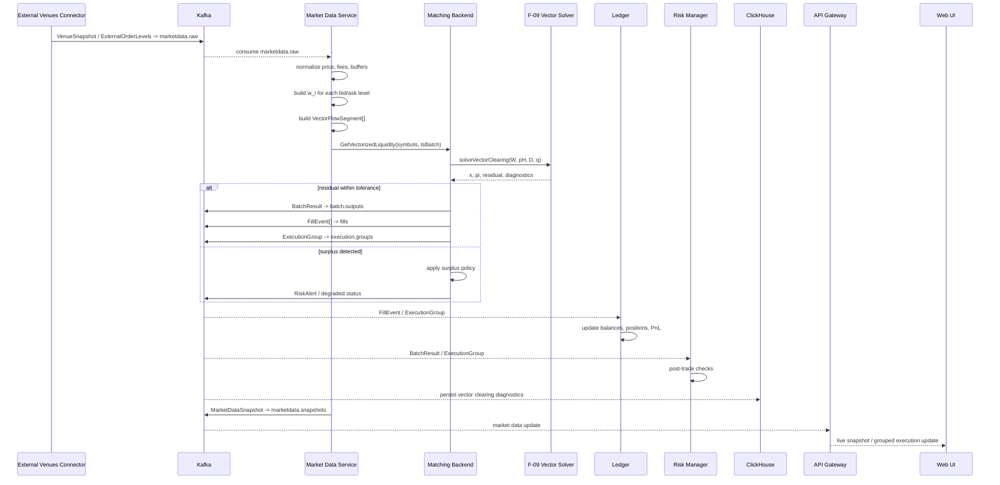

<!--
IN-014 immutable archive.
Provenance: chat-attached document "F‑05A — Vectorized External Order Book Liquidity
for F‑09 Batch-Combo Clearing.md". The attachment arrived mojibake-encoded
(UTF-8 bytes decoded as Latin-1/CP1252); Russian prose was corrupted while all
technical blocks (code, YAML, math, tables, English) were intact. Encoding recovered
manually at registration (same procedure as IN-011 / IN-013). The single attachment
contained TWO concatenated drafts of the same feature (a feature-doc-style version and
a more detailed repo-style version 1–18); they are consolidated here into one canonical
archive with all unique content preserved. If a pristine UTF-8 original is supplied,
register it as a superseding v2 — do not edit this file (immutable source rule).
Source algorithm: "Алгоритм Варианта 1.md".
-->

# F‑05A — Vectorized External Liquidity for F‑09 Batch/Combo Clearing

> **Статус:** planned / design-ready
> **Базовая фича:** F‑05 Live Market Data
> **Зависимая фича:** F‑09 Batch, Combo and Multi-leg Orders
> **Тип:** расширение F‑05 для поддержки F‑09 `multileg_vector_solver`
> **Источник алгоритма:** `Алгоритм Варианта 1.md`
> **Рекомендуемое размещение:**
> `docs/02-system/features/F-05-live-market-data/addendum-F05A-vectorized-external-liquidity.md`
> `docs/02-system/features/F-05-live-market-data/F-05A-feature.yaml`

---

## 🧭 Navigation Map

```text
   ┌─ Уровень ──────────────┬─ Артефакт ─────────────────────────────────────┐
☁️ L0 │ Что система делает    │ Эта страница + L0 system sequence              │
🌊 L1 │ Какие функции у фичи? │ Use Cases UC-F05A-*                            │
      │ Какие сервисы?        │ L1 service sequences                            │
🐟 L2 │ Из каких классов      │ Component overviews + L2 sequences              │
      │ состоит сервис?       │ market-data / matching / venues / gateway       │
💻 src │ Код                  │ cpp/market_data, cpp/matching, cpp/venues       │
   └────────────────────────┴─────────────────────────────────────────────────┘
```

---

## 📋 Use Cases

| UC | Имя | L0 sequence ☁️ | L1 sequence 🌊 |
| --- | --- | --- | --- |
| `UC-F05A-01` | Vectorize External Order Book | `SEQ-UC-F05A-01-system.md` | `SEQ-F05A-UC-F05A-01-services.md` |
| `UC-F05A-02` | Run Vector Clearing with F‑09 Solver | `SEQ-UC-F05A-02-system.md` | `SEQ-F05A-UC-F05A-02-services.md` |
| `UC-F05A-03` | Display Vector Liquidity in UI | `SEQ-UC-F05A-03-system.md` | `SEQ-F05A-UC-F05A-03-services.md` |
| `UC-F05A-04` | Validate Algorithm on Real Exchange Order Books | `SEQ-UC-F05A-04-system.md` | `SEQ-F05A-UC-F05A-04-services.md` |
| `UC-F05A-05` | Replay Vector Clearing Scenario | `SEQ-UC-F05A-05-system.md` | `SEQ-F05A-UC-F05A-05-services.md` |

---

## 📦 Components Involved

| Component | Роль в F‑05A |
| --- | --- |
| `market-data` | Нормализует внешние стаканы, строит `VectorFlowSegment`, публикует `marketdata.vectorized`, считает snapshots/effective spread. |
| `external-venues / venues` | Получает реальные order books CEX/DEX/AMM, публикует `marketdata.raw`. |
| `matching` | Принимает vectorized liquidity, решает QP/vector clearing, формирует `BatchResult`, `FillEvent`, `ExecutionGroup`. |
| `risk` | Проверяет аномальные spread/surplus/residual, публикует `risk.alerts`. |
| `ledger` | Применяет `FillEvent` / `ExecutionGroup` к балансам, позициям и PnL. |
| `gateway` | Предоставляет REST/WebSocket UI для графиков и диагностики. |
| `observability` | Метрики `residualNorm`, `solveTimeMs`, stale snapshots, surplus, solver convergence. |
| `backtest` | Детерминированно воспроизводит реальные captured order book snapshots. |
| `clickhouse` | Хранит snapshots, vectorized segments, solver results, effective spread, replay results. |
| `postgresql` | Хранит конфигурацию market data, asset basis, параметры vectorization. |

---

# 1. Описание

F‑05A расширяет F‑05 Live Market Data: Market Data Service должен не только отдавать
live ticker/snapshot, но и преобразовывать **реальные внешние стаканы бирж** в
математически пригодную форму для F‑09 `multileg_vector_solver`.

Базовая F‑05 уже описана как сервис, который принимает `BatchResult` из `batch.outputs`,
`FillEvent` из `fills`, вычисляет mid-price, spread, effective spread, depth, volume24h,
публикует `MarketDataSnapshot` через Kafka/WebSocket и отдаёт reference prices для Matching.

F‑05A добавляет новый слой:

```text
External Order Book
  → ExternalOrderLevel[]
  → VectorFlowSegment[]
  → W matrix
  → Vector QP solve
  → ExecutionGroup / FillEvent / MarketDataSnapshot
```

Смысл алгоритма: каждый внешний order book level превращается в отдельный вектор
активов (w_i), затем все (w_i) образуют матрицу (W). Исполнение ищется не по отдельным
парам, а через условие баланса активов:

\[
Wx = 0
\]

Это естественно связывает F‑05 с F‑09: F‑09 уже требует, чтобы `multileg_vector_solver`
исполнял группу как единый бизнес-объект и выбирал согласованный вектор исполнения, а не
превращал legs в независимые `FlowOrder`.

---

# 2. Ключевое архитектурное решение

## 2.1. Не строить синтетический pair book

F‑05A **не должна** строить отдельную синтетическую книгу по парам вроде:

```text
synthetic BTC/ETH book
synthetic BTC/USD book
synthetic ETH/USD book
```

Вместо этого каждый внешний order level остаётся отдельной сущностью:

```text
source_order_id
venue_id
pair
side
price
quantity
effective_price
w_i
```

Далее solver работает с матрицей:

\[
W = [w_1, w_2, ..., w_I]
\]

где каждый столбец — один реальный order book level.

## 2.2. Почему это важно

* использовать реальную внешнюю ликвидность без потери provenance;
* видеть, какие именно уровни стакана участвовали в execution;
* воспроизводить результат в F‑15 replay;
* показывать пользователю доказательные графики;
* проверять баланс активов через (Wx);
* расширять F‑09 на pair/basket/spread/factor/risk constraints.

---

# 3. Математическая модель

## 3.1. Asset basis

\[
A = \{a_1, a_2, ..., a_N\}
\]
Например: `A = [BTC, ETH, USDT]`.

## 3.2. Bid level (X/Y) — внешний участник покупает X, продаёт Y

\[
w_i = e_X - B_{XY}^{eff} e_Y
\]

## 3.3. Ask level (X/Y) — внешний участник продаёт X, покупает Y

\[
w_i = -e_X + A_{XY}^{eff} e_Y
\]

## 3.4. Flow segment

\[
(w_i, p_i^L, p_i^H, q_i, Q_i^{max})
\]
Для Варианта 1: (p_i^L = 0), (p_i^H = d_i^{HL}).

## 3.5. Demand curve

\[
D_i(w_i^\top \pi) = q_i \cdot trunc\left(\frac{d_i^{HL} - w_i^\top \pi}{d_i^{HL}}\right)
\]
где `trunc` ограничивает значение интервалом [0,1].

## 3.6. QP formulation

\[
\max_x \left[ x^\top p^H - \frac{1}{2} x^\top D x \right]
\]
при ограничениях (Wx = 0), (0 \le x \le q).

## 3.7. Residual

\[
r = Wx, \quad residualNorm = \|r\|
\]
Для converged: (residualNorm < tolerance).

---

# 4. User Stories

| ID | User Story |
| --- | --- |
| `US-F05A-001` | Как трейдер, я хочу видеть, какие реальные уровни внешнего стакана были использованы для grouped execution. |
| `US-F05A-002` | Как маркет-мейкер, я хочу видеть, как стакан CEX/DEX преобразуется в vector flow liquidity. |
| `US-F05A-003` | Как оператор, я хочу видеть residual (Wx), surplus и статус solver convergence. |
| `US-F05A-004` | Как исследователь, я хочу загрузить реальные order book snapshots и доказать, что алгоритм корректно строит (W) и (x). |
| `US-F05A-005` | Как пользователь F‑09 combo order, я хочу видеть, что grouped execution реально использует multi-asset liquidity, а не независимые legs. |

---

# 5. Frontend Scope

F‑05A добавляет к UI **доказательные графики**, показывающие, что алгоритм работает правильно.

## 5.1. UI экран: Vector Liquidity Explorer
Блоки: Venue selector; Symbol/pair selector; Raw order book table; Normalized levels table;
Vector segment table; Asset basis viewer; Mapping source_order_id → w_i.
- Chart 1. Raw Order Book Depth (x=price, y=cumulative qty; series bids/asks).
- Chart 2. Normalized Effective Price (raw / fees-adjusted / latency-buffered / slippage-buffered / effective).
- Chart 3. Vector Segment Table / Heatmap (rows=source order levels, columns=assets, cells=w_{i,j}).

## 5.2. UI экран: W Matrix & Solver Input
- Chart 4. Matrix (W) Heatmap (rows=assets, columns=vector segments, color=coefficient).
- Chart 5. Bounds Chart (x=segment_id; series q_i, Q_i_max, p_i_H=dHL).
- Chart 6. Segment Source Trace (клик по столбцу W_i → venue_id/source_order_id/pair/side/raw price/effective price/quantity/timestamp).

## 5.3. UI экран: Solver Result
- Chart 7. Execution Vector (x_i).
- Chart 8. Asset Balance Residual (Wx) — **обязательный**, визуально подтверждает (Wx ≈ 0).
- Chart 9. Residual Norm Over Time (threshold line = tolerance).
- Chart 10. Solver Diagnostics (solverStatus, iterations, solveTimeMs, residualNorm, surplusPolicy, fallbackAction).

## 5.4. UI экран: Clearing Graph
Граф multi-asset cycle: nodes=assets, edges=executed vector segments (labels: venue/pair/side/executed qty/effective price). Для триангулярного сценария показать цикл `BTC → USDT → ETH → BTC`.

## 5.5. UI экран: Surplus / Exchange PnL
surplus by asset; surplus over time; surplus allocation policy; EXCHANGE_PNL impact; MM_LAST_RESORT usage; degraded batches.

## 5.6. UI экран: Real Order Book Test Replay
Выбрать captured fixture → увидеть исходные order books → запустить vectorization → увидеть W → запустить solver → увидеть x → увидеть Wx residual → сравнить expected/actual.
Обязательные элементы: fixture_id, venue, symbol/product_id/pair, capture_time_utc, endpoint/source, raw_response_sha256, normalization_version, solver_config_version.

---

# 6. UI Acceptance Criteria

| ID | Criterion |
| --- | --- |
| `AC-F05A-UI-001` | UI показывает raw bid/ask depth для каждого реального exchange snapshot. |
| `AC-F05A-UI-002` | UI показывает преобразование каждого order book level в (w_i). |
| `AC-F05A-UI-003` | UI показывает heatmap матрицы (W). |
| `AC-F05A-UI-004` | UI показывает execution vector (x_i). |
| `AC-F05A-UI-005` | UI показывает residual (Wx) по каждому активу. |
| `AC-F05A-UI-006` | UI визуально выделяет residualNorm выше tolerance. |
| `AC-F05A-UI-007` | UI показывает source trace: каждый fill связан с venue/orderbook level. |
| `AC-F05A-UI-008` | UI показывает clearing graph по активам. |
| `AC-F05A-UI-009` | UI показывает surplus / EXCHANGE_PNL, если он возник. |
| `AC-F05A-UI-010` | UI имеет replay mode для captured real order book snapshots. |

---

# 7. Contracts and Data

## 7.1. gRPC
```text
MarketDataService/GetVectorizedLiquidity
MarketDataService/GetVectorClearingDiagnostics
```

## 7.2. Kafka

| Topic | Message | Producer | Consumers |
| --- | --- | --- | --- |
| `marketdata.raw` | `VenueSnapshot` | `venues` | `market-data` |
| `marketdata.vectorized` | `VectorizedLiquiditySnapshot` | `market-data` | `matching`, `backtest`, `observability` |
| `marketdata.snapshots` | `MarketDataSnapshot` | `market-data` | `gateway`, `ui` |
| `execution.groups` | `ExecutionGroup` | `matching` | `ledger`, `risk`, `observability`, `backtest` |
| `fills` | `FillEvent` | `matching` | `ledger`, `market-data`, `clickhouse`, `risk` |
| `risk.alerts` | `RiskAlert` | `risk`, `market-data`, `matching` | `observability`, `ui` |

## 7.3. REST / WebSocket
```text
GET /api/v1/marketdata/vector-liquidity
GET /api/v1/marketdata/vector-liquidity/{fixtureId}
GET /api/v1/marketdata/vector-liquidity/{fixtureId}/W
GET /api/v1/marketdata/vector-liquidity/{fixtureId}/solver-result
GET /api/v1/execution-groups/{id}/vector-diagnostics
WS  /api/market/vector
```

## 7.4. Data
PostgreSQL: `marketdata_config`, `asset_basis`, `venue_orderbook_fixtures`, `vector_flow_segments`, `vectorization_runs`.
ClickHouse: `marketdata_snapshots`, `effective_spreads`, `vector_flow_segments_history`, `vector_clearing_results`, `surplus_events`, `real_orderbook_snapshots`.

---

# 8. Testing

## 8.1. Главный принцип
Unit-тесты на синтетических данных **недостаточны**. Обязательно использовать реальные
captured order book snapshots из реальных биржевых стаканов с сохранением raw response и
metadata. Синтетический треугольный пример нужен для проверки математики, но не может быть
единственным доказательством корректности.

## 8.2. Источники реальных стаканов
Fixtures минимум из двух независимых venues:
* Binance Spot REST `GET /api/v3/depth` (bids/asks, параметр limit).
* Coinbase Advanced Trade `Get Product Book` (pricebook: product_id, bids, asks, time, last, mid_market, spread_bps, spread_absolute).
* Kraken `Get Order Book` (`/public/Depth`, L2 aggregated by price level).

## 8.3. Fixture format
```text
tests/fixtures/real-orderbooks/
  2026-07-07T12-00-00Z-binance-BTCUSDT-depth.json
  2026-07-07T12-00-00Z-binance-ETHUSDT-depth.json
  2026-07-07T12-00-00Z-binance-ETHBTC-depth.json
  2026-07-07T12-00-00Z-coinbase-BTC-USD-product-book.json
  2026-07-07T12-00-00Z-kraken-BTC-USD-depth.json
```
metadata (per fixture): fixture_id, venue, endpoint, capture_time_utc, symbol_or_pair,
limit_or_count, raw_response_sha256, schema_version, normalization_version, license_notes.

## 8.4. Unit tests
| ID | Test |
| --- | --- |
| `U-F05A-001` | BID (X/Y) строит (w=e_X-Pe_Y). |
| `U-F05A-002` | ASK (X/Y) строит (w=-e_X+Pe_Y). |
| `U-F05A-003` | Fees/slippage/latency корректно меняют effective price. |
| `U-F05A-004` | Asset basis стабилен и детерминирован. |
| `U-F05A-005` | (W) имеет размер (N × I). |
| `U-F05A-006` | (D=diag(dHL/q)) корректно строится. |
| `U-F05A-007` | (0 ≤ x ≤ q) enforced. |
| `U-F05A-008` | (Wx=0) для сбалансированного synthetic triangle. |
| `U-F05A-009` | Surplus обнаруживается и не скрывается. |
| `U-F05A-010` | Source mapping сохраняет venue/source_order_id. |

## 8.5. Integration tests with real order books
| ID | Test |
| --- | --- |
| `I-F05A-001` | Real Binance depth snapshots → `ExternalOrderLevel[]` → `VectorFlowSegment[]`. |
| `I-F05A-002` | Real Coinbase product book → normalized levels → (W). |
| `I-F05A-003` | Real Kraken depth → normalized levels → (W). |
| `I-F05A-004` | Multi-pair captured fixtures BTC/USDT + ETH/USDT + ETH/BTC → vector solver input. |
| `I-F05A-005` | Solver result (x) produces residualNorm below tolerance or explicit surplus. |
| `I-F05A-006` | `marketdata.vectorized` Kafka message produced and consumed by Matching. |
| `I-F05A-007` | `ExecutionGroup` links every leg to original venue/source level. |
| `I-F05A-008` | ClickHouse stores `vector_clearing_results`. |
| `I-F05A-009` | UI endpoint returns (W,x,residual) diagnostics for fixture. |
| `I-F05A-010` | Replay of captured fixtures produces deterministic (W,x,residual). |

## 8.6. UI tests
UI-F05A-001..008: raw order book chart; W heatmap dims; execution vector x_i; Wx residual per asset; residual>tolerance warning; segment click→source level; clearing graph triangular; replay expected vs actual.

## 8.7. Performance tests
P-F05A-001 vectorize 1,000 levels <100 ms p95; P-F05A-002 vectorize 10,000 levels under SLA;
P-F05A-003 UI renders W heatmap for 1,000 segments without freezing; P-F05A-004 WS publishes
vector diagnostics within F‑05 latency budget; P-F05A-005 replay 100 snapshots deterministically.

## 8.8. Test data quality gate
Fixture valid only if: raw response stored; metadata stored; sha256 stored; venue+endpoint
documented; normalizer version stored; asset basis reproducible; test does not rely on live
API availability; test can run offline. Live API calls only for refreshing fixtures, not for
deterministic CI.

---

# 9. Acceptance Criteria (feature)

| ID | Criterion |
| --- | --- |
| `AC-F05A-001` | Каждый внешний order book level преобразуется в `VectorFlowSegment`. |
| `AC-F05A-002` | BID/ASK правила построения (w_i) покрыты unit tests. |
| `AC-F05A-003` | (W,pH,D,q,sourceMap) формируются для каждого batch/vectorization run. |
| `AC-F05A-004` | Solver проверяет (Wx) и записывает residual/residualNorm. |
| `AC-F05A-005` | Surplus явно показывается и не скрывается. |
| `AC-F05A-006` | Используются реальные captured exchange order book fixtures минимум из двух venues. |
| `AC-F05A-007` | UI показывает raw order book, (W), (x), (Wx), residualNorm и source trace. |
| `AC-F05A-008` | UI-графики подтверждают корректность: residual по активам близок к нулю либо явно показан surplus. |
| `AC-F05A-009` | `marketdata.vectorized` публикуется и потребляется Matching. |
| `AC-F05A-010` | F‑09 `ExecutionGroup` содержит ссылки на vectorized source levels. |
| `AC-F05A-011` | F‑15 replay воспроизводит (W,x,residual) детерминированно. |
| `AC-F05A-012` | Все данные диагностики сохраняются в ClickHouse. |
| `AC-F05A-013` | REST/WebSocket API отдают vector diagnostics для UI. |
| `AC-F05A-014` | Observability содержит метрики vectorization/solver/surplus/staleness. |
| `AC-F05A-015` | Definition of Done выполнен полностью. |

---

# 10. Definition of Done

## 10.1. Documentation DoD
feature README/addendum в стиле F‑09; `F-05A-feature.yaml`; use cases `UC-F05A-*`; system-level
sequences; service-level sequences; обновлены F‑05 и F‑09 relatedFeatures; ADR по surplus policy;
ADR/design note по QP solver choice; обновлена coverage matrix.

## 10.2. Contract DoD
`vector_liquidity.proto`; `GetVectorizedLiquidity`; Kafka topic `marketdata.vectorized`; обновлён
`topics.md`; обновлены REST/WebSocket docs; все service-level arrows имеют contract binding.

## 10.3. Data DoD
PostgreSQL таблицы/миграции для vectorization config/source map; ClickHouse таблицы для vector
segments/results/surplus; все таблицы имеют owner/writer/reader; fixtures real order books
versioned and immutable.

## 10.4. Backend DoD
market-data умеет нормализовать real order book snapshots; строит `VectorFlowSegment[]`; matching
принимает vectorized liquidity; solver строит и решает (W,D,q,pH); solver возвращает (x,π,residual);
surplus policy реализована; `ExecutionGroup` содержит source trace; Kafka events публикуются.

## 10.5. UI DoD
raw order book chart; vectorization table; (W) heatmap; (x_i) chart; (Wx) residual chart; clearing
graph; surplus/EXCHANGE_PNL; replay fixture diagnostics; клик fill/segment → source order level.

## 10.6. Testing DoD
unit BID/ASK; unit (W,D,q,pH); unit residual/surplus; integration на captured Binance; integration
на Coinbase/Kraken или втором venue; integration `marketdata.vectorized → matching → execution.groups`;
UI tests для всех обязательных графиков; replay test; performance 1k/10k; CI не зависит от live API.

## 10.7. Observability DoD
метрики `vector_segments_total`, `vectorization_time_ms`, `vector_solver_residual_norm`,
`vector_solver_solve_time_ms`, `surplus_events_total`, `stale_orderbook_levels_total`;
alerts для stale data, residual above tolerance, surplus above threshold.

---

# 11. Known Gaps

| ID | Severity | Description |
| --- | --- | --- |
| `GAP-F05A-001` | blocker | Нет ADR по surplus / EXCHANGE_PNL. |
| `GAP-F05A-002` | blocker | Нет выбранного QP solver backend. |
| `GAP-F05A-003` | major | Нет `marketdata.vectorized` topic. |
| `GAP-F05A-004` | major | Нет UI для (W,x,Wx) diagnostics. |
| `GAP-F05A-005` | major | Нет real order book fixture pipeline. |
| `GAP-F05A-006` | major | Нет F‑15 replay для vectorized liquidity. |
| `GAP-F05A-007` | minor | Для больших (W) UI heatmap требует sampling/virtualization. |

---

# 12. Бизнес-часть

## 12.1. Проблема
Внешние venues дают ликвидность дискретными стаканами (BTC/USD, ETH/USD, BTC/ETH bid/ask levels).
Обычный matching по каждой паре отдельно не видит, что ликвидность может клириться **через цикл
активов** `BTC → USD → ETH → BTC`. Три разных внешних ордера (BTC/USD ask, BTC/ETH bid, ETH/USD bid)
образуют самобалансирующуюся комбинацию, т.к. сумма соответствующих векторов активов равна нулю.

## 12.2. Цель
1. Брать внешние orderbook levels из CEX/DEX/AMM.
2. Нормализовать с учётом fees, latency buffer, slippage buffer.
3. Преобразовывать каждый внешний order level в вектор активов (w_i).
4. Превращать каждый (w_i) в flow-сегмент.
5. Передавать множество таких сегментов в F‑09 grouped solver.
6. Находить самобалансирующиеся исполнения при (Wx = 0).
7. Возвращать результат как `ExecutionGroup`, `FillEvent`, `BatchResult`, market data snapshot, analytics.

## 12.3. Бизнес-ценность
Более глубокое использование внешней ликвидности; multi-asset / triangular / cross-pair clearing;
unified solver вместо отдельных pair books; более точный grouped execution для F‑09; основа для
arbitrage-free venue aggregation; демонстрация пользователю реальной multi-leg ликвидности.

## 12.4. Заинтересованные стороны
Trader; Market Maker; Provider/Broker; Exchange Operator; Risk Manager; Ledger; Backtest/Research —
интересы по строкам исходного документа (лучшее исполнение, видимость влияния внешней ликвидности,
контроль surplus/residual/stale, балансированные FillEvent без phantom inventory, воспроизводимость).

---

# 13. Domain Model

## 13.1. ExternalOrderLevel
```yaml
ExternalOrderLevel:
  venue_id: string
  source_order_id: string
  pair: string
  base_asset: string
  quote_asset: string
  side: bid | ask
  price: decimal
  effective_price: decimal
  quantity: decimal
  remaining_quantity: decimal
  timestamp: timestamp
  fees_bps: decimal
  latency_buffer_bps: decimal
  slippage_buffer_bps: decimal
  quality_flags: string[]
```

## 13.2. AssetBasis
```yaml
AssetBasis:
  basis_id: string
  assets:
    - index: int
      asset: string
  num_assets: int
  created_at: timestamp
```

## 13.3. VectorFlowSegment
```yaml
VectorFlowSegment:
  segment_id: string
  source_order_id: string
  venue_id: string
  pair: string
  side: bid | ask
  w: decimal[]          # length N
  p_low: decimal        # usually 0
  p_high: decimal       # dHL
  d_hl: decimal
  q_rate: decimal
  q_max: decimal
  remaining_quantity: decimal
  source_timestamp: timestamp
```

## 13.4. VectorClearingInput
```yaml
VectorClearingInput:
  batch_id: string
  basis: AssetBasis
  W: matrix_decimal
  pH: decimal[]
  dHL: decimal[]
  q: decimal[]
  D: diagonal_matrix_decimal
  source_map:
    - column_index: int
      segment_id: string
      source_order_id: string
      venue_id: string
```

## 13.5. VectorClearingResult
```yaml
VectorClearingResult:
  batch_id: string
  x: decimal[]
  pi: decimal[]
  residual: decimal[]
  residual_norm: decimal
  multipliers: object
  solver_status: converged | degraded | failed
  surplus:
    asset: string
    amount: decimal
    allocation_policy: EXCHANGE_PNL | SURPLUS | MM_LAST_RESORT | REJECT
```

---

# 14. Функциональные / нефункциональные требования (сжато)

FR-F05A-001 получение внешних order levels; FR-002 нормализация (effective price = P ± fees ±
latency_buffer ± slippage_buffer); FR-003 asset basis; FR-004 построение (w_i) bid/ask; FR-005 flow
segment (pL=0, pH=dHL, q=min(Q,rateCap), Qmax=Q); FR-006 сборка (W,pH,dHL,q,D=diag(dHL/q),source);
FR-007 решение QP; FR-008 проверка residual; FR-009 формирование исполнений (executed_asset_vector =
x_i·w_i); FR-010 связь с F‑09 ExecutionGroup; FR-011 публикация событий (batch.outputs, fills,
execution.groups, marketdata.snapshots).

NFR-F05A-001 детерминизм; NFR-002 latency (p95 vectorization <100ms, solver <batch SLA, snapshot
<200ms); NFR-003 traceability каждого x_i к source_order_id/venue/w_i/batch/execution_group/fill;
NFR-004 auditability (W,pH,dHL,q,D,x,π,residual,source mapping,diagnostics,surplus в ClickHouse/replay);
NFR-005 replay compatibility (F‑15 детерминированно воспроизводит vectorization→W→QP→ExecutionGroup).

---

# 15. Сервисная архитектура (L1 service sequence)

Участники: External Venues Connector, Market Data Service, Matching Backend, F‑09 Grouped Solver,
Kafka, ClickHouse, Ledger, Risk Manager, Gateway, Web UI, Backtest/Replay, Observability.



---

# 16. Алгоритм (псевдокод Варианта 1)

```python
def vectorize_external_orders(external_orders, assets, dHL_policy, rate_cap_policy):
    segments = []
    for o in external_orders:
        validate_pair(o.pair)
        X = o.base_asset
        Y = o.quote_asset
        P = effective_price(price=o.price, side=o.side, fees=o.fees,
                            latency_buffer=o.latency_buffer, slippage_buffer=o.slippage_buffer)
        Q = normalize_base_quantity(o.quantity, o.pair)
        if Q <= 0:
            continue
        w = zero_vector(len(assets))
        if o.side == "bid":
            w[X] = +1; w[Y] = -P
        elif o.side == "ask":
            w[X] = -1; w[Y] = +P
        dHL = dHL_policy(o)
        pL = 0; pH = dHL
        q = min(Q, rate_cap_policy(o)); Qmax = Q
        segments.append(VectorFlowSegment(
            source_order_id=o.id, venue_id=o.venue_id, pair=o.pair, side=o.side,
            w=w, p_low=pL, p_high=pH, d_hl=dHL, q_rate=q, q_max=Qmax))
    return segments

def build_qp(segments):
    W = columns([s.w for s in segments])
    pH = vector([s.p_high for s in segments])
    q = vector([s.q_rate for s in segments])
    dHL = vector([s.d_hl for s in segments])
    D = diag(dHL / q)
    source = [s.source_order_id for s in segments]
    return W, pH, D, q, source

def clear_vector_batch(W, pH, D, q, tolerance):
    x, pi, multipliers = solve_qp(
        objective="max x.T @ pH - 0.5 * x.T @ D @ x",
        constraints=["W @ x = 0", "0 <= x <= q"])
    residual = W @ x
    residual_norm = norm(residual)
    if residual_norm > tolerance:
        return degraded_or_surplus_result(x, pi, residual)
    return VectorClearingResult(x=x, pi=pi, residual=residual)
```

---

# 17. Known Issues / Open Questions

- `KI-F05A-001` Surplus policy — нужен ADR (EXCHANGE_PNL | SURPLUS | MM_LAST_RESORT | REJECT_IF_RESIDUAL). blocker.
- `KI-F05A-002` Solver choice — MVP: малый QP/Eigen/OSQP; production: primal-dual interior point. major.
- `KI-F05A-003` Units and dimensions — самый высокий риск (BTC/ETH/USD units, price units, batch interval, rate units) → нужна отдельная validation layer. major.
- `KI-F05A-004` Venue order level lifecycle — staleness threshold, venue freshness score, snapshot timestamp, latency buffer, execution confirmation. major.
- `KI-F05A-005` Strict atomicity with external venues — внешние ноги без native atomic support нельзя маркировать `strict_atomic` (F‑09 уже фиксирует это правило). 

---

# 18. Implementation Plan (из источника)

MVP‑1 Documentation and fixtures (T-F05A-001..004).
MVP‑2 Vectorization (T-F05A-010..014: ExternalOrderLevel, AssetBasis, BID/ASK→w_i, VectorFlowSegment, publish marketdata.vectorized).
MVP‑3 Solver integration (T-F05A-020..024: VectorClearingInput, QP solver path, x/pi/residual, surplus policy, F‑09 ExecutionGroup).
MVP‑4 UI (T-F05A-030..035: raw order book, W heatmap, x chart, Wx residual, clearing graph, replay selector).
MVP‑5 Testing and DoD (T-F05A-040..045: unit, real orderbook integration, UI, replay, performance, CI quality gate).

Детальная разбивка по target-файлам (из источника): domain модели в `cpp/market_data/src/domain/`;
vectorization UC в `cpp/market_data/src/app/`; proto `contracts/proto/fob/marketdata/v1/vector_liquidity.proto`;
topic `marketdata.vectorized`; расширение solver input в `cpp/matching/src/domain/solver.hpp` +
`cpp/matching/src/app/run_batch_uc.cpp`; QP solver `cpp/matching/src/domain/vector_qp_solver.cpp`;
surplus policy ADR + `cpp/matching/src/domain/surplus_policy.hpp`; ClickHouse persistence; observability
metrics; unit/integration/replay tests.

---

# 19. Feature YAML draft (из источника)

```yaml
feature:
  id: F-05A
  name: Vectorized External Liquidity for F-09 Batch/Combo Clearing
  status: planned
  owner: core-team
  level: kite

description: >
  Дополнение к F-05 Live Market Data и F-09 Batch/Combo Orders.
  Фича преобразует внешние дискретные orderbook levels из CEX/DEX/AMM
  в векторные flow-сегменты (w_i, pL, pH, q, Qmax), собирает единую
  матрицу W и передаёт её в F-09 multileg_vector_solver. Matching возникает
  из условия Wx=0, без создания отдельной синтетической книги по парам.

source:
  in:
    - Алгоритм Варианта 1.md
    - F-05-live-market-data
    - F-09-batch-combo-orders
  algorithm: variant_1_external_orders_to_W

relatedFeatures: [F-04, F-05, F-09, F-11, F-12, F-13, F-15, F-17]

primaryComponents: [market-data, external-venues, matching, ledger, risk, observability, gateway, backtest]

executionMode: [multileg_vector_solver]

kafkaTopics:
  produces: [marketdata.vectorized, marketdata.snapshots, risk.alerts]
  consumes: [marketdata.raw, batch.outputs, fills, execution.groups]

grpcServices:
  exposes: [MarketDataService/GetVectorizedLiquidity, MarketDataService/GetReferencePrices]
  calls: [MatchingInternal/solveVectorClearing]

postgresTables: [marketdata_config, asset_basis, venue_order_levels, vector_flow_segments, vectorization_runs]
clickhouseTables: [vector_flow_segments_history, vector_clearing_results, surplus_events, marketdata_snapshots, effective_spreads]

acceptanceCriteria:
  - {id: AC-F05A-001, text: "BID X/Y converts to w=e_X-P_eff e_Y."}
  - {id: AC-F05A-002, text: "ASK X/Y converts to w=-e_X+P_eff e_Y."}
  - {id: AC-F05A-003, text: "Every external order level remains a separate W column; no synthetic pair book is created."}
  - {id: AC-F05A-004, text: "QP input contains W, pH, D, q and source map."}
  - {id: AC-F05A-005, text: "Converged solve has norm(Wx) < tolerance."}
  - {id: AC-F05A-006, text: "Triangular BTC/USD ask + BTC/ETH bid + ETH/USD bid example clears to Wx=0."}
  - {id: AC-F05A-007, text: "Surplus is explicitly allocated or marked degraded; it is never hidden."}
  - {id: AC-F05A-008, text: "Result can be emitted as ExecutionGroup for F-09 multileg_vector_solver."}
  - {id: AC-F05A-009, text: "MarketDataSnapshot updates after vector clearing within F-05 SLA."}
  - {id: AC-F05A-010, text: "F-15 replay reproduces W, x, pi and residual deterministically."}

knownIssues:
  - {id: surplus-policy-open, severity: blocker, description: "Need ADR for EXCHANGE_PNL/SURPLUS/MM_LAST_RESORT/REJECT policy."}
  - {id: qp-solver-choice, severity: major, description: "Need implementation decision: OSQP/Eigen/primal-dual IPM."}
  - {id: unit-dimensional-validation, severity: major, description: "Need strict validation of asset units, price units and batch interval units."}
  - {id: external-staleness, severity: major, description: "Need stale external order level policy before live execution."}
```

---

# 20. Куда положить в репозитории (рекомендация источника)

```text
docs/02-system/features/F-05-live-market-data/addendum-F05A-vectorized-external-liquidity.md
docs/02-system/features/F-05-live-market-data/F-05A-feature.yaml
docs/02-system/use-cases/UC-F05A-01-vectorize-external-liquidity/use-case.md
docs/02-system/use-cases/UC-F05A-02-vector-clearing/use-case.md
docs/05-components/sequences/SEQ-F05A-UC-F05A-01-services.md
docs/06-api/messaging/marketdata-vectorized.md
docs/06-api/grpc/marketdata-get-vectorized-liquidity.md
docs/07-data/vector-flow-segments.md
docs/07-data/vector-clearing-results.md
docs/03-architecture/adr/ADR-0XX-surplus-exchange-pnl.md
docs/implementation-plan/F-05A-vectorized-external-liquidity.tasks.md
```
Альтернатива — addendum к F‑09; но `feature.yaml` лучше держать рядом с F‑05 (primary owner —
Market Data / External Liquidity). Ссылки на API venue-стаканов: Binance Spot REST market-data
endpoints; Coinbase Advanced Trade Get Product Book; Kraken Get Order Book.
