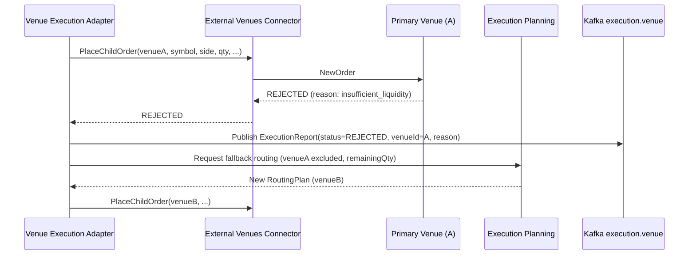
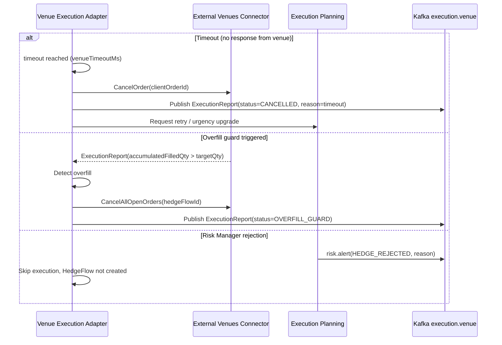
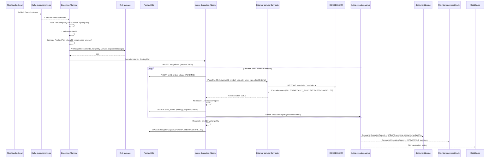
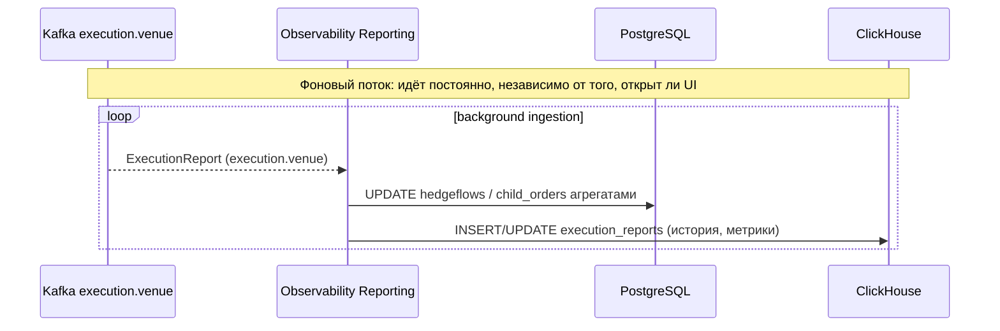
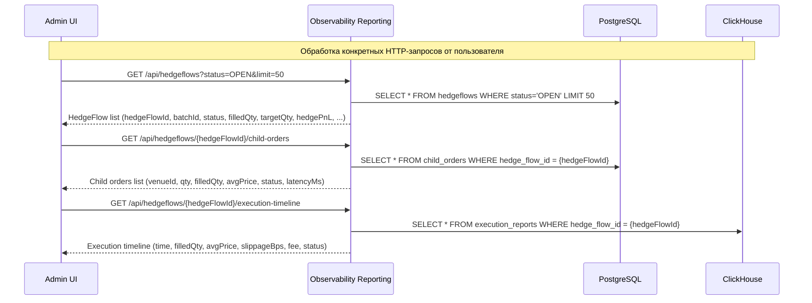
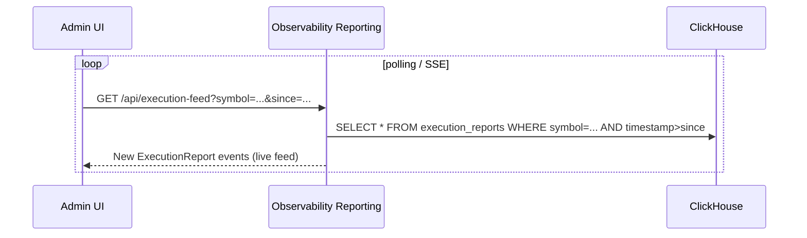
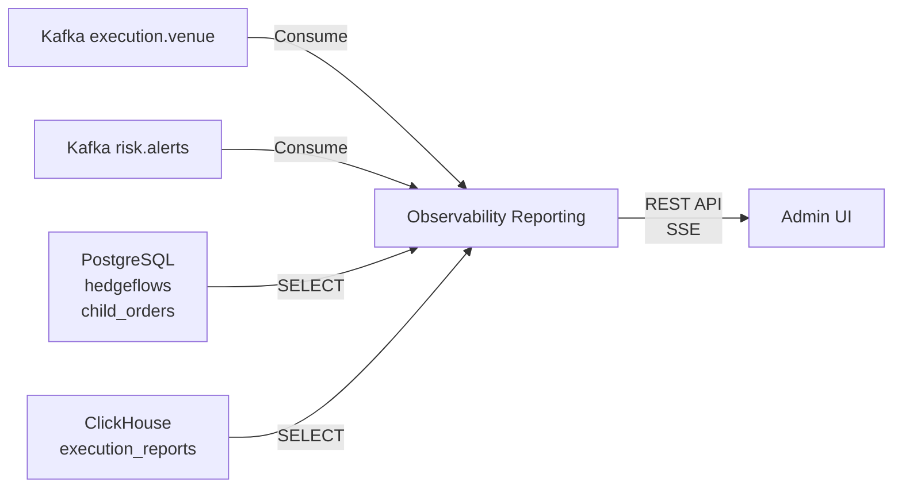

# F-12. Хеджирование на внешних площадках (Execution Hedge)

**Версия:** 2.0-final  
**Статус:** Актуальная редакция  
**Дата:** 2026-05-25

---

## Содержание

1. [Обзор](#1-обзор)
2. [BRD — Бизнес-требования](#2-brd--бизнес-требования)
3. [Требования к качеству](#3-требования-к-качеству)
4. [TRD — Технические требования](#4-trd--технические-требования)
5. [Тестирование](#5-тестирование)
6. [Definition of Done](#6-definition-of-done)

---

## 1. Обзор

### 1.0. Понятия и определения

#### F-12 Execution Hedge

**Определение**  
Фича автоматического хеджирования нетто-позиций переводчика на внешних площадках (CEX/DEX/AMM) после внутреннего матчинга через цепочку:

```
нетто-позиция → ExecutionIntent → child-ордера → ExecutionReport → обновление позиций и PnL в Ledger
```

**Параметры (как логической фичи):**

- `scopeInstruments` — перечень инструментов, по которым поддерживается хедж. Ограничивает зону ответственности F-12 (например, только спот FX и мажорные crypto-пары).
- `supportedVenues` — список поддерживаемых venues (CEX/DEX/AMM). Только эти площадки могут использоваться в ExecutionIntent и child-ордерах.
- `hedgeModes` — поддерживаемые режимы исполнения (авто после батча, ручной операторский хедж, backtest). Определяет, откуда может приходить ExecutionIntent.
- `dependencies` — зависимые фичи и компоненты (F-11, F-04, F-06, Risk, Ledger, Kafka, ClickHouse). Фиксирует, что F-12 не автономна и требует работающий стек внешних сервисов.

---

#### ExecutionIntent

**Определение**  
Внутренний контракт/сообщение на хедж: «что, где и как захеджировать» — исходный объект, по которому строится HedgeFlow и child-ордера.

**Параметры ExecutionIntent (Kafka `execution.intents`):**

| Поле | Тип | Описание |
|---|---|---|
| `hedgeFlowId` | UUID | Уникальный идентификатор сессии хеджа; по нему связываются все child-ордера и ExecutionReport |
| `batchId` | string | Идентификатор батча Matching Backend; привязывает хедж к конкретному батчу и его clearing-цене |
| `providerId` | string | Идентификатор переводчика/провайдера, для которого выполняется хедж |
| `symbol` | string | Внутренний идентификатор инструмента (например, BTCUSDT), согласованный с Market Data и F-11 |
| `side` | string (BUY\|SELL) | Направление хеджа: SELL — сокращаем лонг, BUY — покрываем шорт |
| `targetQty` | number | Целевой объём хеджа в единицах инструмента; основная величина для reconciliation |
| `targetNotional` | number | Целевой объём в нотации (qty × referenceMid); удобен для риск-лимитов и отчётности |
| `referenceMid` | number | Эталонная внутренняя цена (clearing-price батча или mid), относительно которой измеряется slippage и HedgePnL |
| `urgency` | string (LOW\|MEDIUM\|HIGH) | Режим агрессивности исполнения; определяет типы child-ордеров и допустимый slippage |
| `priceConstraint` | number \| null | Верхняя/нижняя ценовая граница, за пределами которой хедж запрещён |
| `timeoutMs` | integer | Дедлайн на исполнение хеджа; по истечении запускается reconciliation и при необходимости fallback |
| `allowedVenues` | string[] | Белый список venues, на которые разрешено выводить данный хедж |
| `createdAt` | string (ISO8601) | Время создания Intent; используется для SLA, мониторинга и отладки |

---

#### HedgeFlow

**Определение**  
Сессия хеджирования одного ExecutionIntent: агрегирующая сущность, связывающая Intent, child-ордера и ExecutionReport, хранящая итоговый результат хеджа и его PnL.

**Параметры HedgeFlow (таблица `hedgeflows` в PostgreSQL):**

| Поле | Тип | Описание |
|---|---|---|
| `hedgeFlowId` | UUID | Первичный ключ; совпадает с `ExecutionIntent.hedgeFlowId` |
| `intentId` | UUID | Ссылка на исходный Intent; позволяет восстановить входные параметры хеджа |
| `providerId` | string | Владелец хеджируемой позиции; нужен для обновления позиций и PnL в Ledger |
| `symbol` | string | Инструмент, по которому шёл хедж |
| `side` | string (BUY\|SELL) | Направление хеджа |
| `targetQty` | decimal | Запланированный для хеджа объём; база для reconciliation |
| `filledQty` | decimal | Фактически исполненный суммарный объём по всем child-ордерам |
| `avgFillPrice` | decimal \| null | Средневзвешенная цена исполнения по всем fills; используется для расчёта HedgePnL |
| `totFee` | decimal | Суммарные комиссии по хеджу (по всем venues и child-ордерам) |
| `referenceMid` | decimal \| null | Эталонная внутренняя цена (из ExecutionIntent); для пересчёта HedgePnL и анализа slippage |
| `hedgePnl` | decimal \| null | Итоговый PnL перевода по этому хеджу (суммарно по child-ордерам, в базовой валюте) |
| `status` | string (OPEN\|COMPLETED\|UNDERFILLED\|REJECTED) | Текущий статус сессии |
| `createdAt` | timestamptz | Время старта хеджа |
| `completedAt` | timestamptz \| null | Время логического завершения; используется для SLA |
| `timeoutMs` | int | Операционный таймаут, после которого запускается reconciliation |

---

#### Child Order

**Определение**  
Конкретный ордер на внешней площадке (CEX/DEX/AMM), созданный на основе ExecutionIntent и routing-плана; минимальная единица исполнения на уровне venue.

**Параметры ChildOrder (таблица `child_orders` в PostgreSQL):**

| Поле | Тип | Описание |
|---|---|---|
| `childOrderId` | UUID | Уникальный идентификатор child-ордера в нашей системе |
| `hedgeFlowId` | UUID | Ссылка на HedgeFlow; позволяет агрегировать все child-ордера одного хеджа |
| `venueId` | string | Идентификатор внешней площадки (например, binance, coinbase, uniswapv3) |
| `symbol` | string | Торговый символ на venue (уже после маппинга: BTCUSDT, XBTUSD и т.п.) |
| `side` | string (BUY\|SELL) | Направление ордера на venue |
| `orderType` | string (LIMIT\|MARKET\|IOC\|POST_ONLY) | Тип ордера, выбираемый на основе urgency и политики исполнения |
| `qty` | decimal | Количество инструмента, запрашиваемое у venue |
| `price` | decimal \| null | Лимитная цена (для LIMIT/POST_ONLY); для MARKET может быть null |
| `filledQty` | decimal | Сколько реально исполнено по данному child-ордеру |
| `avgPrice` | decimal \| null | Средневзвешенная цена исполнения по этому child-ордеру |
| `fee` | decimal \| null | Комиссия venue для этого ордера (в валюте feeCurrency) |
| `status` | string (PENDING\|FILLED\|PARTIALLY_FILLED\|CANCELLED\|REJECTED) | Текущий статус ордера |
| `clientOrderId` | string | Идентификатор, отправляемый на venue (`hedgeFlowId + '_' + seq`); для матчинга репортов |
| `createdAt` | timestamptz | Время создания ордера |
| `updatedAt` | timestamptz \| null | Время последнего изменения статуса/полей ордера |

---

#### ExecutionReport

**Определение**  
Нормализованный отчёт о событии исполнения на venue (fill, partial fill, cancel, reject), публикуемый в Kafka `execution.venue` и используемый Ledger, Risk и аналитикой.

**Параметры ExecutionReport (Kafka `execution.venue` и ClickHouse `execution_reports`):**

| Поле | Тип | Описание |
|---|---|---|
| `executionId` | string | Уникальный идентификатор события исполнения (fill or status change) |
| `hedgeFlowId` | string | Идентификатор HedgeFlow |
| `childOrderId` | string | Идентификатор child-ордера в нашей системе |
| `venueId` | string | Источник исполнения (конкретная биржа/DEX/AMM) |
| `symbol` | string | Торговый символ на venue |
| `side` | string (BUY\|SELL) | Направление исполнения |
| `filledQty` | number | Размер объёма в этом событии (для partial fills — инкрементальный объём) |
| `avgPrice` | number | Цена исполнения |
| `fee` | number | Комиссия за это исполнение |
| `feeCurrency` | string | Валюта комиссии (USDT, USD, BTC и т.п.) |
| `status` | string (FILLED\|PARTIALLY_FILLED\|CANCELLED\|REJECTED\|OVERFILL_GUARD) | Состояние ордера после события |
| `timestamp` | DateTime | Время события на venue |
| `slippageBps` | number | Slippage относительно referenceMid (в bps) |
| `referenceMid` | number | Эталонная внутренняя цена на момент хеджа |
| `batchId` | string | Идентификатор батча, для которого выполнялся хедж |
| `providerId` | string | Владелец операций; Ledger и Risk используют для маршрутизации обновлений |
| `hedgePnl` | number | Рассчитанный PnL по этому событию (опционально, в ClickHouse) |

---

#### Urgency

**Определение**  
Режим агрессивности исполнения хеджа; определяет комбинацию типов child-ордеров, допустимый slippage и поведение при таймаутах.

| Значение | Поведение | Типы ордеров | Макс. slippage |
|---|---|---|---|
| `LOW` | Пассивное исполнение, минимальный slippage, возможно неполное исполнение к timeout | POST_ONLY / LIMIT около mid | ≤ 5 bps |
| `MEDIUM` | Смешанный режим; часть объёма пассивно, при нехватке — агрессивные догрузы | LIMIT + IOC | ≤ 15 bps |
| `HIGH` | Приоритет скорости, широкие допуски по slippage | MARKET / IOC | ≤ 30 bps |

---

#### Глоссарий F-12

| Термин | Определение |
|---|---|
| ExecutionIntent | Задание на хедж: venue, symbol, side, targetQty, urgency |
| Child Order | Ордер на внешней бирже, порождённый из ExecutionIntent |
| HedgeFlow | Сессия хеджирования одного ExecutionIntent |
| ExecutionReport | Нормализованный отчёт о событии исполнения от venue |
| HedgePnL | PnL переводчика по хеджу |
| Urgency | LOW / MEDIUM / HIGH — режим агрессивности исполнения |
| Slippage | Отклонение avgPrice от reference price (в bps) |
| Partial Fill | Частичное исполнение child-ордера |
| Overfill Guard | Защита от превышения целевого объёма |
| Reconciliation | Сверка фактически исполненного объёма с планом |
| Hedge Trigger Threshold | Порог нетто-позиции, при превышении которого инициируется хедж |
| VenueLiquidityCurve | Кривая ликвидности venue из F-11; используется для routing plan |
| RoutingPlan | Распределение объёма хеджа по venues и траншам |
| referenceMid | Внутренняя эталонная цена (clearing-price батча или mid) |

---

### 1.1. Краткое описание фичи

**F-12 Execution Hedge** — фича, реализующая логику автоматического хеджирования нетто-позиций переводчика (Provider/Exchange) на внешних площадках (CEX, DEX, AMM). После каждого батча внутреннего матчинга система определяет остаточную чистую позицию, формирует **ExecutionIntent** (план хеджа по venue, символу, стороне, объёму и срочности) и через **Venue Execution Adapter** размещает child-ордера на внешних биржах. Поступающие execution reports нормализуются, публикуются в Kafka `execution.venue` и учитываются Settlement Ledger при расчёте позиций и PnL переводчика.

---

### 1.2. Вовлечённые компоненты

| Компонент | Роль |
|---|---|
| **Matching Backend FOB Core** | Источник нетто-позиции провайдера после батча; генерирует ExecutionIntent в `execution.intents` |
| **Risk Manager** | Валидирует ExecutionIntent (pre-hedge check); следит за лимитами hedgeExposure и maxSlippage; post-trade обновление по `execution.venue` |
| **Execution Planning Forecast** | Строит routing plan (venue allocation, urgency, qty split) по VenueLiquidityCurve и venue.health из F-11 |
| **Venue Execution Adapter** | Ядро F-12: получает ExecutionIntent, генерирует child-ордера, взаимодействует с EVC, нормализует отчёты, ведёт reconciliation |
| **External Venues Connector (F-11)** | Физический транспорт child-ордеров до CEX/DEX/AMM и обратный приём execution reports |
| **Settlement Ledger / Collateral Manager** | Потребляет `execution.venue`; обновляет позиции, балансы и PnL переводчика |
| **Kafka Message Broker** | Топики `execution.intents`, `execution.venue`; связующая шина между компонентами |
| **ClickHouse Event Analytics DB** | Хранит историю исполнения: execution_reports, hedge_flows, slippage-метрики |
| **PostgreSQL OLTP** | Таблицы `hedgeflows`, `child_orders`, `execution_reports_raw` |
| **Market Data Service (F-11)** | Поставляет VenueLiquidityCurve и VenueSnapshot для Execution Planning |
| **Backtest Replay Engine (F-15)** | В режиме backtest заменяет реальный EVC симулятором VenueSim, воспроизводя историческое исполнение |
| **Observability Reporting** | Дашборды fill rate, slippage, latency, rejection rate, hedge PnL |
| **Admin UI** | Отображение статуса хеджа, hedge PnL, live execution feed; данные через Observability Reporting → PostgreSQL/ClickHouse |

**Источники данных для Admin UI:**

| Экран | Источник данных |
|---|---|
| HedgeFlow Monitor | Observability Reporting → PostgreSQL `hedgeflows`, `child_orders` |
| Execution Live Feed | Kafka `execution.venue` (через Observability Reporting) |
| Hedge PnL Dashboard | ClickHouse `execution_reports` |
| Reconciliation Alerts | PostgreSQL `hedgeflows` (status=UNDERFILLED) |
| Manual Override | Публикует ExecutionIntent в Kafka `execution.intents` через API Matching Backend |
| Policy Config | Читает/пишет `solverconfig` через API Matching Backend / Venue Execution Adapter |

---

### 1.3. Сценарии использования

1. **Автоматический хедж после батча** — Matching Backend публикует нетто-позицию. Если позиция превышает hedgeTriggerThreshold, генерируется ExecutionIntent. Execution Planning выбирает venue и параметры, Venue Execution Adapter размещает child-ордера, получает fills, публикует `execution.venue`. Ledger обновляет позиции и PnL.

2. **Ручной хедж по инициативе оператора** — Оператор через Admin UI создаёт ExecutionIntent вручную, указывая venue, qty, urgency. Система публикует Intent в `execution.intents` и исполняет аналогично автоматическому сценарию.

3. **Частичное исполнение и retry** — Child-ордер исполнен частично. Venue Execution Adapter определяет остаток (remainingQty), создаёт новый child-ордер с той же привязкой к hedgeFlowId.

4. **Rejection и fallback** — Child-ордер отклонён биржей (REJECTED). Adapter логирует причину, публикует rejection event в `execution.venue`, Execution Planning строит новый RoutingPlan на альтернативный venue.

5. **Backtest-сценарий** — Вместо реального External Venues Connector используется Backtest Replay Engine / VenueSim, воспроизводящий историческое LOB. Все остальные компоненты (ExecutionIntent → child order → ExecutionReport → Ledger) работают идентично продакшн-сценарию.

---

### 1.4. Цели и ограничения

**Цели:**
- Минимизировать открытую нетто-позицию переводчика после каждого батча.
- Обеспечить полный аудит-трейл хеджа: от ExecutionIntent до settlement в Ledger.
- Поддержать мульти-venue хедж с routing по VenueLiquidityCurve и venue.health.
- Разрешить backtest исторического хеджа без изменения исполнительного кода.

**Ограничения:**
- Исполнение зависит от доступности F-11 (venue connectivity, VenueLiquidityCurve, healthscore).
- Latency хеджа ограничена latency внешних площадок (p95 < 500 ms для CEX).
- Объём одного child-ордера ограничен `maxOrderSize` из venueconfig и `hedgeLimits` из Risk Manager.
- На DEX/AMM gas cost и slippage могут существенно влиять на hedge PnL.

---

## 2. BRD — Бизнес-требования

### 2.1. Функциональные требования

| ID | Требование |
|---|---|
| F12-1 | ExecutionIntent генерируется автоматически при нетто-позиции > hedgeTriggerThreshold |
| F12-2 | Поддержка urgency LOW / MEDIUM / HIGH с соответствующими типами ордеров |
| F12-3 | Мульти-venue routing на основе VenueLiquidityCurve и healthscore |
| F12-4 | Overfill guard: отмена лишних child-ордеров при превышении targetQty |
| F12-5 | Reconciliation по истечении hedgeTimeoutMs; fallback при gap > threshold |
| F12-6 | Все ExecutionReport публикуются в `execution.venue` (Kafka) |
| F12-7 | HedgeFlow, child_orders, execution_reports хранятся в PostgreSQL и ClickHouse |
| F12-8 | Pre-hedge risk check через Risk Manager |
| F12-9 | Backtest-режим через VenueSim без изменения кода Adapter |
| F12-10 | p95 latency ExecutionIntent → first child order ≤ 100 ms (CEX) |
| F12-11 | Hedge PnL рассчитывается Settlement Ledger и доступен в Admin UI |
| F12-12 | Rejection fallback: автоматическая маршрутизация на альтернативный venue |

### 2.2. Нефункциональные требования

| Метрика | Значение |
|---|---|
| p95 latency ExecutionIntent → first child order (CEX) | ≤ 100 ms |
| p95 latency ExecutionIntent → first child order (DEX/AMM) | ≤ 1 000 ms |
| Fill rate (urgency HIGH) | ≥ 95% от targetQty за timeout |
| Slippage (urgency LOW) | ≤ 5 bps |
| Slippage (urgency MEDIUM) | ≤ 15 bps |
| Slippage (urgency HIGH) | ≤ 30 bps |
| Reconciliation gap | ≤ 0.01% от targetQty по истечении timeout |
| Retention execution_reports (ClickHouse) | ≥ 90 дней |
| Throughput | ≥ 50 HedgeFlow/s |

---

### 2.3. Use Cases и основной сценарий

**Happy Path:**

```
1. Matching Backend → Kafka execution.intents: ExecutionIntent
2. Execution Planning читает VenueLiquidityCurve (venue.liquidity.fob), venue.health
3. Execution Planning строит RoutingPlan
4. Risk Manager валидирует ExecutionIntent (pre-hedge check)
5. Venue Execution Adapter создаёт HedgeFlow в PostgreSQL (status=OPEN)
6. Venue Execution Adapter генерирует child orders
7. External Venues Connector отправляет child orders на CEX/DEX/AMM
8. CEX/DEX → ExecutionReport (FILLED / PARTIALLY_FILLED)
9. Venue Execution Adapter нормализует, публикует в execution.venue
10. Settlement Ledger: обновление позиций, PnL
11. Risk Manager: post-trade обновление VaR, exposure
12. ClickHouse: запись execution history
13. Venue Execution Adapter: Reconciliation → HedgeFlow status=COMPLETED
```

---

### 2.4. Подробные сценарии

#### 2.4.1. Автоматический хедж

1. **Matching Backend** завершает батч, формирует PositionSnapshot: `{providerId, symbol, netQty, batchId, clearingPrice, ts}`. Публикует в Kafka `execution.intents` как ExecutionIntent.

2. **Execution Planning** при получении ExecutionIntent:
   - Загружает VenueLiquidityCurve из `venue.liquidity.fob` для symbol по всем активным venues.
   - Читает `venue.health`, исключает venues с circuit breaker OPEN или healthScore < minHealthThreshold.
   - Рассчитывает expected slippage и impact для каждого venue.
   - Строит RoutingPlan: распределяет targetQty по venues пропорционально ликвидности и healthScore.
   - Определяет urgency на основе hedgeUrgencyPolicy из solverconfig.

3. **Risk Manager** выполняет pre-hedge check:
   - `notionalCheck`: `targetQty * referenceMid ≤ maxNotionalPerHedge`
   - `exposureCheck`: `currentHedgeExposure[symbol] + targetQty ≤ hedgeExposureLimit[symbol]`
   - `slippageCheck`: `expectedSlippage ≤ maxSlippage[urgency]`
   - При fail: reject ExecutionIntent, публикует `risk.alerts` с типом `HEDGE_RISK_REJECT`.

4. **Venue Execution Adapter** при получении подтверждённого ExecutionIntent:
   - INSERT в PostgreSQL `hedgeflows`: `{hedgeFlowId, intentId, providerId, symbol, side, targetQty, filledQty=0, status=OPEN, createdAt}`.
   - Для каждой (venue, tranche) из RoutingPlan: INSERT `child_orders`.

5. **External Venues Connector** (F-11) отправляет child orders:
   - CEX: REST/WebSocket `NewOrder` с `clientOrderId = hedgeFlowId + "_" + seq`.
   - DEX/AMM: on-chain tx с `amountIn, amountOutMin, deadline`.

6. **Venue** возвращает execution reports:
   - `FILLED`: `{execId, filledQty, avgPrice, fee, ts}`
   - `PARTIALLY_FILLED`: `filledQty < childQty` → Adapter создаёт retry child order
   - `REJECTED`: Adapter логирует причину, запускает fallback на альтернативный venue

7. **Venue Execution Adapter** нормализует execution report → публикует в `execution.venue`.

8. **Reconciliation**: по истечении `hedgeTimeoutMs` → §2.4.3.

9. **Settlement Ledger** потребляет `execution.venue`: обновляет `positions`, `accounts`, рассчитывает:

$$
\text{hedgePnL} = (\text{clearingPrice} - \text{avgFillPrice}) \times \text{filledQty} - \text{fees}
$$

10. **Risk Manager** потребляет `execution.venue`: обновляет VaR, exposure, margin.

---

#### 2.4.2. Rejection и Fallback



**Шаги:**

1. `EXEC → EVC: PlaceChildOrder(venueA, ...)` — Adapter отправляет child-ордер на venue A согласно RoutingPlan.
2. `EVC → VENUE: NewOrder` — EVC транслирует ордер во внешний venue по нативному протоколу.
3. `VENUE → EVC: REJECTED` — Venue отклоняет ордер (пример причины: `insufficient_liquidity`).
4. `EVC → EXEC: REJECTED` — EVC нормализует ответ и возвращает унифицированный статус REJECTED.
5. `EXEC → Kafka: ExecutionReport(REJECTED)` — Adapter публикует в `execution.venue` для Ledger, Risk, ClickHouse.
6. `EXEC → PLAN: Request fallback routing` — Adapter запрашивает новый RoutingPlan для remainingQty с явным исключением venue A.
7. `PLAN → EXEC: New RoutingPlan(venueB)` — Execution Planning рассчитывает маршрут на venue B по VenueLiquidityCurve и venue.health.
8. `EXEC → EVC: PlaceChildOrder(venueB, ...)` — Adapter создаёт новый child-ордер на venue B.

---

#### 2.4.3. Reconciliation

По истечении `hedgeTimeoutMs` (из solverconfig) Venue Execution Adapter выполняет:

$$
\text{reconciliationGap} = \text{targetQty} - \text{filledQty}
$$

```
if reconciliationGap <= reconciliationGapThreshold:
    HedgeFlow.status = COMPLETED
else:
    if fallbackVenueAvailable:
        create new ExecutionIntent(
            targetQty = reconciliationGap,
            urgency   = HIGH  ← принудительный upgrade
        )
    else:
        publish risk.alert(type=HEDGE_UNDERFILL, hedgeFlowId, gap=reconciliationGap)
        HedgeFlow.status = UNDERFILLED
```

**Параметры:**

| Параметр | Описание |
|---|---|
| `targetQty` | Плановый объём из ExecutionIntent/HedgeFlow |
| `filledQty` | Суммарно исполненный объём по всем ExecutionReport в HedgeFlow |
| `reconciliationGapThreshold` | Допустимое недоисполнение (абсолютное или % от targetQty, из solverconfig) |
| `hedgeTimeoutMs` | Момент, после которого запускается сверка |
| `fallbackVenueAvailable` | Наличие живой альтернативной площадки |

**Примеры:**
- `targetQty=5.0`, `filledQty=4.99`, `threshold=0.05` → gap=0.01 ≤ 0.05 → `COMPLETED`
- `targetQty=5.0`, `filledQty=4.3`, `threshold=0.05` → gap=0.7 > 0.05 → fallback или `UNDERFILLED`

---

### 2.5. Обработка ошибок



| Сценарий | Поведение |
|---|---|
| **Timeout** | Venue не отвечает за `venueTimeoutMs`: отмена child order через EVC, публикация CANCELLED, retry с повышением urgency |
| **Overfill guard** | Суммарный filledQty превысил targetQty (race condition при мульти-venue): немедленная отмена всех открытых child-ордеров по hedgeFlowId |
| **Risk rejection** | Risk Manager отклонил ExecutionIntent: публикуется risk.alert `HEDGE_RISK_REJECT`, HedgeFlow не создаётся |
| **Venue unavailable** | Circuit breaker OPEN (F-11): ExecutionIntent маршрутизируется на альтернативный venue |
| **Invalid price / lot size** | Child order не проходит venue-side validation: Adapter корректирует qty/price по tick size и lot size из venueconfig и повторяет |

---

### 2.6. Admin UI

Admin UI предоставляет оператору 6 панелей для наблюдения и управления F-12. Данные каждой панели поступают из Observability Reporting (PostgreSQL / ClickHouse) и не участвуют в pipeline исполнения.

#### 2.6.1. HedgeFlow Monitor

**Назначение:** Основной экран для операторов и риск-команды. Показывает все сессии хеджа с привязкой к батчам: плановый и фактический объём, venues, PnL, статус. Drill-down до child-ордеров и ExecutionReport.

**Источник данных:** Observability Reporting → PostgreSQL `hedgeflows`, `child_orders` + ClickHouse `execution_reports`

**Таблица HedgeFlow:**

| Поле | Описание |
|---|---|
| HedgeFlowId | Ссылка для drill-down |
| BatchId | Связь с батч-клирингом (F-04) |
| ProviderId | Чей хедж |
| Symbol / Side | Инструмент и направление |
| TargetQty | Плановый объём |
| FilledQty | Фактически исполненный объём |
| FillRatio | FilledQty / TargetQty |
| ReferenceMid | Clearing-price батча |
| AvgFillPrice | Средняя цена хеджа |
| HedgePnL | PnL с учётом fees |
| Status | OPEN / COMPLETED / UNDERFILLED / REJECTED |
| CreatedAt / CompletedAt | Временные рамки сессии |

**Drill-down (по hedgeFlowId):**
- Вкладка **Overview** — входные и итоговые параметры (TargetQty, FilledQty, FillRatio, AvgFillPrice, TotFee, HedgePnL, Status).
- Вкладка **Child Orders** — таблица всех child-ордеров (venueId, qty, filledQty, price, fee, status, latencyMs).
- Вкладка **Execution Timeline** — лента ExecutionReport по hedgeFlowId (время, venue, childOrderId, filledQty, avgPrice, slippageBps, fee, status).

---

#### 2.6.2. Execution Live Feed

**Назначение:** Real-time поток ExecutionReport. Показывает каждое исполнение (symbol, venue, side, filledQty, avgPrice, slippage, fee, status) с возможностью фильтров.

**Источник данных:** Kafka `execution.venue` через Observability Reporting

**Колонки:** Time, Symbol, VenueId, Side, FilledQty, AvgPrice, SlippageBps, Fee, Status, HedgeFlowId, ChildOrderId

---

#### 2.6.3. Hedge PnL Dashboard

**Назначение:** Аналитика: HedgePnL по времени/символам/venues, распределение slippage, сравнение clearingPrice (F-04) и avgFillPrice (F-12) по батчам.

**Источник данных:** ClickHouse `execution_reports`

**KPI-карточки:** Total HedgePnL, Average Slippage (bps), Average FillRatio, UNDERFILLED Share

**Графики:**
- HedgePnL по времени (line/area chart): X = время, Y = суммарный HedgePnL
- ClearingPrice vs AvgFillPrice (scatter): X = clearingPrice, Y = avgFillPrice, цвет = venue/urgency
- Гистограмма slippageBps

---

#### 2.6.4. Reconciliation Alerts

**Назначение:** Экран инцидентов: все HedgeFlow со статусом UNDERFILLED или значимым reconciliationGap.

**Источник данных:** Observability Reporting → PostgreSQL `hedgeflows` (status=UNDERFILLED)

**Колонки:** HedgeFlowId, Symbol, BatchId, TargetQty, FilledQty, ReconciliationGap, Timestamp, Runbook

---

#### 2.6.5. Manual Override

**Назначение:** Форма ручного создания ExecutionIntent оператором.

**Источник данных:** Публикует в Kafka `execution.intents` через API Matching Backend / Venue Execution Adapter

**Поля формы:** Symbol, Side, TargetQty, Urgency, AllowedVenues, PriceConstraint, TimeoutMs

---

#### 2.6.6. Policy Config

**Назначение:** Редактирование параметров hedgeUrgencyPolicy, hedgeTriggerThreshold, maxSlippage, reconciliationGapThreshold из solverconfig.

**Источник данных:** Читает/пишет через API Matching Backend / Venue Execution Adapter

---

## 3. Требования к качеству

### 3.1. Acceptance Criteria

| ID | Критерий | Порог |
|---|---|---|
| AC-1 | Fill rate (urgency HIGH) | ≥ 95% от targetQty за hedgeTimeoutMs |
| AC-2 | Slippage (urgency LOW) | ≤ 5 bps |
| AC-3 | Slippage (urgency MEDIUM) | ≤ 15 bps |
| AC-4 | Slippage (urgency HIGH) | ≤ 30 bps |
| AC-5 | Reconciliation gap (после всех retry) | ≤ 0.01% от targetQty |
| AC-6 | Latency ExecutionIntent → first child order (CEX p95) | ≤ 100 ms |
| AC-7 | Latency ExecutionIntent → first child order (DEX/AMM p95) | ≤ 1 000 ms |
| AC-8 | HedgeFlow audit trail | 100% HedgeFlow имеют полный трейл в PostgreSQL и ClickHouse |
| AC-9 | Overfill guard | 0 случаев overfill > 1% от targetQty в продакшне |
| AC-10 | Backtest parity | Execution logic идентична продакшн при замене EVC на VenueSim |
| AC-11 | Risk pre-check | 0 случаев исполнения ExecutionIntent без проверки Risk Manager |

---

## 4. TRD — Технические требования

### 4.1. Sequence Diagram — основной поток



---

### 4.2. Пошаговое описание последовательности

**Шаг 1. Matching Backend → Kafka `execution.intents`**  
Matching Backend после завершения батча публикует ExecutionIntent в топик `execution.intents`. Поля: `hedgeFlowId` (UUID), `batchId`, `providerId`, `symbol`, `side`, `targetQty`, `referenceMid` (clearing price батча), `urgency`, `priceConstraint`, `timeoutMs`, `allowedVenues`.

**Шаг 2. Execution Planning — построение RoutingPlan**  
Подписан на `execution.intents`. При получении ExecutionIntent:
- Загружает VenueLiquidityCurve из `venue.liquidity.fob`.
- Исключает venues с circuit breaker OPEN или healthScore < minHealthThreshold.
- Для каждого venue рассчитывает expected VWAP по кривой ликвидности (Lv-функция).
- Строит qty split пропорционально Lv_venue(targetQty).
- Определяет urgency по hedgeUrgencyPolicy из solverconfig.

**Шаг 3. Risk Manager — pre-hedge check**  
- `notionalCheck`: `targetQty * referenceMid ≤ maxNotionalPerHedge`
- `exposureCheck`: `currentHedgeExposure[symbol] + targetQty ≤ hedgeExposureLimit[symbol]`
- `slippageCheck`: `expectedSlippage ≤ maxSlippage[urgency]`
- При fail: reject, публикует `risk.alerts(HEDGE_RISK_REJECT)`.

**Шаг 4. Venue Execution Adapter — создание HedgeFlow**  
- INSERT `hedgeflows`: `{hedgeFlowId, intentId, providerId, symbol, side, targetQty, filledQty=0, status=OPEN, createdAt}`.
- INSERT `child_orders` для каждой (venue, tranche) из RoutingPlan.

**Шаг 5. External Venues Connector — отправка child orders**  
- **CEX**: venue-native NewOrder (symbol=venueSymbol, side, type, price, qty, tif, clientOrderId) по REST или WebSocket.
- **DEX/AMM**: on-chain tx (`tokenIn, tokenOut, amountIn, amountOutMin=qty*(1-slippageTol), deadline=now+timeoutMs`).

**Шаг 6. Venue → Execution events**  
- CEX WebSocket: `{execId, clientOrderId, status, filledQty, avgPrice, fee, ts}`.
- DEX: transaction receipt: `{txHash, amountOut, gasUsed, fee, blockTimestamp}`.

**Шаг 7. Venue Execution Adapter — нормализация и публикация**  
Нормализует raw событие → ExecutionReport, обновляет `child_orders` в PostgreSQL, публикует в `execution.venue`.

**Шаг 8. Reconciliation**  
По истечении `hedgeTimeoutMs`: вычисляет reconciliationGap, определяет финальный статус HedgeFlow.

**Шаг 9. Settlement Ledger**  
Потребляет `execution.venue`: UPDATE `positions`, UPDATE `accounts`, рассчитывает hedgePnL.

**Шаг 10. Risk Manager (post-trade)**  
Потребляет `execution.venue`: UPDATE VaR, exposure, margin.

**Шаг 11. ClickHouse**  
INSERT в `execution_reports` для аналитики и Observability Reporting.

---

### 4.3. Схема данных PostgreSQL

#### Таблица `hedgeflows`

```sql
CREATE TABLE hedgeflows (
    hedge_flow_id     UUID PRIMARY KEY,
    intent_id         UUID,
    provider_id       VARCHAR(64) NOT NULL,
    symbol            VARCHAR(32) NOT NULL,
    side              VARCHAR(4) CHECK (side IN ('BUY', 'SELL')) NOT NULL,
    target_qty        DECIMAL(28, 10) NOT NULL,
    filled_qty        DECIMAL(28, 10) NOT NULL DEFAULT 0,
    avg_fill_price    DECIMAL(28, 10),
    tot_fee           DECIMAL(28, 10) NOT NULL DEFAULT 0,
    reference_mid     DECIMAL(28, 10),
    hedge_pnl         DECIMAL(28, 10),
    status            VARCHAR(16) CHECK (status IN ('OPEN','COMPLETED','UNDERFILLED','REJECTED')) NOT NULL,
    timeout_ms        INTEGER NOT NULL,
    created_at        TIMESTAMPTZ NOT NULL DEFAULT NOW(),
    completed_at      TIMESTAMPTZ
);
```

#### Таблица `child_orders`

```sql
CREATE TABLE child_orders (
    child_order_id    UUID PRIMARY KEY,
    hedge_flow_id     UUID NOT NULL REFERENCES hedgeflows(hedge_flow_id),
    venue_id          VARCHAR(64) NOT NULL,
    symbol            VARCHAR(32) NOT NULL,
    side              VARCHAR(4) CHECK (side IN ('BUY', 'SELL')) NOT NULL,
    order_type        VARCHAR(16) NOT NULL,
    qty               DECIMAL(28, 10) NOT NULL,
    price             DECIMAL(28, 10),
    filled_qty        DECIMAL(28, 10) NOT NULL DEFAULT 0,
    avg_price         DECIMAL(28, 10),
    fee               DECIMAL(28, 10),
    status            VARCHAR(24) NOT NULL,
    client_order_id   VARCHAR(128) NOT NULL,
    created_at        TIMESTAMPTZ NOT NULL DEFAULT NOW(),
    updated_at        TIMESTAMPTZ
);
CREATE INDEX idx_child_orders_hedge_flow_id ON child_orders(hedge_flow_id);
```

#### ClickHouse: таблица `execution_reports`

```sql
CREATE TABLE execution_reports (
    execution_id      String,
    hedge_flow_id     String,
    child_order_id    String,
    venue_id          String,
    symbol            String,
    side              String,
    filled_qty        Decimal(28, 10),
    avg_price         Decimal(28, 10),
    fee               Decimal(28, 10),
    fee_currency      String,
    status            String,
    slippage_bps      Decimal(12, 4),
    reference_mid     Decimal(28, 10),
    batch_id          String,
    provider_id       String,
    hedge_pnl         Nullable(Decimal(28, 10)),
    timestamp         DateTime64(3)
) ENGINE = MergeTree()
PARTITION BY toYYYYMM(timestamp)
ORDER BY (hedge_flow_id, child_order_id, timestamp)
TTL timestamp + INTERVAL 90 DAY;
```

---

### 4.4. Kafka топики

| Топик | Producer | Consumer(s) | Описание |
|---|---|---|---|
| `execution.intents` | Matching Backend | Execution Planning | ExecutionIntent — задание на хедж |
| `execution.venue` | Venue Execution Adapter | Settlement Ledger, Risk Manager, ClickHouse | ExecutionReport — события исполнения |
| `risk.alerts` | Risk Manager | Admin UI (Observability) | Алерты: HEDGE_RISK_REJECT, HEDGE_UNDERFILL |
| `venue.health` | External Venues Connector (F-11) | Execution Planning | Состояние venues, circuit breaker |
| `venue.liquidity.fob` | Market Data Service (F-11) | Execution Planning | VenueLiquidityCurve для routing |

---

### 4.5. Venue-mapping и child order format

#### CEX (REST/WebSocket)

```json
{
  "symbol": "<venueSymbol>",
  "side": "SELL",
  "type": "LIMIT",
  "price": "87250.50",
  "quantity": "0.5",
  "timeInForce": "GTC",
  "newClientOrderId": "<hedgeFlowId>_001"
}
```

Urgency → type mapping:
- `LOW` → POST_ONLY / LIMIT (GTC, price = mid − tick)
- `MEDIUM` → LIMIT (IOC, price = mid − 2×tick) + fallback IOC
- `HIGH` → MARKET или IOC

#### DEX/AMM (on-chain)

```
amountIn     = childQty (tokenIn)
amountOutMin = childQty * referenceMid * (1 - slippageTolerance)
deadline     = now() + timeoutMs / 1000
```

---

### 4.6. Расчёты

#### Расчёт HedgePnL по HedgeFlow

$$
\text{hedgePnL} = (\text{referenceMid} - \text{avgFillPrice}) \times \text{filledQty} - \text{totFee}
$$

> Знак side: для SELL (`referenceMid − avgFillPrice`) × filledQty = положительный PnL, если мы продали дороже clearing-цены.

**Параметры:**
- `referenceMid` — clearing-price батча (из ExecutionIntent)
- `avgFillPrice` — средневзвешенная цена по всем fills HedgeFlow
- `filledQty` — фактически захеджированный объём
- `totFee` — суммарные комиссии venues

---

#### Расчёт Slippage

$$
\text{slippageBps} = \frac{\text{execPrice} - \text{referenceMid}}{\text{referenceMid}} \times 10^4
$$

Положительный slippage (SELL): execPrice > referenceMid → продали дороже → хорошо.  
Отрицательный slippage (SELL): execPrice < referenceMid → продали дешевле.

---

#### Расчёт Overfill Guard

$$
\text{overfill} = \text{accumulatedFilledQty} - \text{targetQty}
$$

$$
\text{guardTriggered} = \text{overfill} > \text{overfillThreshold}
$$

При срабатывании: отмена всех открытых child-ордеров по hedgeFlowId, публикация `ExecutionReport(status=OVERFILL_GUARD)`.

---

#### Расчёт Reconciliation Gap

$$
\text{reconciliationGap} = \text{targetQty} - \text{filledQty}
$$

```
if reconciliationGap <= reconciliationGapThreshold:
    HedgeFlow.status = COMPLETED
else:
    if fallbackVenueAvailable:
        create new ExecutionIntent(targetQty=reconciliationGap, urgency=HIGH)
    else:
        publish risk.alert(HEDGE_UNDERFILL, gap=reconciliationGap)
        HedgeFlow.status = UNDERFILLED
```

---

#### Расчёт FillRatio

$$
\text{fillRatio} = \frac{\text{filledQty}}{\text{targetQty}}
$$

---

## 5. Тестирование

### 5.1. Юнит-тесты

| ID | Компонент | Сценарий | Проверяет |
|---|---|---|---|
| U1 | Venue Execution Adapter | Happy path: FILLED | ExecutionReport корректен, HedgeFlow → COMPLETED |
| U2 | Venue Execution Adapter | Partial fill → retry child order | remainingQty рассчитан верно, новый child-ордер создан |
| U3 | Venue Execution Adapter | Overfill guard | При accumulatedFilledQty > targetQty + threshold → отмена открытых ордеров |
| U4 | Venue Execution Adapter | Rejection → fallback | ExecutionReport(REJECTED) опубликован, fallback routing запрошен |
| U5 | Venue Execution Adapter | Timeout → CANCELLED | child_order.status=CANCELLED, reconciliation запущен |
| U6 | Execution Planning | Urgency LOW/MEDIUM/HIGH | Корректный тип ордера (POST_ONLY/LIMIT/MARKET) выбран |
| U7 | Venue Execution Adapter | Reconciliation: gap > threshold + fallback | Новый ExecutionIntent с urgency=HIGH создан |
| U8 | Venue Execution Adapter | Reconciliation: gap > threshold, нет fallback | HedgeFlow=UNDERFILLED, risk.alert опубликован |
| U9 | Execution Planning | Multi-venue routing | qty split пропорционален VenueLiquidityCurve |
| U10 | Risk Manager | Pre-hedge check fail | ExecutionIntent отклонён, HedgeFlow не создан |

---

### 5.2. Интеграционные тесты

#### IT-1 — Happy Path E2E (одна venue, FILLED)

**Сценарий:**
1. Публикуем ExecutionIntent: `{symbol=BTCUSDT, side=SELL, targetQty=1.0, urgency=MEDIUM, venues=[CEX_A]}`.
2. VenueSim CEX_A → `FILLED(filledQty=1.0, avgPrice=87252.30, fee=0.85 USDT)`.

**Проверить:**
- `child_orders`: 1 запись, `status=FILLED`, `filledQty=1.0`.
- `execution.venue`: 1 ExecutionReport(FILLED).
- `hedgeflows.status=COMPLETED`, `filledQty=1.0`, `hedgePnL ≠ null`.
- Ledger: позиция обновлена на -1.0 BTC у провайдера.
- ClickHouse: 1 строка execution_report.

---

#### IT-2 — Partial Fill E2E

**Сценарий:**
1. VenueSim: PARTIALLY_FILLED(filledQty=1.0) затем FILLED(filledQty=1.0) для targetQty=2.0.

**Проверить:**
- `child_orders`: 2 записи для одного `hedgeFlowId`.
- Kafka `execution.venue`: 2 ExecutionReport (PARTIALLY_FILLED, FILLED).
- `hedgeflows.filledQty=2.0=targetQty`, `status=COMPLETED`.
- Ledger: суммарное обновление позиции = 2.0.
- ClickHouse: 2 строки с одним `hedgeFlowId`.

---

#### IT-3 — Rejection + Fallback E2E

**Сценарий:**
1. `venues=[CEX_A, CEX_B]`. VenueSim CEX_A → `REJECTED`. VenueSim CEX_B → `FILLED(filledQty=1.0)`.

**Проверить:**
- `execution.venue`: 2 ExecutionReport: `{venueId=CEX_A, status=REJECTED}`, `{venueId=CEX_B, status=FILLED}`.
- `hedgeflows.status=COMPLETED` (через fallback на CEX_B).
- Ledger: позиция обновлена по CEX_B fill.
- `risk.alerts` НЕ содержит `HEDGE_UNDERFILL`.

---

#### IT-4 — Timeout + UNDERFILLED + risk alert

**Сценарий:**
1. `targetQty=1.0, hedgeTimeoutMs=300`. VenueSim не отвечает. Ждём 300 ms + margin.

**Проверить:**
- `hedgeflows.status=UNDERFILLED`.
- `child_orders.status=CANCELLED`.
- `execution.venue`: ExecutionReport(status=CANCELLED).
- `risk.alerts`: `{type=HEDGE_UNDERFILL, hedgeFlowId=...}`.
- Ledger: позиция НЕ обновлена.

---

#### IT-5 — SLA: latency ≤ 100 ms (CEX)

**Сценарий:**
1. Серия из 50 ExecutionIntent (BTCUSDT, BUY, qty=0.1, urgency=HIGH, VenueSim мгновенно FILLED).
2. Измеряем `t(first PlaceChildOrder) − t(ExecutionIntent.createdAt)`.

| Метрика | Порог |
|---|---|
| p50 latency | ≤ 50 ms |
| p95 latency | ≤ 100 ms |
| p99 latency | ≤ 200 ms |
| max latency | ≤ 500 ms |

---

#### IT-6 — Нагрузочный тест: throughput 50 HedgeFlow/s

**Сценарий:**
1. 50 ExecutionIntent/s в течение 60 секунд (3 000 хеджей).
2. VenueSim: 90% FILLED, 5% PARTIALLY_FILLED→FILLED, 5% REJECTED→fallback.

| Метрика | Порог |
|---|---|
| Fill rate (COMPLETED) | ≥ 95% |
| Reconciliation gap avg | ≤ 0.01% от targetQty |
| p95 latency Intent→first order | ≤ 100 ms |
| Kafka consumer lag ошибок | 0 |
| Записей в ClickHouse | = 3 000 ± допустимая погрешность ingestion |

---

#### IT-7 — Backtest parity: VenueSim vs продакшн-поток

**Сценарий:**
1. Фиксированный набор: 100 ExecutionIntent + записанные VenueSim-события.
2. Прогон 1: продакшн-поток (real Adapter + VenueSim).
3. Прогон 2: Backtest Replay Engine (F-15) с тем же набором.

**Проверить:**
- Для каждого `hedgeFlowId`: `filledQty`, `avgPrice`, `status`, `reconciliationGap` идентичны в обоих прогонах.
- Наборы ExecutionReport в ClickHouse совпадают (determinism).
- Latency в backtest-режиме не проверяется; только логика.

---

### 5.3. Ручные тесты

#### Функциональный тест

1. Через Admin UI (Manual Override) создать ExecutionIntent: `{symbol=BTCUSDT, side=SELL, targetQty=0.5, urgency=MEDIUM, venues=[CEX_A]}`.
2. Дождаться завершения HedgeFlow.
3. Проверить в UI и PostgreSQL/ClickHouse:
   - HedgeFlow `status=COMPLETED`.
   - `filledQty ≈ 0.5`, `avgPrice` в пределах ожидаемого spread.
   - `slippageBps ≤ 15 bps` (maxSlippage[MEDIUM]).
   - Settlement Ledger: позиция по BTCUSDT изменилась на -0.5.
4. Повторить с urgency=HIGH: убедиться, что тип ордера стал MARKET/IOC и fill пришёл быстрее.

#### Диагностический тест

1. Открыть HedgeFlow Monitor → проверить наличие полей: `hedgeFlowId`, `batchId`, `providerId`, `symbol`, `side`, `targetQty`, `filledQty`, `reconciliationGap`, `status`, `avgFillPrice`, `slippageBps`, `hedgePnL`.
2. Drill-down: проверить child orders (venueId, qty, filledQty, avgPrice, status, type) и Execution Timeline (fillId, fee, timestamp).
3. Открыть Execution Live Feed: поток ExecutionReport в реальном времени.
4. Открыть Hedge PnL Dashboard: clearingPrice vs avgFillPrice по символу и времени.

#### Негативные тесты

**Сценарий 1 — Circuit breaker:**
1. Выставить `venue.health[CEX_A]=OPEN`.
2. Создать ExecutionIntent с `allowedVenues=[CEX_A, CEX_B]`.
3. Убедиться: Execution Planning исключил CEX_A, child order создан только на CEX_B, в логах виден `VENUE_EXCLUDED_BY_CIRCUIT_BREAKER`.

**Сценарий 2 — Превышение slippage:**
1. Выставить `maxSlippage[HIGH]=5 bps`. VenueSim возвращает avgPrice, дающий slippageBps=20.
2. Убедиться: Risk Manager (post-trade) генерирует `SLIPPAGE_EXCEEDED` в `risk.alerts`, в UI показан алерт.

**Сценарий 3 — Risk pre-check rejection:**
1. Выставить `hedgeExposureLimit[BTCUSDT]=0`.
2. Создать ExecutionIntent с `targetQty=1.0`.
3. Убедиться: Adapter НЕ создаёт child_orders, `hedgeFlow.status=RISK_REJECTED`, в `risk.alerts` запись `HEDGE_RISK_REJECT`, Ledger НЕ обновляет позиции.

**Сценарий 4 — Двойной timeout (UNDERFILLED):**
1. Выставить `hedgeTimeoutMs=500`, заблокировать VenueSim. Дождаться timeout.
2. Убедиться: `hedgeFlow.status=UNDERFILLED`, `child_orders.status=CANCELLED`, в Reconciliation Alerts виден HedgeFlow с gap и timestamp.

---

### 5.4. Матрица покрытия

| Acceptance Criteria | Юнит | Интеграц. | Ручной |
|---|---|---|---|
| AC-1: fill rate HIGH ≥ 95% | U1 | IT-1, IT-6 | ✓ |
| AC-2/3/4: slippage по urgency | U6 | IT-1 | ✓ |
| AC-5: reconciliation gap ≤ 0.01% | U7, U8 | IT-4, IT-6 | ✓ |
| AC-6: CEX latency ≤ 100 ms | — | IT-5 | — |
| AC-7: DEX latency ≤ 1 000 ms | — | IT-5 | — |
| AC-8: audit trail 100% | — | IT-1–IT-4 | ✓ |
| AC-9: overfill guard | U3 | IT-1 | — |
| AC-10: backtest parity | — | IT-7 | — |
| AC-11: pre-check 0 bypass | U10 | — | ✓ Сценарий 3 |
| F12-3: multi-venue routing | U9 | IT-1, IT-3 | — |
| F12-12: rejection fallback | U4 | IT-3 | ✓ Сценарий 1 |

---

## 6. Definition of Done (F-12)

### Разработка

- [ ] Venue Execution Adapter реализует полный lifecycle: ExecutionIntent → child order → ExecutionReport → HedgeFlow update
- [ ] Overfill Guard реализован и покрыт юнит-тестами (U3)
- [ ] Reconciliation реализован с ветками COMPLETED / UNDERFILLED / fallback (U7, U8)
- [ ] Pre-hedge risk check интегрирован с Risk Manager (U10)
- [ ] Rejection fallback реализован (U4)
- [ ] Partial fill retry реализован (U2)
- [ ] Timeout handling реализован (U5)
- [ ] Маппинг child orders для CEX (REST/WS) и DEX/AMM (on-chain) реализован
- [ ] Backtest parity: при замене EVC на VenueSim логика идентична (IT-7)

### Данные и интеграция

- [ ] PostgreSQL: таблицы `hedgeflows`, `child_orders`, `execution_reports_raw` созданы с индексами
- [ ] ClickHouse: таблица `execution_reports` создана с TTL 90 дней
- [ ] Kafka: топики `execution.intents`, `execution.venue` сконфигурированы
- [ ] Все ExecutionReport публикуются в `execution.venue` (F12-6)
- [ ] Settlement Ledger потребляет `execution.venue` и обновляет позиции/PnL
- [ ] Risk Manager (post-trade) потребляет `execution.venue`

### Тесты

- [ ] Юнит-тесты U1–U10 написаны и зелёные
- [ ] Интеграционные тесты IT-1–IT-7 написаны и зелёные
- [ ] SLA подтверждён: p95 latency ≤ 100 ms (CEX) — IT-5
- [ ] Throughput подтверждён: 50 HedgeFlow/s — IT-6
- [ ] Backtest parity подтверждён — IT-7
- [ ] Ручные тесты (функциональный, диагностический, негативный) пройдены

### Admin UI и наблюдаемость

- [ ] HedgeFlow Monitor отображает все поля таблицы §2.6.1 с drill-down
- [ ] Execution Live Feed отображает поток ExecutionReport в реальном времени
- [ ] Hedge PnL Dashboard: clearingPrice vs avgFillPrice, слипpage-гистограмма, KPI
- [ ] Reconciliation Alerts: список UNDERFILLED HedgeFlow с gap и runbook
- [ ] Manual Override: форма создания ExecutionIntent работает
- [ ] Policy Config: редактирование solverconfig работает
- [ ] Дашборды Observability Reporting: fill rate, slippage, latency, rejection rate, hedge PnL

### Документация

- [ ] Данный документ F-12 актуален и согласован с командой
- [ ] API контракты Kafka-топиков задокументированы (Schema Registry или Avro/Protobuf)
- [ ] Runbook для UNDERFILLED / circuit breaker / overfill описан
- [ ] Схемы PostgreSQL и ClickHouse зафиксированы в репозитории миграций


---

## 7. Как оператор видит хедж в Admin UI (Data Flow диаграмма)

Это единственный недостающий элемент в TRD: путь данных от pipeline исполнения до экранов Admin UI. Он **не входит** в sequence pipeline (§4.1), но должен быть явно описан.

### 7.1. Sequence: Observability Reporting → Admin UI

Ниже — две отдельные диаграммы и подробное пояснение к каждой:  
1) фоновой ingest-поток Observability,  
2) обработка запросов от Web UI.

***

#### 1. Диаграмма ingest‑потока Observability (фон)

Эта диаграмма описывает, как **без участия пользователя** Observability Reporting постоянно потребляет события исполнения из Kafka и обновляет агрегаты/историю в PostgreSQL и ClickHouse.



##### Подробное описание шагов

1. **Kafka execution.venue → Observability**  
   - Источник: топик `execution.venue`, в который Venue Execution Adapter публикует нормализованные `ExecutionReport` по каждому fill/partial fill/reject/overfill.  
   - Observability Reporting выступает **consumer’ом** этого топика.  
   - Поток непрерывен: даже если сейчас никто не смотрит UI, сервис всё равно читает события, чтобы поддерживать актуальное состояние для дашбордов и алертов.

2. **OBS → PostgreSQL: обновление агрегатов по HedgeFlow/child_orders**  
   - При каждом новом ExecutionReport Observability может (вариант реализации):
     - подтянуть/пересчитать агрегированные показатели по хеджу;
     - например:
       - обновить `hedgeflows.filledQty`, `hedgeflows.avgFillPrice`, `hedgeflows.totFee`, `hedgeflows.status`;
       - обновить производные поля, которые нужны для быстрых UI‑запросов (fillRatio, последняя активность и т.п.).
   - Это **не меняет бизнес‑правду** (её уже записал Venue Execution Adapter), а только готовит данные к эффективному чтению и агрегации для отчётности.

3. **OBS → ClickHouse: вставка/обновление execution_reports**  
   - Observability записывает ExecutionReport в аналитическую таблицу ClickHouse `execution_reports`:
     - подробная история всех исполнений (для графиков, PnL, распределений slippage и т.п.);
     - агрегации по символу, venue, urgency, времени.  
   - ClickHouse затем используется для тяжёлых запросов:
     - графики Hedge PnL по времени,
     - гистограммы slippage,
     - сравнение clearingPrice vs avgFillPrice,
     - аналитика по fill rate и т.д.

4. **Важное свойство: ingest‑поток не зависит от UI**  
   - Этот цикл крутится **сам по себе**:
     - если через час оператор откроет Web UI, все данные уже будут в PostgreSQL/ClickHouse;
     - если UI никем не открыт, ingest всё равно идёт, чтобы history и агрегаты не отставали.

***

#### 2. Диаграмма обработки запросов от Admin UI (Web Interface)

Эта вторая диаграмма показывает, что **при обращении Web UI порядок всегда такой**:  
`UI → Observability → БД → Observability → UI`.



Если нужен **live feed**, сверху добавляется периодический запрос или SSE:



##### Подробное описание ключевых запросов

###### 2.1. Просмотр списка HedgeFlow (верхний уровень экрана)

**Запрос:**  
`UI -> OBS: GET /api/hedgeflows?status=OPEN&limit=50`

**Действие Observability:**

1. OBS формирует SQL к PostgreSQL:
   - `SELECT * FROM hedgeflows WHERE status='OPEN' ORDER BY created_at DESC LIMIT 50;`
2. При необходимости может использовать:
   - дополнительный фильтр по символу/провайдеру (по query‑параметрам);
   - предвычисленные поля (fillRatio, последняя активность и т.п.).
3. Возвращает UI JSON‑список:

   - `hedgeFlowId`
   - `batchId`
   - `providerId`
   - `symbol`
   - `side`
   - `targetQty`
   - `filledQty`
   - `fillRatio`
   - `referenceMid`
   - `avgFillPrice`
   - `hedgePnl`
   - `status`
   - `createdAt`
   - `completedAt`

**Что видит оператор:**

- Таблицу HedgeFlow Monitor:
  - список активных/недавно завершённых хеджей;
  - сразу после того, как матчинг завершился и Adapter создал запись в `hedgeflows`, эта запись становится видна через запрос к PG.

***

###### 2.2. Drill‑down: список child orders по выбранному HedgeFlow

**Запрос:**  
`UI -> OBS: GET /api/hedgeflows/{hedgeFlowId}/child-orders`

**Действие Observability:**

1. OBS формирует SQL к PostgreSQL:
   - `SELECT * FROM child_orders WHERE hedge_flow_id = :hedgeFlowId ORDER BY created_at;`
2. Возвращает JSON‑массив:

   - `childOrderId`
   - `venueId`
   - `symbol`
   - `side`
   - `orderType`
   - `qty`
   - `price`
   - `filledQty`
   - `avgPrice`
   - `fee`
   - `status`
   - `clientOrderId`
   - `createdAt`
   - `updatedAt`
   - (опционально) latency‑метрики, если считаются на уровне OBS.

**Что видит оператор:**

- Вкладку **Child Orders** у выбранного HedgeFlow:
  - по каждому venue видно, какие ордера были отправлены, чем закончились, по какой цене и с какими комиссиями.

***

###### 2.3. Drill‑down: Execution Timeline (лента ExecutionReport)

**Запрос:**  
`UI -> OBS: GET /api/hedgeflows/{hedgeFlowId}/execution-timeline`

**Действие Observability:**

1. OBS обращается в ClickHouse, потому что Execution Timeline — это история событий (часто много строк, надо быстро фильтровать/сортировать по времени):
   - `SELECT * FROM execution_reports WHERE hedge_flow_id = :hedgeFlowId ORDER BY timestamp;`
2. Возвращает JSON‑массив событий:

   - `timestamp`
   - `venueId`
   - `childOrderId`
   - `side`
   - `filledQty`
   - `avgPrice`
   - `fee`, `feeCurrency`
   - `status`
   - `slippageBps`
   - `referenceMid`
   - `hedgePnl` (если считается на уровне ClickHouse)

**Что видит оператор:**

- Ленту событий по хеджу: сначала PENDING → PARTIALLY_FILLED → FILLED/REJECTED/CANCELLED, с ценами, объёмами, комиссиями и slippage.

***

###### 2.4. Live Execution Feed (вариант с polling/SSE)

**Опция 1 — polling:**

- UI раз в N миллисекунд делает:
  - `GET /api/execution-feed?symbol=BTCUSDT&since=2026-05-25T20:00:00Z`
- OBS читает ClickHouse:
  - `SELECT * FROM execution_reports WHERE symbol='BTCUSDT' AND timestamp > :since ORDER BY timestamp;`
- Возвращает все ExecutionReport, произошедшие «после» указанного времени.

**Опция 2 — SSE/WebSocket:**

- UI открывает длительное соединение.
- OBS сам пушит новые ExecutionReport в UI по мере их поступления из Kafka/ClickHouse.

**Роль ingest‑диаграммы здесь:**

- Благодаря фоновому ingest (диаграмма 1), данные уже в БД; UI‑слой только вычитывает их.

***

#### Итоговая развязка двух диаграмм

- **Диаграмма 1 (ингест)** отвечает на вопрос:  
  «Как Observability получает и подготавливает данные, чтобы UI всегда видел актуальную картину, даже если пользователь только что открыл страницу?»
- **Диаграмма 2 (UI‑запросы)** отвечает на вопрос:  
  «Что происходит **конкретно в момент**, когда оператор нажал F5 или зашёл на экран HedgeFlow Monitor?»

Ключевой момент, о котором вы справедливо заметили:

- В контексте **UI‑запроса** порядок строго `UI → OBS → DB → OBS → UI`.  
- Фоновый поход OBS в БД после чтения Kafka — это **отдельный, параллельный** процесс, который не должен стоять «перед» UI на одной линейной последовательности, иначе возникает ощущение, что OBS сначала сходил в БД, а UI только потом что‑то спросил.

Если нужно, я могу сформировать ещё одну, комбинированную диаграмму с явным `par`‑блоком, где слева будет ingest, а справа — запросы UI, чтобы в документе не осталось вообще никакого двусмысленного места.


### 7.2. Что видит оператор после завершения матчинга — шаг за шагом

| Шаг | Кто действует             | Что происходит                                                        | Где видно в UI                                                                     |
| --- | ------------------------- | --------------------------------------------------------------------- | ---------------------------------------------------------------------------------- |
| 1   | Matching Backend          | Публикует ExecutionIntent → Kafka `execution.intents`                 | — (не видно, хедж ещё не начат)                                                    |
| 2   | Venue Execution Adapter   | INSERT `hedgeflows` (status=OPEN) → PostgreSQL                        | HedgeFlow Monitor: строка со статусом **OPEN**                                     |
| 3   | Venue Execution Adapter   | INSERT `child_orders` (status=PENDING) → PostgreSQL                   | Drill-down: child-ордера со статусом **PENDING**                                   |
| 4   | External Venues Connector | Отправляет child-ордера на venue                                      | —                                                                                  |
| 5   | Venue → Execution Report  | FILLED / PARTIALLY_FILLED / REJECTED                                  | —                                                                                  |
| 6   | Venue Execution Adapter   | Publishes ExecutionReport → Kafka `execution.venue`                   | **Execution Live Feed**: новая строка в реальном времени                           |
| 7   | Venue Execution Adapter   | UPDATE `child_orders`, UPDATE `hedgeflows.filledQty` → PostgreSQL     | HedgeFlow Monitor: обновляется **filledQty**, **fillRatio**                        |
| 8   | Observability Reporting   | Reads `execution_reports` → ClickHouse                                | **Hedge PnL Dashboard**: обновляется slippageBps, hedgePnL                         |
| 9   | Venue Execution Adapter   | Reconciliation → UPDATE `hedgeflows.status` = COMPLETED / UNDERFILLED | HedgeFlow Monitor: статус меняется с **OPEN** на **COMPLETED** или **UNDERFILLED** |
| 10  | Risk Manager              | `risk.alerts(HEDGE_UNDERFILL)` → Kafka `risk.alerts` → Observability  | **Reconciliation Alerts**: новая строка с gap и timestamp                          |

---

### 7.3. Источники данных по каждому экрану

| Экран Admin UI | Kafka-топик | PostgreSQL | ClickHouse | Режим обновления |
|---|---|---|---|---|
| HedgeFlow Monitor | — | `hedgeflows`, `child_orders` | — | Polling каждые ~2 s |
| Execution Live Feed | `execution.venue` | — | — | SSE / long-poll, real-time |
| Hedge PnL Dashboard | — | — | `execution_reports` | Polling / batch refresh |
| Reconciliation Alerts | `risk.alerts` | `hedgeflows` (status=UNDERFILLED) | — | Polling каждые ~5 s |
| Manual Override | — | — | — | REST POST → `execution.intents` |
| Policy Config | — | `solverconfig` | — | REST GET/PUT |

---

### 7.4. Место Observability Reporting в общей архитектуре



**Важно:** Observability Reporting — **только read-side**. Он не участвует в pipeline исполнения (не пишет в `execution.intents`, не вызывает Venue Execution Adapter). Единственное исключение — Manual Override и Policy Config, которые через Observability Reporting передают запрос в API Matching Backend / Venue Execution Adapter.

